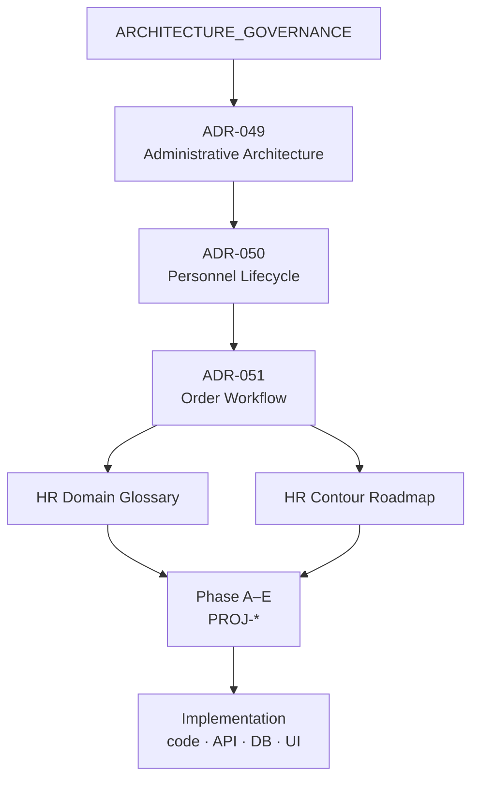

# Architecture Governance — кадровый контур

| Поле | Значение |
|------|----------|
| **Тип документа** | Governance (мета-документ; не ADR) |
| **Дата** | 2026-06-30 |
| **Статус** | Active |
| **Область действия** | Правила ведения архитектурного пакета кадрового контура |

---

## 1. Назначение

Документ фиксирует **иерархию и правила** архитектурного пакета кадрового контура: какие типы документов существуют, в каком порядке они имеют приоритет и как из архитектурных решений переходить к реализации.

**Governance не принимает прикладных архитектурных решений** о сущностях, lifecycle или workflow. Решения — только в Accepted ADR.

---

## 2. Иерархия документов

```text
ARCHITECTURE_GOVERNANCE
           │
           ▼
      ADR-049
           │
           ▼
      ADR-050
           │
           ▼
      ADR-051
           │
     ┌─────┴─────┐
     ▼           ▼
Glossary     Roadmap
     │           │
     └─────┬─────┘
           ▼
     Phase A–E
           ▼
      Implementation
```



---

## 3. Уровни и роли

| Уровень | Документ / артеfact | Принимает решения? | Назначение |
|---------|---------------------|--------------------|------------|
| **Governance** | [ARCHITECTURE_GOVERNANCE.md](./ARCHITECTURE_GOVERNANCE.md) | Нет (правила процесса) | Иерархия, приоритет, change workflow |
| **ADR** | [ADR-049](./adr/ADR-049-administrative-roles-and-responsibility-model.md) → [ADR-050](./adr/ADR-050-personnel-lifecycle-architecture.md) → [ADR-051](./adr/ADR-051-personnel-order-workflow-architecture.md) | **Да** | Что и почему: сущности, инварианты, контуры, workflow |
| **Reference** | [HR Domain Glossary](./reference/hr-domain-glossary.md) | Нет | Единая терминология для ADR, PROJ-*, API, UI, кода |
| **Roadmap** | [HR Contour Implementation Roadmap](./roadmap/hr-contour-implementation-roadmap.md) | Нет | Phase A–E, PROJ-*, guardrails реализации |
| **Backlog / phases** | PROJ-PERSON, PROJ-EMPLOYMENT, … | Нет (план работ) | Декомпозиция roadmap на проекты |
| **Implementation** | Код, API, миграции, UI | Нет (исполнение) | Приведение системы к ADR в рамках PROJ-* |

---

## 4. Правила приоритета

1. **Accepted ADR** — высший источник архитектурной истины для кадрового контура.
2. При расхождении **Glossary ↔ ADR** — верен **ADR**; Glossary обновляется вслед за ADR.
3. При расхождении **Roadmap ↔ ADR** — верен **ADR**; Roadmap обновляется вслед за ADR.
4. При расхождении **Implementation ↔ ADR** — неверна **Implementation**; либо исправление кода, либо **новый ADR / amendment** (не silent drift).
5. **Glossary и Roadmap** равны по статусу (оба производны от ADR); используются **совместно**:
   - Glossary — **как называть**;
   - Roadmap — **в каком порядке строить**.

---

## 5. Architecture Freeze

**Accepted ADR считаются замороженными.**

- Изменения — **только** через новый ADR или официальное amendment к существующему.
- В ходе реализации **запрещено «тихо»** менять архитектурные решения ради удобства кода, сроков или локального рефакторинга.

Implementation следует модели предметной области, а **не** переписывает её. Эрозия архитектуры (silent drift) — нарушение governance; путь исправления — §6 Change workflow.

---

## 6. Change workflow

| Шаг | Действие | Когда |
|-----|----------|-------|
| 1 | Выявлен конфликт или новое требование | Любая задача PROJ-* / Cursor / review |
| 2 | Проверка ADR-049/050/051 + [Glossary](./reference/hr-domain-glossary.md) | Перед проектированием |
| 3 | Если решение **укладывается** в ADR | Реализация по [Roadmap](./roadmap/hr-contour-implementation-roadmap.md), термины из Glossary |
| 4 | Если решение **нарушает** ADR | Сначала **новый ADR или amendment**; затем sync Glossary / Roadmap; затем код |
| 5 | После принятия ADR | Обновить Glossary (термины) и Roadmap (фазы/PROJ-*), если затронуты |
| 6 | Implementation | Только после шагов 3–5; guardrails — Roadmap §9 |

**Запрещено:** менять код/API/БД в обход ADR под видом «уточнения roadmap» или «нового термина в glossary».

---

## 7. Цепочка ADR (кратко)

| ADR | Вопрос | Ключевой результат |
|-----|--------|-------------------|
| **ADR-049** | Кто и в каком контуре? | Person → Employee → Account → Access; platform / org-tech / HR |
| **ADR-050** | Какие сущности и lifecycle? | Employee Aggregate Root; Employment; Events; Archive |
| **ADR-051** | Как работают приказы? | Order workflow; Draft → Effective; Order → Event → projection |

Подробный реестр: [adr/README.md](./adr/README.md).

---

## 8. Производные документы

| Документ | Путь | Обязателен для |
|----------|------|----------------|
| HR Domain Glossary | [reference/hr-domain-glossary.md](./reference/hr-domain-glossary.md) | ADR, API, UI, тесты, код, задачи Cursor |
| HR Contour Roadmap | [roadmap/hr-contour-implementation-roadmap.md](./roadmap/hr-contour-implementation-roadmap.md) | PROJ-*, планирование Phase A–E, guardrails |

---

## 9. Phase A–E → Implementation

Roadmap задаёт порядок:

```text
Phase A (PERSON → EMPLOYMENT → EVENTS)
    → Phase B (PERSONAL-FILE → SECTIONS)
    → Phase C (DOCUMENTS → ORDERS → ORDER-WORKFLOW)
    → Phase D (HIRE, TRANSFER, LEAVE, TERMINATION, ARCHIVE-UI)
    → Phase E (CANDIDATE, TERMS-CHANGE, AWARDS-DISCIPLINE)
    → Implementation (backend, frontend, API, migrations)
```

Каждая зада Implementation должна указывать: **PROJ-***, **Phase**, затронутые **ADR**, термины из **Glossary**, проверяемые **INV/LR/OW**.

---

## 10. Правила для задач Cursor

1. **Терминология** — только из [HR Domain Glossary](./reference/hr-domain-glossary.md).
2. **Architecture Freeze** (§5) — Accepted ADR не менять через код; только ADR / amendment.
3. **Архитектура** — не нарушать ADR-049/050/051; при сомнении — ADR, не код.
4. **Объём работ** — привязка к Phase и PROJ-* из Roadmap.
5. **Checklist задачи** — шаблон Roadmap §9.3 (ADR, invariants, entities, tests, migrations).
6. **Новое решение** — ADR first; Glossary и Roadmap sync second; code last.

---

## 11. Что не входит в governance

| Область | Где решается |
|---------|--------------|
| RBAC role codes, seed | ADR-049, док. №15 |
| Конкретные таблицы БД | ADR-052+ (planned), PROJ-* |
| UI wireframes | UX-проекты |
| Payroll, OCR, e-sign provider | Отдельные ADR / integration |
| Platform-wide architecture (вне HR) | Другие ADR, концептуальные документы |

---

## 12. История изменений

| Дата | Изменение |
|------|-----------|
| 2026-06-30 | Первая версия: иерархия ADR → Glossary / Roadmap → Phase A–E → Implementation |
| 2026-06-30 | §5 Architecture Freeze — запрет silent drift при реализации |
