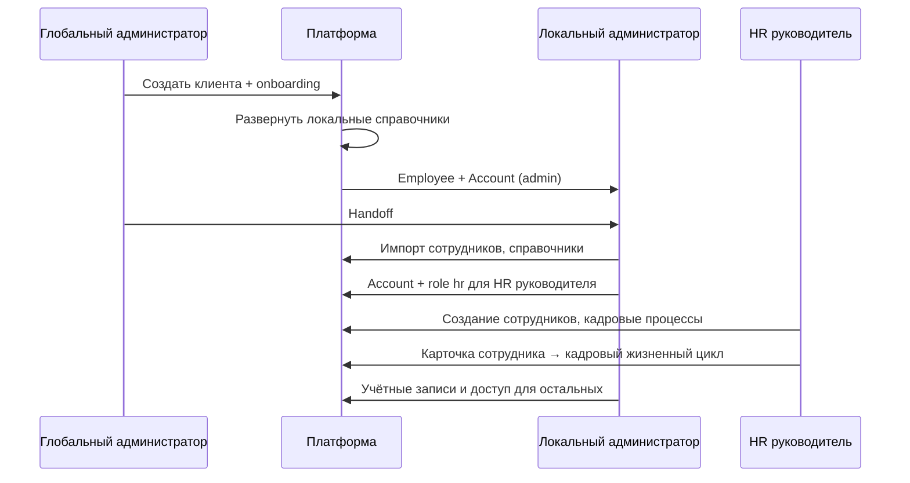

# ADR-049 — Административные роли и модель ответственности

| Поле | Значение |
|------|----------|
| **Статус** | Accepted |
| **Дата** | 2026-06-30 |
| **Принято** | 2026-06-30 |
| **Контекст** | После UX-REF-001 (Phase 1–2): разделение «Сотрудники» / «Аккаунты» в UI локального администратора |
| **Связанные документы** | [документ №15 (RBAC)](../specs/документ_№_15.md), [HR OS Agreement](../../hr-os/architecture/HR_Operating_System_Architecture_Agreement.md), [reference_catalogs_global_and_client.md](../reference_catalogs_global_and_client.md), UX-REF-001 |
| **Область действия** | Архитектура административного контура мультитенантной платформы |
| **Вне scope ADR** | Изменение RBAC, role codes, модели Person/Employee, реализация кадровых модулей, аккаунтов, UI |

---

## 1. Контекст и проблема

### 1.1. Зачем нужен документ

Права и обязанности **глобального администратора**, **локального администратора** и **кадрового контура** сегодня описаны фрагментарно:

- техническая RBAC-матрица — в [документе №15](../specs/документ_№_15.md) (концептуальные коды `super_admin`, `client_admin`, `hr_manager`);
- фактические role codes в коде — `system_admin`, `admin`, `hr`, `manager`, `employee`, `developer` ([`app/seed.py`](../../app/seed.py), [`app/auth/context.py`](../../app/auth/context.py));
- разделение кадровых и технических экранов — частично зафиксировано в UX-REF-001 ([`sidebar-registry.js`](../../static/shared/sidebar-registry.js));
- прикладные HR-модули — в [HR Operating System Agreement](../../hr-os/architecture/HR_Operating_System_Architecture_Agreement.md).

Перед разработкой **кадрового контура** (личные листки, приказы, архив, отпуска, переводы, увольнения, повторный приём, образование, сертификаты и др.) требуется **единая архитектурная модель административных ролей**, не привязанная к конкретной реализации экранов, но задающая правила для всех последующих проектов.

### 1.2. Базовые сущности (не меняются)

```text
Person  →  Employee  →  Account  →  Access (Role codes)
   ↑           ↑            ↑
 кадровое    организа-    технический
  лицо       ционный      доступ
             контекст
```

- **Сотрудник (Employee)** — основная рабочая сущность организации.
- **Учётная запись (Account)** — средство доступа в систему; не является самостоятельной кадровой сущностью. **Пользователь системы** появляется только после создания учётной записи и назначения ролей.
- **Роль в системе** — назначение прав через существующие role codes; каталог ролей платформенный, клиент не создаёт новые коды.

### 1.3. Три административных контура

| Контур | Уровень | Role code (владелец) | Назначение |
|--------|---------|----------------------|------------|
| **Платформенный** | Global | `system_admin` | Клиенты, onboarding, глобальные справочники, системные учётные записи |
| **Организационно-технический** | Client | `admin` | Локальные справочники, структура, учётные записи, управление доступом |
| **Кадровый контур** | Client / Org unit | `hr` | Сотрудники, кадровый жизненный цикл, кадровые процессы и модули |

**Терминология.** «Кадровый контур» — архитектурное имя третьего контура. Он шире, чем «HR-функции»: включает личные листки, приказы, архив, отпуска, переводы, увольнения, повторный приём, образование, сертификаты и другие кадровые процессы. Внутри кадрового контура могут существовать отдельные **HR-модули** (HR OS), но сам контур не называется «HR».

---

## 2. Решение

Зафиксировать **целевую модель административных ролей** как набор **архитектурных персон** с явным владельцем каждой операции, единой точкой управления каждой сущностью и разделением кадрового и технического администрирования.

**Важно:** ADR описывает целевое состояние. Текущая реализация (RBAC, навигация, API) может отличаться; приведение к модели — отдельные проекты.

### 2.1. Соответствие архитектурных ролей и role codes

| Архитектурная роль | Role code (без изменений) | Scope | Контур |
|--------------------|---------------------------|-------|--------|
| Глобальный администратор | `system_admin` | global | Платформенный |
| Разработчик платформы | `developer` | global | Технический (не административная персона клиентов) |
| Локальный администратор | `admin` | client | Организационно-технический |
| HR руководитель | `hr` | client | Кадровый контур |
| Уполномоченный сотрудник ОК | `hr` | org_unit * | Кадровый контур (делегированный scope) |
| Руководитель | `manager` | org_unit | Управленческий просмотр / согласования |
| Сотрудник | `employee` | self / limited | Self-service |
| — | `platform_admin`, `org_admin`, `viewer`, `onboarding_operator` | — | Концепции док. №15; **не** в seed MVP |

\* Scope для уполномоченного сотрудника ОК задаётся не новым role code, а **org_unit scope + permission layer** (см. открытые вопросы).

### 2.2. Разделение кадровых и технических действий

| Кадровый контур (`hr`) | Организационно-технический контур (`admin`) |
|------------------------|---------------------------------------------|
| **Создаёт сотрудников** (Employee) | **Создаёт учётные записи** (Account) |
| Сопровождает кадровые данные | Управляет доступом |
| Выполняет кадровые процессы (приказы, переводы, архив…) | Назначает системные role codes |
| Точка входа — **карточка сотрудника** | Точка входа — **журнал «Аккаунты»** |

**Не использовать:** «HR создаёт пользователей». **Использовать:** «HR создаёт сотрудников»; учётная запись и доступ создаёт локальный администратор (или инициируется из карточки сотрудника — Phase 3 UX-REF-001, исполняет admin).

---

## 3. Роли системы

### 3.1. Глобальный администратор (`system_admin`)

**Назначение.** Операционный владелец платформы: создание и сопровождение клиентов, развёртывание типовой инфраструктуры, ведение глобальных справочников, управление системными учётными записями.

**Область ответственности.**

- Реестр клиентов (организаций).
- One-click onboarding и развёртывание локальных справочников из шаблона.
- Создание **первого** локального администратора клиента (в рамках onboarding).
- Глобальные справочники: типовая оргструктура, должности, регламенты, KPI, навыки.
- Платформенные пользователи (`/users`) и реестр админов организаций (`/org-admins`).
- Платформенный аудит и эскалации (просмотр, не штатное ведение кадров клиента).

**Ограничения.**

- Не ведёт операционный кадровый учёт клиента (личные листки, приказы, кадровые процессы).
- Не подменяет локального администратора в повседневном сопровождении локальных справочников после handoff.
- Не является владельцем операционной работы в HR-модулях клиента.

**Жизненный цикл.**

| Этап | Действие |
|------|----------|
| Создание | Seed / ручное создание системной учётной записи без `employee_id` |
| Активация | Назначение role `system_admin`, status account = active |
| Эксплуатация | Работа в платформенном кабинете |
| Деактивация | block account; role не удаляется из истории |
| Архив | Учётная запись blocked/archived; аудит сохраняется |

*Исключение для платформенного слоя:* системные учётные записи (`system_admin`, `developer`) могут существовать без `employee_id` — см. §7.5.

---

### 3.2. Локальный администратор (`admin`)

**Назначение.** Технический и организационный администратор **одного клиента**: справочники, структура, учётные записи, назначение системных ролей.

**Область ответственности.**

- Локальные справочники: подразделения, должности, регламенты, KPI, навыки.
- Импорт и первичное заведение сотрудников (Employee) как **организационных записей** (в т.ч. до появления учётной записи).
- **Создание учётных записей**, block/unblock, reset password (по политике).
- **Назначение системных role codes** (`admin`, `hr`, `manager`, `employee`) — журнал «Администрирование → Аккаунты» (UX-REF-001).
- Сопровождение **технической стороны** работы пользователей организации.
- Подключение/видимость HR-модулей на уровне конфигурации организации (если предусмотрено платформой).

**Ограничения.**

- **Не** ведёт кадровые процессы: личные листки, приказы, кадровый архив, отпуска, переводы как кадровый домен.
- **Не** редактирует глобальные справочники (только копирование/развёртывание из шаблона).
- **Не** назначает platform roles (`system_admin`, `developer`).
- Журнал «Аккаунты» — **исключительно** техническое администрирование учётных записей.

**Жизненный цикл.**

| Этап | Действие |
|------|----------|
| Создание | Onboarding создаёт Employee + Account + role `admin` |
| Handoff | После передачи клиенту — автономная работа в `/client/{client_id}` |
| Смена | Новый admin назначается global admin или действующим admin; старый — block/deactivate |
| Потеря роли | Снятие `admin` с Account; Employee остаётся кадровой записью |

---

### 3.3. HR руководитель (архитектурная роль → `hr`, client scope)

**Назначение.** Функциональный владелец **кадрового контура** организации: учёт персонала, кадровый жизненный цикл, кадровые документы, HR-модули.

**Область ответственности.**

- **Создание и ведение сотрудников** (Employee) в кадровом смысле.
- Сопровождение кадровых данных через **карточку сотрудника** (основная точка входа).
- Кадровые процессы: приём, перевод, увольнение, повторный приём, отпуска, образование, сертификаты (по мере внедрения).
- Личные листки, приказы, кадровый архив (будущие проекты).
- Операционная работа в подключённых HR-модулях (HR OS).
- Инициирование запроса на учётную запись **из карточки сотрудника** (Phase 3+ UX-REF-001); исполнение — admin.

**Ограничения.**

- **Не** создаёт учётные записи и **не** назначает role codes через журнал «Аккаунты» (по умолчанию).
- **Не** изменяет глобальные и локальные **технические** справочники без согласования с admin.
- **Не** создаёт других локальных администраторов без эскалации.

**Жизненный цикл.**

| Этап | Действие |
|------|----------|
| Назначение | Admin создаёт Employee; при необходимости Account + `hr` |
| Эксплуатация | Работа в кабинете кадрового контура |
| Делегирование | Передаёт scope уполномоченным сотрудникам ОК |
| Смена | Назначение нового HR руководителя — admin или global admin |

---

### 3.4. Уполномоченный сотрудник отдела кадров (архитектурная роль → `hr`, org_unit scope)

**Назначение.** Исполнитель кадровых операций в пределах делегированного участка.

**Область ответственности.**

- Ведение сотрудников и документов **в scope** через карточку сотрудника.
- Работа с подмножеством HR-модулей, разрешённых HR руководителем.
- Подготовка черновиков приказов, личных листков — по регламенту организации.

**Ограничения.**

- Не управляет учётными записями и системными ролями (по умолчанию).
- Не изменяет org-wide справочники.
- Не утверждает приказы, если процесс требует HR руководителя (workflow — отдельный проект).

**Жизненный цикл.**

| Этап | Действие |
|------|----------|
| Назначение | HR руководитель или admin: Employee + `hr` + org_unit binding |
| Изменение scope | HR руководитель / admin |
| Отзыв | Снятие роли или сужение scope |

---

### 3.5. Прочие пользовательские роли

#### Руководитель (`manager`)

| Аспект | Описание |
|--------|----------|
| Назначение | Просмотр структуры и команды; согласования в HR-модулях |
| Scope | org_unit |
| Ограничения | Без администрирования аккаунтов и кадровых процессов |
| Жизненный цикл | Назначается admin; Employee создаётся в кадровом или org-контуре |

#### Сотрудник (`employee`)

| Аспект | Описание |
|--------|----------|
| Назначение | Self-service: личные данные, назначенные HR-модули |
| Scope | self |
| Ограничения | Нет административных функций |
| Жизненный цикл | Может существовать без Account; при увольнении — кадровый архив + block Account |

#### Разработчик платформы (`developer`)

| Аспект | Описание |
|--------|----------|
| Назначение | Техническая разработка и API |
| Scope | global (технический) |
| Ограничения | Не бизнес-администратор клиентов |
| Жизненный цикл | Системная учётная запись без `employee_id` |

---

## 4. Матрица ролей и ответственности

### 4.0. Категории доступа

Для каждого раздела и операции используются **только** следующие категории:

| Категория | Смысл |
|-----------|--------|
| **Владелец** | Единственная роль, ответственная за операцию и её результат |
| **Делегированные действия** | Выполнение в рамках scope по делегированию владельца |
| **Просмотр** | Read-only доступ без права изменения |
| **Нет доступа** | Раздел или операция недоступны |

Для каждой **административной операции** в §4.3 указана ровно одна роль-владелец.

### 4.1. Сводная матрица по разделам

| Раздел системы | Роль-владелец | Глобальный администратор | Локальный администратор | HR руководитель | Уполномоченный ОК | manager | employee |
|----------------|---------------|--------------------------|-------------------------|-----------------|-------------------|---------|----------|
| **Клиенты** | Глобальный администратор | Владелец | Нет доступа | Нет доступа | Нет доступа | Нет доступа | Нет доступа |
| **Пользователи (platform)** | Глобальный администратор | Владелец | Нет доступа | Нет доступа | Нет доступа | Нет доступа | Нет доступа |
| **Onboarding** | Глобальный администратор | Владелец | Нет доступа | Нет доступа | Нет доступа | Нет доступа | Нет доступа |
| **Глобальные справочники** | Глобальный администратор | Владелец | Нет доступа | Нет доступа | Нет доступа | Нет доступа | Нет доступа |
| **Локальные справочники** | Локальный администратор | Просмотр | Владелец | Просмотр | Просмотр | Просмотр | Нет доступа |
| **Кадровые данные сотрудника** | HR руководитель * | Просмотр | Делегированные действия ** | Владелец | Делегированные действия | Просмотр | Просмотр (self) |
| **Аккаунты (журнал)** | Локальный администратор | Владелец *** | Владелец | Нет доступа | Нет доступа | Нет доступа | Нет доступа |
| **HR-модули** | HR руководитель | Просмотр | Нет доступа **** | Владелец | Делегированные действия | Делегированные действия | Делегированные действия |
| **Кадровый архив** | HR руководитель | Просмотр | Нет доступа | Владелец | Делегированные действия | Нет доступа | Нет доступа |
| **Личные листки** | HR руководитель | Нет доступа | Нет доступа | Владелец 🔜 | Делегированные действия 🔜 | Просмотр 🔜 | Просмотр (self) 🔜 |
| **Приказы** | HR руководитель | Нет доступа | Нет доступа | Владелец 🔜 | Делегированные действия 🔜 | Просмотр 🔜 | Нет доступа |
| **Администрирование (org)** | Локальный администратор | Просмотр | Владелец | Нет доступа | Нет доступа | Нет доступа | Нет доступа |

\* **Кадровые данные сотрудника** — единый домен: реестр, карточка, личный листок, образование, сертификаты, семейное положение, кадровая история, архивная запись и др.; карточка — текущая основная точка входа, не единственный экран (см. ADR-050). Admin — владелец **импорта/первичного** заведения Employee (OQ-5).  
\*\* Admin: импорт, org-поля; не кадровые процессы.  
\*\*\* Global admin — владелец platform `/users`; org Account — local admin.  
\*\*\*\* **As-is:** HR-модули видны всем в sidebar; **целевое** — «Нет доступа» для admin.

### 4.2. Детализация по разделам

#### Клиенты

| Роль | Категория |
|------|-----------|
| Глобальный администратор | **Владелец** |
| Локальный администратор | Нет доступа |
| HR руководитель / ОК / manager / employee | Нет доступа |

#### Пользователи (platform `/users`)

| Роль | Категория |
|------|-----------|
| Глобальный администратор | **Владелец** |
| Все прочие роли организации | Нет доступа |

#### Onboarding

| Роль | Категория |
|------|-----------|
| Глобальный администратор | **Владелец** |
| Локальный администратор и прочие | Нет доступа |

#### Глобальные справочники

| Роль | Категория |
|------|-----------|
| Глобальный администратор | **Владелец** |
| Локальный администратор | Нет доступа (копирование в client — операция admin в org-контуре) |
| HR руководитель | Просмотр (при кадровой необходимости) |
| Прочие | Нет доступа |

#### Локальные справочники

| Роль | Категория |
|------|-----------|
| Локальный администратор | **Владелец** |
| Глобальный администратор | Просмотр |
| HR руководитель | Просмотр; Делегированные действия — при согласованном кадровом сценарии |
| Уполномоченный ОК | Просмотр в scope |
| manager | Просмотр в scope |
| employee | Нет доступа |

#### Кадровые данные сотрудника

Единый кадровый домен одной сущности Employee: реестр, карточка, личный листок, фотография, образование, сертификаты, семейное положение, кадровая история, архивная запись. Отдельные строки матрицы ниже (личные листки, приказы, кадровый архив) — **подразделы** этого домена до консолидации в ADR-050.

| Роль | Категория |
|------|-----------|
| HR руководитель | **Владелец** (кадровые данные и процессы) |
| Локальный администратор | Делегированные действия (импорт, org-поля); Просмотр |
| Уполномоченный ОК | Делегированные действия в scope |
| Глобальный администратор | Просмотр |
| manager | Просмотр в scope |
| employee | Просмотр (self) |

#### Аккаунты (журнал «Аккаунты»)

| Роль | Категория |
|------|-----------|
| Локальный администратор | **Владелец** (org scope) |
| Глобальный администратор | **Владелец** (platform scope) |
| HR руководитель | Нет доступа; индикатор «Есть УЗ / —» в реестре сотрудников |
| Уполномоченный ОК / manager / employee | Нет доступа |

#### HR-модули (внутри кадрового контура)

| Роль | Категория |
|------|-----------|
| HR руководитель | **Владелец** |
| Уполномоченный ОК | Делегированные действия |
| manager / employee | Делегированные действия / Просмотр (по модулю) |
| Локальный администратор | Нет доступа (целевое) |
| Глобальный администратор | Просмотр (платформенный аудит) |

#### Кадровый архив, личные листки, приказы

| Роль | Категория |
|------|-----------|
| HR руководитель | **Владелец** |
| Уполномоченный ОК | Делегированные действия |
| Локальный администратор | Нет доступа |
| Глобальный администратор | Просмотр (аудит платформы) |
| manager | Просмотр (где предусмотрено процессом) |
| employee | Просмотр (self), где предусмотрено |

### 4.3. Роль-владелец по ключевым операциям

| Операция | Роль-владелец |
|----------|---------------|
| Создание клиента | Глобальный администратор |
| Запуск onboarding | Глобальный администратор |
| CRUD глобальных справочников | Глобальный администратор |
| CRUD локальных справочников | Локальный администратор |
| Импорт / первичное создание Employee | Локальный администратор |
| Кадровые данные сотрудника (ведение) | HR руководитель |
| Любое кадровое действие (приказ, перевод, отпуск…) | HR руководитель (точка входа — кадровые данные; сейчас — карточка) |
| Создание Account | Локальный администратор |
| Назначение role codes | Локальный администратор |
| Block / reset password | Локальный администратор |
| Операции в HR-модулях | HR руководитель |
| Личные листки, приказы, кадровый архив | HR руководитель |

---

## 5. Административные процессы

### 5.1. Глобальный администратор

```text
1. Создать клиента (юрлицо, код, шаблон)
2. Запустить onboarding (validate → preview → execute)
3. Onboarding создаёт: org structure, positions, первого admin
4. Сопровождать глобальные справочники
5. Handoff → локальный администратор
6. Платформенный аудит: org-admins, users
```

### 5.2. Локальный администратор

```text
1. Донастроить локальные справочники (после detach от шаблона)
2. Импорт / первичное создание сотрудников (Employee)
3. Создать учётные записи для HR руководителя и иных сотрудников
4. Назначить системные role codes (admin, hr, manager, employee)
5. Управлять доступом: block, reset password — журнал «Аккаунты»
6. НЕ выполнять кадровые процессы и НЕ работать в HR-модулях
```

### 5.3. HR руководитель (кадровый контур)

```text
1. Создавать и вести сотрудников (Employee)
2. Все кадровые действия — из карточки сотрудника
3. Кадровые процессы: приём, перевод, увольнение, отпуска, образование…
4. Личные листки, приказы, кадровый архив (🔜)
5. Операционная работа в HR-модулях
6. Делегировать scope уполномоченным ОК
7. Инициировать запрос на учётную запись из карточки (🔜); исполняет admin
```

### 5.4. Сквозной сценарий «Новый клиент → Рабочая организация»



---

## 6. Административный интерфейс (целевая структура кабинетов)

> **Примечание.** ADR фиксирует **целевую** навигацию. Текущая реализация после UX-REF-001 частично совпадает для local admin; role-based filtering HR-модулей — **не реализован**.

### 6.1. Кабинет глобального администратора

**Точка входа:** `/clients` после login.

```text
Typical Infrastructure
    Клиенты
    Админы организаций
    Пользователи
    Мастер onboarding

Глобальные справочники
    Обзор … API (Swagger)
```

### 6.2. Кабинет локального администратора

**Точка входа:** `/client/{client_id}` (role `admin`).

```text
Справочники организации
    Локальные подразделения … Сотрудники

Администрирование
    Аккаунты          ← единственная точка технического управления доступом

(HR-модули — скрыты, целевое)
```

**Сценарии:** справочники, импорт Employee, создание Account, назначение role codes. **Не** кадровые процессы.

### 6.3. Кабинет кадрового контура

**Точка входа:** `/client/{client_id}` (role `hr`).

```text
Кадровый контур
    Сотрудники              ← реестр + карточка = основная точка входа
    (🔜 Личные листки)
    (🔜 Приказы)
    (🔜 Архив)
    (🔜 Отпуска, переводы, …)

Организация (ограниченно)
    Подразделения, должности — Просмотр / Делегированные действия

HR-модули                 ← прикладной слой внутри кадрового контура
    Психологические тестирования, Обучение, Аттестации, …

(Журнал «Аккаунты» — отсутствует в меню)
```

**Сценарии:** создание сотрудников, кадровые процессы из карточки, HR-модули. Учётная запись — только инициирование запроса admin.

### 6.4. Руководитель и сотрудник (кратко)

| Роль | Фокус |
|------|-------|
| manager | Просмотр команды, Делегированные действия в HR-модулях |
| employee | Просмотр (self), участие в назначенных HR-модулях |

---

## 7. Архитектурные принципы

### 7.1. Единственная точка ответственности (Single Owner)

Каждая административная операция имеет **ровно одного** владельца-роли — см. §4.3. Shared **Просмотр** допустим; **mutate** — только у владельца или через **Делегированные действия**.

### 7.2. Единственная точка управления (Single Management Screen)

| Сущность | Основной экран | Назначение |
|----------|----------------|------------|
| Client | `/clients` | Платформенный реестр |
| Кадровые данные сотрудника | Карточка сотрудника (основная точка входа) | **Все кадровые действия — в этом домене** |
| Employee (реестр) | `#employees` | Навигация к кадровым данным |
| Account | `#accounts` (admin) | **Исключительно** техническое администрирование УЗ |
| Org unit, positions | `#org`, `#positions` | Локальные справочники (admin) |
| Global catalog | `/global/*` | Глобальные справочники |
| HR module | вкладка модуля | Операции внутри кадрового контура |

### 7.3. Кадровое управление через кадровые данные сотрудника

- **Все кадровые действия относятся к домену «кадровые данные сотрудника»** и начинаются от этой сущности (Employee + связанные кадровые документы и история).
- **Карточка сотрудника** — текущая основная точка входа в кадровые процессы (приём, перевод, приказ, отпуск и т.д.); по мере развития контура добавятся отдельные экраны (личный листок, образование, сертификаты, кадровая история — см. ADR-050).
- Журнал «Аккаунты» предназначен **исключительно** для технического администрирования учётных записей локальным администратором.
- Реестр «Сотрудники» — навигация и обзор; кадровая работа выполняется в карточке.

### 7.4. Разделение кадрового и технического администрирования

```text
┌─────────────────────┬─────────────────────┬─────────────────────────────┐
│   Платформенный     │ Организационно-     │   Кадровый контур           │
│                     │ технический         │                             │
├─────────────────────┼─────────────────────┼─────────────────────────────┤
│ clients, onboarding │ local catalogs      │ employee lifecycle          │
│ global catalogs     │ accounts, roles     │ personal files, orders      │
│ system users        │ import (org)        │ archive, leave, transfers   │
│                     │                     │ HR-modules (inside contour) │
└─────────────────────┴─────────────────────┴─────────────────────────────┘
         ↑                       ↑                         ↑
   system_admin                 admin                        hr
```

**Не смешивать:** кадровый процесс ≠ создание учётной записи ≠ развёртывание шаблона KPI.

### 7.5. Разделение жизненных циклов

Фундаментальные правила для проектирования всех кадровых модулей:

1. **Сотрудник может существовать без учётной записи.**  
   Employee создаётся и ведётся в кадровом контуре независимо от наличия Account. Отсутствие УЗ не блокирует кадровый учёт.

2. **Учётная запись организации не может существовать без сотрудника.**  
   Каждый Account клиентского контура обязан быть связан с Employee (`employee_id`). Пользователь системы в организации — это сотрудник **с** учётной записью и назначенными role codes.

*Исключение платформенного слоя (без изменения текущей модели):* системные учётные записи `system_admin` и `developer` могут существовать без `employee_id` — они относятся к платформенному контуру, не к кадровому.

```text
  Employee ──optional──▶ Account ──▶ Access (roles)
     │                      │
     │  может быть без      │  org Account всегда
     │  Account               │  требует Employee
     ▼                      ▼
  кадровый контур      технический контур (admin)
```

### 7.6. Минимально необходимые права (Least Privilege)

- Role codes — минимально достаточный набор (`ORG_ASSIGNABLE_ROLE_CODES` для admin).
- HR руководитель не получает `admin` по умолчанию.
- Локальный администратор не получает операционный доступ к HR-модулям (целевое).
- Глобальный администратор не используется как штатный оператор кадрового контура клиента.

---

## 8. Что НЕ делать (явные ограничения ADR)

| Область | Статус |
|---------|--------|
| RBAC engine, permission tables | Без изменений |
| Role codes в seed | Без изменений |
| Модель Person / Employee | Без изменений |
| HR-модули (модули, API) | Без изменений |
| Accounts API / policies | Без изменений |
| UI (кроме будущих проектов по ADR) | Без изменений |

ADR — **архитектурный ориентир** для backlog.

---

## 9. Текущее состояние vs целевое (gap analysis)

| Аспект | As-is (2026-06) | Target (ADR-049) |
|--------|-----------------|------------------|
| Меню admin: Сотрудники / Аккаунты | Разделены (UX-REF-001 ✅) | ✅ |
| HR-модули в sidebar | Видны всем в client workspace | Нет доступа для `admin` |
| Кадровые vs org CRUD Employee | Оба могут CRUD (API) | Владелец кадра — `hr` |
| HR → журнал «Аккаунты» | ⛔ `org_admin_required` | Нет доступа; карточка сотрудника |
| HR руководитель vs ОК | Один code `hr` | Scope / permissions layer |
| Карточка как точка входа | Частично | Все кадровые действия из карточки |
| Личные листки, приказы | Нет | Владелец — HR руководитель 🔜 |

---

## 10. Открытые вопросы (отдельные проекты)

| # | Вопрос | Предлагаемый owner-проект |
|---|--------|---------------------------|
| OQ-1 | Как различить HR руководителя и уполномоченного ОК при одном `hr` code? | RBAC Phase 2 / HR scope |
| OQ-2 | Может ли HR руководитель инициировать создание `admin`? | Account governance |
| OQ-3 | Phase 3 UX-REF-001: какие account-actions из карточки без `#accounts`? | UX-REF-001 Phase 3 |
| OQ-4 | Reset password: только admin + global admin? | Security policy |
| OQ-5 | Импорт Employee: владелец admin или также HR? | Import / cadre onboarding |
| OQ-6 | Manager scope: org tree vs `manager_id`? | Manager scope ADR |
| OQ-7 | Visibility HR-модулей: config client vs role-based nav | Sidebar RBAC project |
| OQ-8 | Личные листки: Person vs Employee при архиве | Person/Employee ADR |
| OQ-9 | Приказы: workflow утверждения | Document workflow |
| OQ-10 | Увольнение: auto-block Account или вручную admin? | Termination process |
| OQ-11 | Global admin в `/client/{id}`: только Просмотр? | Platform audit policy |
| OQ-12 | Нужен ли `viewer` / `org_admin` как отдельные codes? | RBAC consolidation |
| OQ-13 | Skill assessment: admin по прямому URL | Module access fix |
| OQ-14 | Кадровый архив vs archive account status | Archive ADR |

---

## 11. Последствия

### Положительные

- Устойчивая терминология: **кадровый контур** vs **HR-модули**.
- Единый язык для личных листок, приказов, архива, аккаунтов.
- Явное разделение жизненных циклов Employee и Account.
- UX-REF-001 вписывается в модель (карточка сотрудника, журнал «Аккаунты»).

### Costs

- Follow-up проекты: sidebar RBAC, API ownership, карточка сотрудника.
- Временное расхождение as-is / target.

### Зависимые проекты

1. UX-REF-001 Phase 3 — блок «Аккаунт и доступ» в карточке.
2. Sidebar role-based visibility для HR-модулей.
3. HR scope permissions (`hr` + org_unit).
4. **ADR-050** — Personnel Lifecycle Architecture (кадровые данные, документы, жизненный цикл).
5. Кадровые модули (личные листки, приказы, архив…) — части ADR-050, со ссылкой на ADR-049 для ролей.

---

## 12. Чеклист для review новых фич

- [ ] Указан **single owner** из §4.3.
- [ ] Кадровое действие относится к домену **кадровые данные сотрудника** (§7.3).
- [ ] Соблюдено **разделение жизненных циклов** Employee / Account (§7.5).
- [ ] Не смешаны платформенный / org-tech / кадровый контуры.
- [ ] Role codes не добавлены без отдельного ADR.
- [ ] Права — minimal necessary.

---

## 13. Итоговая схема административной модели

```text
Платформенный контур
(system_admin)

        │

        создаёт организации
        выполняет onboarding
        сопровождает платформу

────────────────────────────

Организационно-технический контур
(admin)

        │

        сопровождает организацию
        создаёт учётные записи
        управляет доступом

────────────────────────────

Кадровый контур
(hr)

        │

        ведёт сотрудников
        управляет кадровыми процессами
        сопровождает кадровый жизненный цикл
              │
              ├── личные листки, приказы, архив
              ├── отпуска, переводы, увольнения
              └── HR-модули (прикладной слой)
```

**Связь сущностей (организация):**

```text
Person → Employee ──(кадровый контур, hr)
              │
              └── Account ──(org-tech контур, admin)── Role codes
```

---

## Приложение A. Role codes (reference, без изменений)

```python
# app/seed.py — канонический набор MVP
("system_admin", "Global administrator (Super Admin)")
("developer", "Platform developer")
("admin", "Organization administrator")
("hr", "HR")
("manager", "Manager")
("employee", "Employee")
```

```python
# app/auth/policies.py
ORG_ASSIGNABLE_ROLE_CODES = frozenset({"admin", "hr", "manager", "employee"})
PLATFORM_ONLY_ROLE_CODES = GLOBAL_ADMIN_ROLE_CODES | frozenset({"developer"})
```

---

## Приложение B. Связь с документом №15

| Док. №15 | ADR-049 / MVP code |
|----------|-------------------|
| super_admin | `system_admin` |
| platform_admin | `system_admin` (операционно) |
| client_admin | `admin` |
| hr_manager | `hr` (владелец **кадрового контура**) |
| onboarding_operator | функция `system_admin` |

При расширении RBAC новые codes — **отдельный ADR**, не часть ADR-049.

---

## Связь с ADR-050 (planned)

ADR-049 задаёт **кто** и **в каком контуре** работает с кадровыми данными. **ADR-050 — Personnel Lifecycle Architecture** определит **что** входит в жизненный цикл сотрудника (личный листок, образование, приказы, архив, Person ↔ Employee ↔ Documents ↔ Orders) и станет центральным документом кадрового контура; все последующие модули — его части, а не независимые функции.
