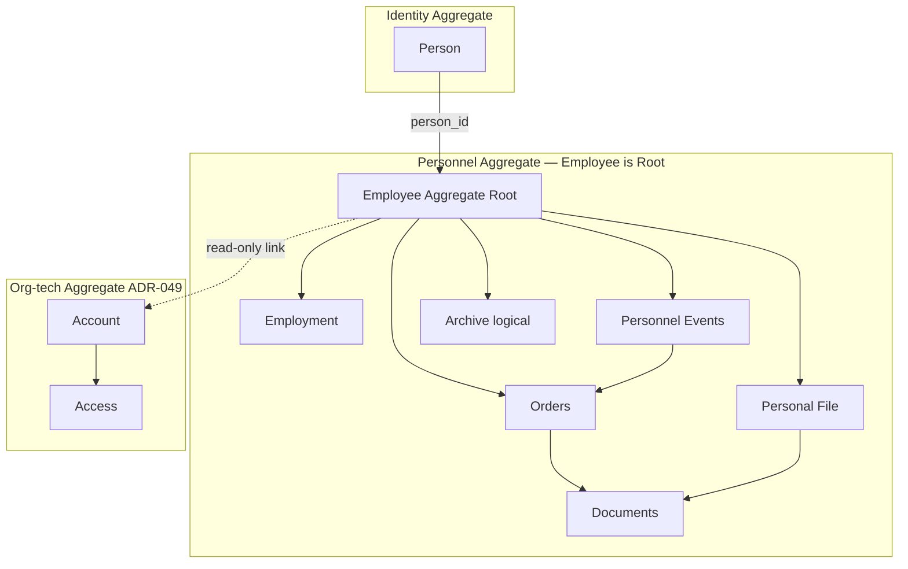
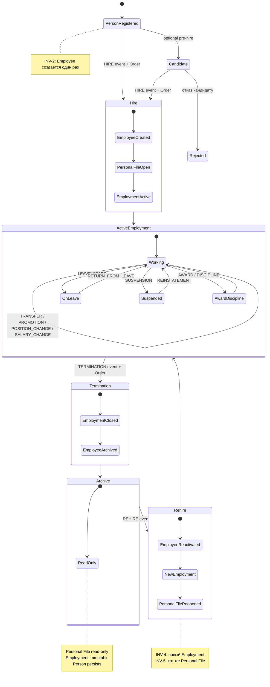
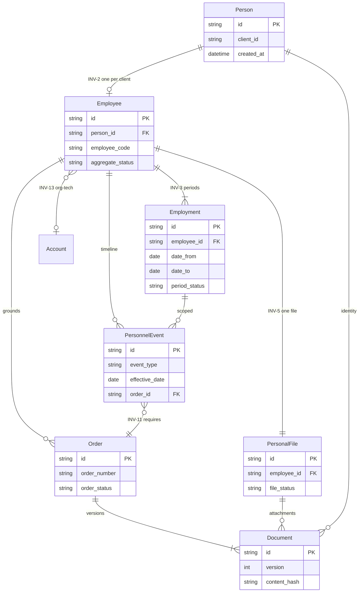
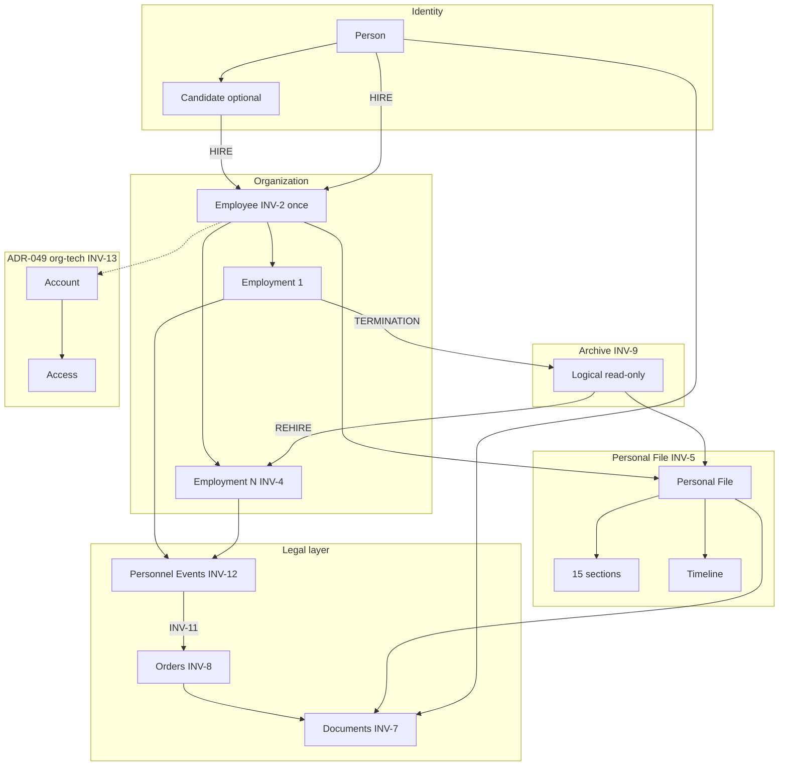

# ADR-050 — Personnel Lifecycle Architecture (Кадровый жизненный цикл)

| Поле | Значение |
|------|----------|
| **Статус** | Accepted |
| **Дата** | 2026-06-30 |
| **Принято** | 2026-06-30 |
| **Контекст** | ADR-049 Accepted: три административных контура, роли, Person → Employee → Account → Access; требуется архитектура **что** входит в кадровый жизненный цикл |
| **Связанные документы** | [ADR-049](./ADR-049-administrative-roles-and-responsibility-model.md), [концептуальная модель данных](../концептуальная_модель_данных_и_erd_типовая_инфраструктура_b_2_b.md), [HR OS Agreement](../../hr-os/architecture/HR_Operating_System_Architecture_Agreement.md), UX-REF-001 |
| **Область действия** | Архитектура кадрового контура мультитенантной платформы |
| **Вне scope ADR** | Реализация кода, изменение БД, RBAC, API, UI, миграции, ADR-049 |

---

## 1. Контекст и проблема

### 1.1. Зачем нужен документ

[ADR-049](./ADR-049-administrative-roles-and-responsibility-model.md) определяет **кто** и **в каком контуре** работает с кадровыми данными: роли `hr` / `admin`, разделение кадрового и технического администрирования, точка входа — карточка сотрудника.

Следующий шаг — зафиксировать **архитектуру кадрового контура**: сущности, жизненный цикл, личный листок, документы, приказы, события, архив. Без единой модели модули (личные листки, приказы, отпуска, переводы, увольнения, повторный приём) будут проектироваться разрозненно и смешивать ответственность сущностей.

### 1.2. Цель ADR-050

Спроектировать **полный жизненный цикл сотрудника** — от первого появления человека в системе до архивирования и возможного повторного приёма — и сделать ADR-050 **главным архитектурным документом кадрового контура** на несколько лет вперёд.

Документ определяет, **что именно** будет строиться в следующих фазах разработки. Реализация — отдельные проекты backlog.

### 1.3. Каноническая модель

ADR-050 **не меняет** ADR-049 и **не затрагивает** Account / Access. Он детализирует кадровую цепочку:

```text
Person
    │
    ▼
Employee
    │
    ▼
Employment
    │
    ▼
Personal File
    │
    ▼
Orders
    │
    ▼
Documents
    │
    ▼
Archive

                 └────────────► Account ► Access   (ADR-049, org-tech контур)
```

**Важно:** ADR описывает целевую архитектуру. Текущая реализация (Employee без Person, без Employment, PATCH-мутации) может отличаться; приведение к модели — отдельные проекты.

---

## 2. Границы кадрового контура

### 2.1. Входит в кадровый контур

| Область | Сущности / процессы |
|---------|---------------------|
| Идентичность | Person, Candidate (опционально) |
| Организационная привязка | Employee, Employment |
| Кадровое дело | Personal File |
| Юридические основания | Orders, Documents |
| История | Personnel Events, Archive |
| Прикладной слой | HR-модули (HR OS) — внутри контура, но не ядро lifecycle |

### 2.2. Не входит в кадровый контур

| Область | Контур | ADR |
|---------|--------|-----|
| Учётные записи, role codes | Организационно-технический (`admin`) | ADR-049 |
| Глобальные / локальные справочники | org-tech + platform | ADR-049 |
| RBAC engine | Platform | док. №15 |
| HR OS (тесты, обучение, аттестации) | Прикладной слой | HR OS Agreement |

---

## 3. Спецификация сущностей

Для каждой сущности зафиксированы: назначение, ответственность, время жизни, жизненный цикл, владелец данных, неизменяемые свойства, связи.

### 3.1. Person (Физическое лицо)

| Аспект | Описание |
|--------|----------|
| **Назначение** | Устойчивая идентичность **человека** в рамках клиента (tenant). Якорь биографических и персональных данных, не зависящих от конкретного периода работы. |
| **Ответственность** | ФИО (история изменений — через Events), дата рождения, пол, гражданство, документы личности, образование, семейное положение, воинский учёт, языки, личные контакты. |
| **Не ответственность** | Текущая должность, подразделение, ставка, приказы, статус занятости, табельный номер — Employment / Employee / Events. |
| **Время жизни** | От первого появления человека в системе клиента **до бессрочного хранения**; не удаляется при увольнении. |
| **Жизненный цикл** | `registered` → `verified` (опционально) → persists через все Employment → при необходимости `anonymized` (compliance, отдельная политика). |
| **Владелец данных** | HR руководитель (`hr`), client scope — ADR-049 §4.3. |
| **Неизменяемые свойства** | `id`, `client_id`, `created_at`; факт создания записи; история Events — append-only. |
| **Связи** | 1 Person → 0..1 Employee (per client); 1 Person → N Documents (identity); Events уровня Person (смена ФИО, семейного положения). |

### 3.2. Employee (Сотрудник организации)

| Аспект | Описание |
|--------|----------|
| **Назначение** | **Aggregate Root** кадрового контура (§4): организационная якорная запись, связь Person с клиентом. Единая точка навигации в реестре «Сотрудники» и карточке кадрового контура. |
| **Ответственность** | `person_id`, табельный номер (`employee_code`), агрегированный статус для реестра, индикатор наличия Account (read-only), связь с Personal File. |
| **Не ответственность** | Детали назначения по периодам, содержимое разделов личного листка, бинарные файлы, workflow приказов, управление Account. |
| **Время жизни** | **Создаётся один раз** при первом трудоустройстве; существует до бессрочного архивного хранения; **не пересоздаётся** при повторном приёме. |
| **Жизненный цикл** | `draft` (импорт admin) → `active` (HIRE) → `archived` (TERMINATION, нет active Employment) → `reactivated` (REHIRE) → … |
| **Владелец данных** | HR руководитель (`hr`); импорт/первичное заведение — admin (делегированное действие, ADR-049 OQ-5). |
| **Неизменяемые свойства** | `id`, `client_id`, `person_id` (после установки), `created_at`; факт первого приёма. |
| **Связи** | N:1 Person; 1:1 Personal File; 1:N Employment; 1:N Order; 1:N PersonnelEvent; 0..1 Account (org-tech, ADR-049). |

### 3.3. Employment (Период работы)

| Аспект | Описание |
|--------|----------|
| **Назначение** | **Конкретный период** работы Employee в организации: от приёма (HIRE / REHIRE) до увольнения (TERMINATION) или текущего момента. |
| **Ответственность** | `date_from`, `date_to`, тип занятости, org_unit, position, ставка (FTE), руководитель, статус периода (active / on_leave / suspended / terminated). |
| **Не ответственность** | Биографические данные Person; текст приказа; хранение файлов. |
| **Время жизни** | Один объект = **один период** работы. При повторном приёме — **новый** Employment; старые периоды immutable. |
| **Жизненный цикл** | `planned` → `active` → (`on_leave` ↔ `active`) → (`suspended` ↔ `active`) → `terminated` → archived (logical). |
| **Владелец данных** | HR руководитель (`hr`); изменения **только** через Personnel Events. |
| **Неизменяемые свойства** | `id`, `employee_id`, `date_from` (после активации), `created_at`; закрытый период (`terminated`) — полностью immutable. |
| **Связи** | N:1 Employee; 1:N PersonnelEvent; N:1 Order (основание открытия/закрытия); проекция org_unit / position из Events. |

*Соответствие концептуальной модели:* целевая **Employment** агрегирует `EmploymentAssignment` (концептуальная модель §5.6).

### 3.4. Personal File (Личный листок / кадровое дело)

| Аспект | Описание |
|--------|----------|
| **Назначение** | **Центральная модель кадрового дела** внутри агрегата Employee (§4) — структурированное кадровое дело. Главный контентный hub кадрового контура. |
| **Ответственность** | Архитектурные разделы (§9), хронология Events, ссылки на Orders и Documents, фотография. |
| **Не ответственность** | Workflow подписания; blob storage; Account; RBAC. |
| **Время жизни** | **Один Personal File на Employee**; **сохраняется между Employment**; не удаляется. |
| **Жизненный цикл** | `open` (с первым HIRE) → `read_only` (Employee archived) → `open` (REHIRE) → … |
| **Владелец данных** | HR руководитель (`hr`); self-service — ограниченно, по политике (OQ-50-5). |
| **Неизменяемые свойства** | `id`, `employee_id`, `created_at`; исторические записи разделов — append-only. |
| **Связи** | 1:1 Employee; sections → Person data / Employment history / Documents; timeline → PersonnelEvents; orders → Orders. |

### 3.5. Orders (Приказы)

| Аспект | Описание |
|--------|----------|
| **Назначение** | **Юридическое основание** кадровых решений: регистрация приказа как сущности, не как файла. |
| **Ответственность** | Номер, дата, тип приказа, статус workflow, связь с Personnel Event, ссылки на Document-артефакты. |
| **Не ответственность** | Хранение бинарных файлов; биографические данные; изменение Employment напрямую. |
| **Время жизни** | Permanent record; не удаляется. |
| **Жизненный цикл** | `draft` → `pending_signature` → `signed` → **immutable**; отмена — compensating Order + Event, не DELETE. |
| **Владелец данных** | HR руководитель (`hr`); подписание — по workflow (ADR-051). |
| **Неизменяемые свойства** | После `signed`: `id`, `order_number`, `order_date`, `order_type`, `employee_id`, содержание metadata, все Document-версии signed. |
| **Связи** | N:1 Employee; 0..1 PersonnelEvent (основание); 1:N Document (draft / pdf / scan); может ссылаться на Employment. |

### 3.6. Documents (Кадровые документы)

| Аспект | Описание |
|--------|----------|
| **Назначение** | **Первичные доказательства** и файловые артефакты кадрового учёта. |
| **Ответственность** | Метаданные, версии, MIME/format, storage ref, связь с Order / Personal File section / Event / Person. |
| **Не ответственность** | Бизнес-смысл решения (Order + Event); статус занятости. |
| **Время жизни** | Permanent; **append-only** (новые версии, не замена с удалением). |
| **Жизненный цикл** | `uploaded` / `generated` → `draft` → `final` → `superseded` (новая version); archived = read-only. |
| **Владелец данных** | HR руководитель (`hr`). |
| **Неизменяемые свойства** | Каждая **final** version: `id`, `version`, `content_hash`, `created_at`, storage ref — immutable. |
| **Связи** | N:1 Order; N:1 Personal File (section); N:1 Person (identity); N:1 PersonnelEvent (attachment). |

### 3.7. Archive (Кадровый архив)

| Аспект | Описание |
|--------|----------|
| **Назначение** | **Логический режим** завершённых кадровых записей — не отдельная «корзина» и не DELETE. |
| **Ответственность** | Фиксация `archived_at`, read-only, фильтрация реестров, сохранение цепочки Person → Employee → Employment → Documents. |
| **Не ответственность** | Block Account (`admin`, ADR-049); физическое удаление данных. |
| **Время жизни** | Наступает после TERMINATION; хранится бессрочно; снимается при REHIRE (Employee / Personal File). |
| **Жизненный цикл** | `active` records → `archived` (logical flag on Employee / Employment / Personal File status) → `reactivated` при REHIRE. |
| **Владелец данных** | HR руководитель (`hr`) — просмотр и rehire; мутации в archived — запрещены (кроме REHIRE flow). |
| **Неизменяемые свойства** | Архивные Employment, Events, signed Orders, final Documents — **не изменяются** после входа в архив. |
| **Связи** | Logical state над Employee + Employment + Personal File; не отдельная таблица-silo (целевая модель). |

### 3.8. Candidate (опциональная сущность)

| Аспект | Описание |
|--------|----------|
| **Назначение** | Pre-hire контур до события HIRE. |
| **Ответственность** | Данные кандидата, статус отбора, связь с будущим Person. |
| **Время жизни** | До HIRE или отказа; при HIRE — Person + Employee создаются, Candidate закрывается. |
| **Employee / Personal File** | **Не создаются** до HIRE. |
| **Владелец данных** | HR (`hr`); проект PROJ-CANDIDATE (Phase E). |

### 3.9. Сводка связей

```text
Person ──1:1── Employee ──1:1── Personal File
  │              │
  │              ├──1:N── Employment ──1:N── PersonnelEvent
  │              │                              │
  │              ├──1:N── Order ◄────────────────┘
  │              │           │
  └── Documents ◄┴───────────┴── Documents
  
Employee ──0..1── Account ──► Access   (ADR-049, не кадровый контур)

Archive = logical(read_only) on Employee | Employment | Personal File
```

---

## 4. Aggregate Ownership (границы агрегатов)

### 4.1. Назначение раздела

Явно зафиксировать **границы кадровых агрегатов**: какая сущность является точкой входа для изменений, какие объекты не могут существовать автономно и как кадровый контур отделён от org-tech контура ADR-049.

### 4.2. Employee — Aggregate Root кадрового контура

**Employee** — **Aggregate Root** кадрового агрегата организации. Все штатные операции lifecycle, кадрового дела и юридического следа выполняются **в контексте Employee** (карточка сотрудника / личный листок — INV-16, ADR-049 §7.3).

От Employee **зависят** (не существуют как самостоятельный кадровый контур без привязки):

| Сущность | Роль в агрегате | Зависимость |
|----------|-----------------|-------------|
| **Employment** | Периоды работы | `employee_id` обязателен; **не может существовать без Employee** |
| **Personal File** | Кадровое дело | 1:1 Employee; **не может существовать без Employee** |
| **Personnel Events** | История изменений | `employee_id` обязателен; **относятся к Employee** |
| **Archive** | Логический режим | Состояние **Employee** (и связанных Employment / Personal File) |
| **Orders** | Юридические основания | Привязаны к Employee; mutating Events — через Order в контексте Employee |
| **Documents** | Файловые доказательства | Связаны с Order / Personal File / Events **внутри** агрегата Employee |

**Rehire** — операция над **тем же Employee** (реактивация Aggregate Root), с созданием **нового Employment** внутри агрегата (INV-4). Не создаётся новый Aggregate Root.

### 4.3. Person — отдельный агрегат идентичности

**Person** — владелец **идентичности человека** (биографические и персональные данные, не привязанные к периоду работы). Person — **не** Aggregate Root кадрового lifecycle; связь с кадровым контуром — через `Employee.person_id`.

| Аспект | Person | Employee (Aggregate Root) |
|--------|--------|----------------------------|
| Scope | Идентичность человека в client | Организационный контекст + lifecycle |
| Жизненный цикл | Persist; INV-1 | draft → active → archived → reactivated |
| Кадровые Events | Person-level (смена ФИО и т.п.) | Employment / Employee status Events |
| UI entry | Через карточку Employee | **Primary entry point** кадрового контура |

Person **может существовать** до создания Employee (Candidate, pre-hire). Employee **не создаётся** без Person (после HIRE).

### 4.4. Account / Access — отдельный административный агрегат

**Account → Access** — **отдельный агрегат** org-tech контура ([ADR-049](./ADR-049-administrative-roles-and-responsibility-model.md)); **не** часть кадрового агрегата Employee (INV-13).

- Связь: Employee → 0..1 Account (read-only индикатор для HR).
- Mutations Account / role codes — только `admin` (ADR-049 §4.3).
- Block / unblock Account при увольнении — org-tech процесс (ADR-054), не Archive.

### 4.5. Правила доступа к агрегату

1. **Единая точка mutating access** к Employment, Personal File, Events, Archive, Orders, Documents — через Aggregate Root **Employee** (роль `hr`, INV-14).
2. **Запрещено** создавать Employment, Personal File или lifecycle Event без существующего Employee (кроме явно описанного pre-HIRE draft flow admin — до HIRE Event).
3. **Запрещено** трактовать Personal File или Employment как независимые корни с собственным lifecycle в обход Employee.

### 4.6. Диаграмма агрегатов



```text
Person (identity)          Employee (Aggregate Root)
     │                           │
     │                           ├── Employment
     └──── person_id ───────────├── Personal File
                                 ├── Personnel Events
                                 ├── Archive
                                 ├── Orders → Documents
                                 └── (link) Account → Access   [ADR-049, вне агрегата]
```

---

## 5. Non-goals

ADR-050 намеренно **не определяет** следующие области. Они выходят за рамки данного документа и должны решаться **отдельными ADR и проектами**.

| Non-goal | Почему вне scope | Куда делегировать |
|----------|------------------|-------------------|
| Workflow согласования приказов | Процесс подписания, не модель lifecycle | **ADR-051**, PROJ-ORDER-WORKFLOW |
| Маршрутизация документов | Document routing / approval chains | ADR-051, ADR-052 |
| Электронная подпись | Crypto / e-sign providers | ADR-051 |
| Шаблоны Word / PDF | Template engine, merge fields | ADR-051, PROJ-ORDERS |
| OCR и распознавание документов | ML / ingestion pipeline | Отдельный проект |
| Импорт исторических кадровых данных | Migration, bulk load | **ADR-059**, PROJ-* migration |
| Интеграция с бухгалтерией | External ERP / payroll | Отдельный integration ADR |
| Кадровая аналитика | BI, dashboards, reporting | Отдельный проект |
| UI личного листка | Экраны, layout, UX | PROJ-PERSONAL-FILE, PROJ-PERSONAL-SECTIONS |
| Пользовательские сценарии экранов | User journeys, wireframes | UX-проекты |
| Реализация API | Endpoints, payloads, OpenAPI | Phase A–D backend projects |
| Структура таблиц БД | Physical schema, indexes | ADR-053, PROJ-PERSON, PROJ-EMPLOYMENT |

**ADR-050 определяет:** сущности, инварианты, lifecycle, aggregate boundaries, event model, gap и roadmap. **Не определяет:** как именно это будет реализовано в коде, БД и UI.

См. также §17 «Явные ограничения ADR» (операционные запреты на изменения в текущей итерации).

---

## 6. Architectural Invariants (конституция кадрового контура)

**Architectural Invariants** — правила, которые **не могут быть нарушены** никакой будущей реализацией, ADR или модулем. Любое предложение, нарушающее инвариант, требует **нового ADR** с явным obsolescence данного правила.

Это не рекомендации (принципы P-1…P-14), а **жёсткие архитектурные ограничения**.

### INV-1. Identity persistence

**Person не удаляется** из кадрового контура. Допустимы только archive, anonymization по compliance — через отдельный ADR и audit trail.

### INV-2. Single Employee per Person per Client

**Employee создаётся ровно один раз** для пары `(Person, Client)`. Повторный приём **не создаёт** новый Employee.

### INV-3. Multiple Employment periods

**Один Person / Employee может иметь несколько Employment.** Каждый период работы — отдельный объект с собственной историей Events.

### INV-4. Rehire creates new Employment

**Повторный приём (REHIRE) создаёт новый Employment**, не reopens старый terminated period. Старые Employment остаются immutable.

### INV-5. Personal File continuity

**Personal File сохраняется между Employment.** Один Personal File на Employee на всю историю отношений с организацией.

### INV-6. Append-only personnel history

**Кадровая история append-only:** Personnel Events, Employment periods, Document versions — только добавление. Retroactive DELETE или silent UPDATE исторических записей **запрещены**.

### INV-7. Documents append-only

**Documents — append-only:** новая информация = новая version / новый Document. Final versions не перезаписываются.

### INV-8. Orders immutable after signing

**Order после статуса `signed` — immutable.** Изменение — через compensating Order + Event (отмена / amendment), не через UPDATE signed Order.

### INV-9. Archive is logical, not delete

**Archive — логический read-only режим**, не удаление данных и не отдельный «мусорный» контур без связи с Person/Employee.

### INV-10. No personnel history deletion

**Кадровая история не удаляется** (Events, Orders, Documents, Employment). Ни UI, ни API, ни admin tools не должны предлагать hard delete как штатную операцию.

### INV-11. Event requires legal ground

**Personnel Event, изменяющий Employment или агрегированный статус Employee, не существует без Order** (юридического основания).

*Исключения только с явным audit flag:* migration import, regulated technical correction (отдельный permission + ADR).

### INV-12. No PATCH-as-lifecycle

**Кадровые изменения lifecycle выполняются через Personnel Event**, не через прямой PATCH полей Employee / Employment в обход Events и Orders. PATCH допустим только для **non-lifecycle** полей (контакты Person, черновик до HIRE) — см. OQ-50-8.

### INV-13. Account boundary

**Account и Access — отдельный административный контур ADR-049.** Кадровый контур не создаёт Account, не назначает role codes, не смешивает `account.status` с `employment` status.

### INV-14. Single HR owner for mutations

**Mutations кадровых сущностей — владелец `hr`** (ADR-049 §4.3). Иные роли — Просмотр или Делегированные действия в scope, не alternate write path в обход Events.

### INV-15. HR modules do not fork identity

**HR OS модули не создают параллельных Person / Employee.** Привязка к `employee_id` (и опционально `person_id`); сертификаты и результаты — в Personal File через integration contract.

### INV-16. Entry point

**Все кадровые процессы начинаются из домена кадровых данных сотрудника** (карточка Employee / Personal File), не из журнала «Аккаунты» и не из org-tech справочников.

### INV-17. Employee as aggregate root

**Employee — единственный Aggregate Root кадрового агрегата.** Employment, Personal File, Personnel Events, Archive и связанные Orders/Documents не существуют и не мутируются вне контекста Employee (§4). Rehire — операция над тем же Aggregate Root.

### Таблица: инвариант → проверка при review

| Инвариант | Вопрос на review |
|-----------|------------------|
| INV-2 | Создаётся ли новый Employee при rehire? → **Должен быть Нет** |
| INV-4 | Reopens ли terminated Employment? → **Должен быть Нет** |
| INV-11 | Есть ли Order у lifecycle Event? → **Должен быть Да** |
| INV-12 | Меняется ли должность через PATCH? → **Должен быть Нет** |
| INV-13 | Создаётся ли Account в HR flow? → **Должен быть Нет** |
| INV-17 | Создаётся ли Employment/Personal File без Employee? → **Должен быть Нет** |

---

## 7. Архитектурные принципы (P-1…P-14)

Принципы **выводятся из** §6 Invariants и поясняют их для команды. При конфликте приоритет у **Architectural Invariants**.

| # | Принцип | Связь с invariant |
|---|---------|-------------------|
| P-1 | No delete | INV-1, INV-10 |
| P-2 | Append-only history | INV-6, INV-7 |
| P-3 | Multiple employments | INV-3 |
| P-4 | Documents as evidence | INV-7 |
| P-5 | No event without ground | INV-11 |
| P-6 | Entry from personnel card | INV-16 |
| P-7 | Separation of concerns | все INV |
| P-8 | Rehire continuity | INV-2, INV-4, INV-5 |
| P-9 | Effective dating | INV-6 |
| P-10 | Single writer (HR) | INV-14 |
| P-11 | HR modules attach, not replace | INV-15 |
| P-12 | Import is not ground | INV-11 (HIRE Event + Order для production) |
| P-13 | Read models for UI | INV-12 (UI/API — проекции Events + Employment) |
| P-14 | Employee aggregate root | INV-17 (§4) |

---

## 8. Жизненный цикл (Lifecycle)

### 8.1. Параллельные оси состояния

Жизненный цикл — **не одно поле `status`**, а параллельные оси:

| Ось | Сущность | Состояния |
|-----|----------|-----------|
| Человек | Person | registered → verified → (persists) |
| Pre-hire | Candidate | optional: applied → selected → rejected / converted |
| Организация | Employee | draft → active → archived → reactivated |
| Период | Employment | planned → active → on_leave → suspended → terminated |
| Дело | Personal File | open ↔ read_only |
| Доступ | Account | *(ADR-049)* none → active → blocked |

### 8.2. Обязательные фазы lifecycle

| Фаза | Описание | Ключевые Events |
|------|----------|-----------------|
| **Candidate** | Опционально; pre-hire | — |
| **Hire** | Первый приём | `HIRE` → Employment #1, Employee active, Personal File open |
| **Active Employment** | Работает | — |
| **Transfer** | Перевод | `TRANSFER` |
| **Leave** | Отпуск | `LEAVE_START` / `RETURN_FROM_LEAVE` |
| **Suspension** | Отстранение / простой | `SUSPENSION` / `REINSTATEMENT` |
| **Termination** | Увольнение | `TERMINATION` → Employment closed |
| **Archive** | Logical read-only | Employee archived, Personal File read_only |
| **Rehire** | Повторный приём | `REHIRE` → Employment #N (new) |

### 8.3. Сквозной сценарий

```text
Person registered
    → [Candidate] → HIRE
    → Employee (once) + Personal File (once) + Employment #1
    → Active: Transfer | Leave | Suspension | Promotion | …
    → TERMINATION → Archive
    → REHIRE → Employment #2 (same Employee, same Personal File)
    → …
```

### 8.4. State diagram — полный кадровый жизненный цикл



---

## 9. Personal File (личный листок)

### 9.1. Роль

**Personal File — центральная модель кадрового дела** внутри агрегата Employee (§4). Aggregate Root — **Employee**; Personal File — главный content hub и точка группировки сведений. Все кадровые процессы инициируются из карточки Employee / личного листка (INV-16, ADR-049 §7.3). Это **архитектурная структура**, не проектирование UI (§5 Non-goals).

### 9.2. Архитектурные разделы

| # | Раздел | Источник данных | Характер |
|---|--------|-----------------|----------|
| 1 | Фотография | Document (media) | Versioned artifact |
| 2 | Персональные сведения | Person | Biographical |
| 3 | Документы личности | Person + Documents | Identity evidence |
| 4 | Образование | Person | Append-only |
| 5 | Сертификаты | Person / HR OS | Integration |
| 6 | Семейное положение | Person + Events | History via Events |
| 7 | Воинский учёт | Person | Regulatory |
| 8 | Награды | Events (AWARD) + Documents | With Order ground |
| 9 | Взыскания | Events (DISCIPLINE) + Documents | With Order ground |
| 10 | История работы | Employment[] + Events | **Lifecycle core** |
| 11 | Контакты | Person + Employment (work) | Split personal/work |
| 12 | Языки | Person | Reference |
| 13 | Прочие сведения | Person / extensions | Extensible |
| 14 | Кадровая хронология | Personnel Events | Read-model timeline |
| 15 | Приказы и основания | Orders + Documents | Legal trail |

### 9.3. Структурная модель

```text
PersonalFile (1:1 Employee)
    ├── sections[1..15]     ← logical grouping
    ├── timeline[]          ← projection of PersonnelEvents
    ├── orders[]            ← linked Orders
    └── documents[]         ← linked Documents
```

### 9.4. Правила

1. Один Personal File на Employee — INV-5.
2. Раздел «История работы» — все Employment в хронологии — INV-3.
3. Изменения должности / подразделения / увольнение — Events + Order — INV-11, INV-12.
4. При Archive — read_only; при Rehire — open с полной историей — INV-9.

---

## 10. Personnel Events (кадровые события)

### 10.1. Назначение

**Personnel Event** — immutable запись факта изменения кадрового состояния. **Единственный штатный механизм** изменения lifecycle (INV-12). **Не PATCH Employee.**

```text
Target flow:
    HR action → draft Order → signed Order → Personnel Event → Employment/Person projection

Forbidden as lifecycle mechanism:
    PATCH /employees/{id} { employment_status, org_unit_id, position_id }
```

### 10.2. Классификация типов событий

| Код | Событие | Влияние |
|-----|---------|---------|
| `HIRE` | Приём на работу | New Employment #1; Employee active; Personal File open |
| `REHIRE` | Повторный приём | New Employment #N; Employee reactivated |
| `TRANSFER` | Перевод | Employment: org_unit / position |
| `PROMOTION` | Повышение | Employment: position, grade |
| `POSITION_CHANGE` | Изменение должности | Employment: position |
| `ORG_UNIT_CHANGE` | Изменение подразделения | Employment: org_unit |
| `SALARY_CHANGE` | Изменение оплаты | Employment / terms payload |
| `LEAVE_START` | Начало отпуска | Employment → on_leave |
| `RETURN_FROM_LEAVE` | Выход из отпуска | Employment → active |
| `SUSPENSION` | Отстранение | Employment → suspended |
| `REINSTATEMENT` | Восстановление после отстранения | Employment → active |
| `TERMINATION` | Увольнение | Close Employment; archive Employee |
| `AWARD` | Награждение | Personal File §9.2 (раздел 8) |
| `DISCIPLINE` | Взыскание | Personal File §9.2 (раздел 9) |
| `TERMS_CHANGE` | Прочие условия труда | Employment + Documents |
| `ORDER_CANCEL` | Отмена приказа | Compensating event |

*Workflow утверждения Order — ADR-051 (ADR-049 OQ-9).*

### 10.3. Архитектурный контракт события

```text
PersonnelEvent
    id                      immutable
    employee_id             → Employee
    employment_id           → Employment (nullable for Person-level events)
    event_type              from catalog §10.2
    effective_date          business date
    order_id                → Order (REQUIRED for lifecycle events, INV-11)
    payload                 typed diff (from / to)
    created_by              audit
    created_at              immutable
```

### 10.4. Проекции (read models)

Текущие поля `employees.org_unit_id`, `position_id`, `employment_status` в as-is — **проекции**, не source of truth. Target: вычисляются из active Employment + Events (P-13).

---

## 11. Orders и Documents

### 11.1. Место в архитектуре

```text
PersonnelEvent ──requires──▶ Order ──has──▶ Document(s)
```

### 11.2. Мультипредставление приказа

```text
Order (metadata, signed = immutable)
    ├── Document v1 (draft.docx)      editable until signed
    ├── Document v2 (generated.pdf)   final
    └── Document v3 (scan_signed.pdf) canonical for audit
```

### 11.3. Documents

- **Append-only** — INV-7.
- Version lineage: draft → final → superseded.
- Signed/final content **immutable**.

---

## 12. Archive

| Объект | При архиве |
|--------|------------|
| Employment | `terminated`, immutable — INV-4 |
| Employee | no active Employment, archived flag |
| Personal File | read_only — INV-5 сохраняет данные |
| Orders / Documents | read_only |
| Person | **не архивируется**, полная история — INV-1 |
| Account | org-tech: blocked — **не** кадровый archive — INV-13 |

**Rehire:** Employee reactivated, Personal File open, **new** Employment — INV-4, INV-5.

---

## 13. Диаграммы сущностей и потоков

### 13.1. erDiagram



### 13.2. flowchart — полный жизненный цикл



---

## 14. Alignment with ADR-049

### 14.1. Что не изменяется

| Элемент ADR-049 | Статус в ADR-050 |
|-----------------|------------------|
| Административные роли (`system_admin`, `admin`, `hr`, …) | **Без изменений** |
| Три административных контура | **Без изменений** |
| Aggregate boundaries (Account отдельно) | **Согласовано** с ADR-049 §7.5, INV-13 |
| Role codes, RBAC engine | **Без изменений** |
| Матрица ответственности §4 | **Без изменений** |
| Person → Employee → Account → Access | **Без изменений** |

### 14.2. Как ADR-050 строится поверх ADR-049

```text
ADR-049                          ADR-050
────────                         ───────
КТО: hr, admin                   ЧТО: Person … Archive
ГДЕ: три контура                 Aggregate Root: Employee (§4)
Точка входа: карточка            Content hub: Personal File (§9)
Employee + Account split         Employment + Events + Orders
OQ-8 Person/Employee rehire      РЕШЕНО: same Employee, new Employment
OQ-14 archive vs account         РАЗВЕДЕНО: INV-9 vs INV-13
```

### 14.3. Account / Access — независимый контур

- HR **не создаёт** Account и **не назначает** role codes (ADR-049 §2.2).
- HR может **инициировать запрос** на Account из карточки (UX-REF-001 Phase 3); исполнение — `admin`.
- Block Account при увольнении — org-tech процесс (ADR-049 OQ-10, ADR-054); **не** смешивать с кадровым Archive (INV-13).
- Индикатор «Есть УЗ» в реестре сотрудников — read-only для HR.

### 14.4. Владельцы операций (напоминание)

| Операция | Владелец (ADR-049 §4.3) |
|----------|-------------------------|
| Кадровые данные, Events, Orders, Personal File | HR руководитель |
| Импорт / первичное Employee | Локальный admin |
| Account, role codes | Локальный admin |

---

## 15. Gap analysis: As-Is → Target

| # | As-Is (2026-06) | Target (ADR-050) | Invariant |
|---|-----------------|------------------|-----------|
| 1 | Employee monolith (ФИО + org + status) | **Person + Employee** | INV-2 |
| 2 | org/position on Employee | **Employment periods** | INV-3 |
| 3 | PATCH `employment_status`, org fields | **Personnel Events** | INV-12 |
| 4 | Нет личного листка | **Personal File** (15 sections) | INV-5 |
| 5 | Нет приказов | **Orders** (workflow — §5 Non-goals, ADR-051) | INV-8, INV-11 |
| 6 | Нет document store | **Documents** append-only | INV-7 |
| 7 | `dismissed` as flat status | **Archive** logical mode | INV-9 |
| 8 | Rehire = риск нового Employee | **REHIRE → Employment #N** | INV-4 |
| 9 | Account block manual | Связанный процесс (org-tech) | INV-13 |
| 10 | HR modules on `employee_id` only | + optional `person_id`; Personal File integration | INV-15 |

### As-is код (reference, без изменений)

- [`app/models.py`](../../app/models.py) — `Employee` без `person_id`, без Employment.
- [`app/routers/employees.py`](../../app/routers/employees.py) — PATCH lifecycle fields.
- [`static/workspace/index.html`](../../static/workspace/index.html) — CRUD карточка без Personal File.

---

## 16. Roadmap (направления развития)

### Phase A — Foundation

| Проект | Содержание |
|--------|------------|
| **PROJ-PERSON** | Person entity; link Employee.person_id |
| **PROJ-EMPLOYMENT** | Employment periods; migration from flat Employee |
| **PROJ-EVENTS** | Personnel Event model; audit; projection layer |

### Phase B — Personal File

| Проект | Содержание |
|--------|------------|
| **PROJ-PERSONAL-FILE** | Personal File aggregate; section shell |
| **PROJ-PERSONAL-SECTIONS** | Поэтапная реализация разделов §9.2 |

### Phase C — Legal layer

| Проект | Содержание |
|--------|------------|
| **PROJ-DOCUMENTS** | Storage, versioning, formats |
| **PROJ-ORDERS** | Order registry, templates |
| **PROJ-ORDER-WORKFLOW** | Signing workflow → ADR-051 |

### Phase D — Lifecycle processes

| Проект | Содержание |
|--------|------------|
| **PROJ-HIRE** | HIRE + REHIRE flows |
| **PROJ-TRANSFER** | TRANSFER, ORG_UNIT_CHANGE |
| **PROJ-LEAVE** | LEAVE_START, RETURN_FROM_LEAVE |
| **PROJ-TERMINATION** | TERMINATION + archive |
| **PROJ-ARCHIVE-UI** | Archive registry / filters |

### Phase E — Extensions

| Проект | Содержание |
|--------|------------|
| **PROJ-CANDIDATE** | Pre-hire optional contour |
| **PROJ-TERMS-CHANGE** | SALARY_CHANGE, TERMS_CHANGE |
| **PROJ-AWARDS-DISCIPLINE** | AWARD, DISCIPLINE |

### Будущие ADR

| ADR | Тема |
|-----|------|
| ADR-051 | Order workflow, e-sign |
| ADR-052 | Document storage, retention |
| ADR-053 | Person entity, migration |
| ADR-054 | Termination ↔ Account sync |
| ADR-055 | Leave management |
| ADR-056 | Transfer, concurrent assignments |
| ADR-057 | Candidate contour |
| ADR-058 | Personal File PII classification |
| ADR-059 | Historical import |

---

## 17. Явные ограничения ADR

Данный раздел фиксирует **операционные запреты текущей итерации** (не вносить изменения в код/БД). Архитектурные области, сознательно **не описанные** в ADR-050, перечислены в §5 **Non-goals**.

| Область | Статус |
|---------|--------|
| Backend / frontend код | Без изменений |
| Схема БД, миграции | Без изменений |
| Новые модели в коде | Без создания |
| API | Без изменений |
| RBAC | Без изменений |
| ADR-049 | Без изменений |

---

## 18. Открытые вопросы

| # | Вопрос | Owner |
|---|--------|-------|
| OQ-50-1 | Person dedup: `person_code` vs match по документам? | ADR-053 |
| OQ-50-2 | Concurrent Employment (совместительство): один vs несколько active? | ADR-056 |
| OQ-50-3 | Document storage: object storage vs GDrive? | ADR-052 |
| OQ-50-4 | Шаблоны приказов: global vs client? | ADR-051 |
| OQ-50-5 | Self-service: editable sections для `employee`? | ADR-058 |
| OQ-50-6 | Anonymization Person после retention? | Compliance ADR |
| OQ-50-7 | Нумерация приказов: сквозная vs по типу? | ADR-051 |
| OQ-50-8 | Какие PATCH поля Employee допустимы до HIRE / для non-lifecycle? | PROJ-EVENTS |

---

## 19. Последствия

### Положительные

- «Конституция» кадрового контура (§6 Invariants, §4 Aggregate Ownership) защищает от архитектурной деградации.
- Единый lifecycle на годы; закрыты ADR-049 OQ-8, OQ-14.
- Явный backlog Phase A–E.

### Costs

- Рефакторинг Person + Employment + Event-driven model.
- Временное расхождение as-is / target.

---

## 20. Чеклист review (кадровые фичи)

- [ ] Не нарушен ни один **Invariant** §6 (включая INV-17, §4).
- [ ] Mutations — через Aggregate Root **Employee** (§4).
- [ ] Lifecycle change — **Personnel Event + Order**, не PATCH (INV-12).
- [ ] Rehire — new Employment, same Employee (INV-4, INV-2).
- [ ] Personal File continuity (INV-5).
- [ ] Account не в HR write path (INV-13).
- [ ] Single owner `hr` для mutations (INV-14).

---

## 21. Итоговая схема

```text
Person
    ↓
Employee          ← INV-2: один раз на (Person, Client)
    ↓
Employment        ← INV-3, INV-4: периоды; rehire = новый
    ↓
Personal File     ← INV-5: один; между Employment
    ↓
Orders            ← INV-8, INV-11: основания; immutable signed
    ↓
Documents         ← INV-7: append-only
    ↓
Archive           ← INV-9: logical; INV-10: no delete

    └────────────► Account ► Access   (ADR-049, INV-13)
```

---

*ADR-050 — центральный документ кадрового контура (Accepted). Все модули личного листка, приказов, архива, отпусков, переводов и повторного приёма — **реализации** этой архитектуры и **обязаны** соблюдать Architectural Invariants §6 и Aggregate Ownership §4.*
