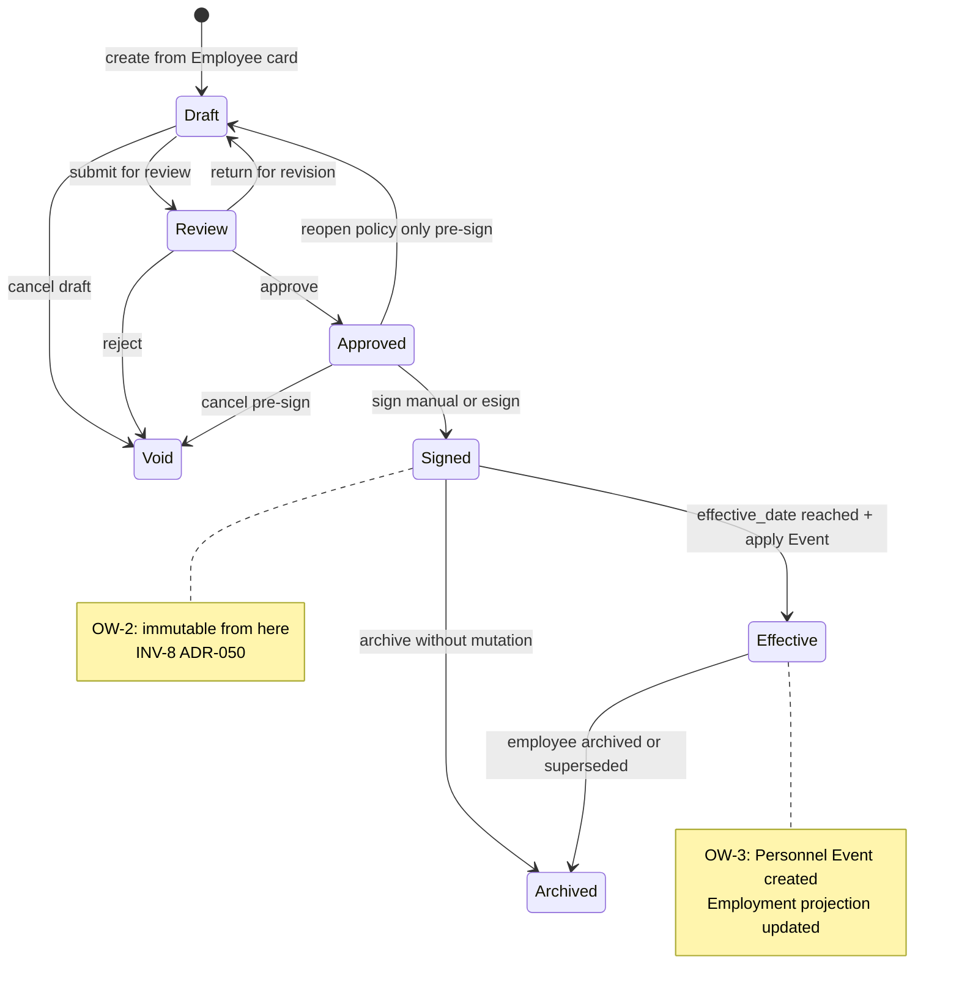
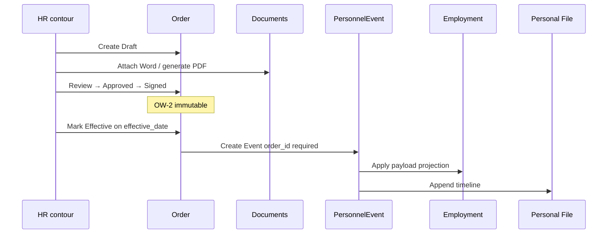
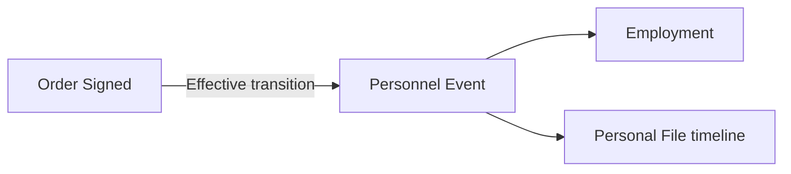

# ADR-051 — Personnel Order Workflow Architecture (Workflow кадровых приказов)

| Поле | Значение |
|------|----------|
| **Статус** | Accepted |
| **Дата** | 2026-06-30 |
| **Принято** | 2026-06-30 |
| **Контекст** | ADR-049 Accepted (роли, контуры); ADR-050 Accepted (Order, Event, Employment, Documents); workflow приказов сознательно вынесен в §5 Non-goals ADR-050 |
| **Связанные документы** | [ADR-049](./ADR-049-administrative-roles-and-responsibility-model.md), [ADR-050](./ADR-050-personnel-lifecycle-architecture.md), [концептуальная модель данных](../концептуальная_модель_данных_и_erd_типовая_инфраструктура_b_2_b.md) |
| **Область действия** | Архитектура workflow кадровых приказов внутри кадрового контура |
| **Вне scope ADR** | Реализация кода, БД, RBAC, API, UI, миграции, ADR-049, ADR-050 |

---

## 1. Контекст и проблема

### 1.1. Зачем нужен документ

[ADR-050](./ADR-050-personnel-lifecycle-architecture.md) зафиксировал:

- **Order** как юридическое основание кадрового решения (INV-11);
- **Personnel Event** только с Order для lifecycle-изменений (INV-12);
- **Documents** как append-only доказательства (INV-7, INV-8);
- Aggregate Root — **Employee** (§4 ADR-050).

Workflow приказов (согласование, подписание, двуязычие, версии Word/PDF, электронная подпись) **намеренно не детализирован** в ADR-050 (§5 Non-goals) и делегирован **ADR-051**.

Без единой модели workflow приказы будут реализованы как «загрузка PDF» или «PATCH статуса», что нарушит INV-8, INV-11 и разделит Event от юридического основания.

### 1.2. Цель ADR-051

Спроектировать **архитектуру workflow кадровых приказов** — жизненный цикл Order, роли, связь Order → Event → Employment, двуязычие, версии документов, точку расширения для электронной подписи — **до написания кода** Phase C (PROJ-ORDERS, PROJ-ORDER-WORKFLOW).

ADR-051 завершает архитектурный фундамент кадрового контура:

```text
ADR-049  →  кто и в каком контуре
ADR-050  →  сущности и lifecycle сотрудника
ADR-051  →  workflow приказов и юридический след
```

### 1.3. Связь с ADR-050 (уточнение, не замена)

ADR-050 §3.5 описывал упрощённый lifecycle: `draft` → `pending_signature` → `signed`. **ADR-051 детализирует** полный workflow:

```text
Draft → Review → Approved → Signed → Effective → Archived
```

Статусы ADR-051 **совместимы** с INV-8 ADR-050: после **Signed** Order immutable; **Effective** — момент порождения Personnel Event.

---

## 2. Границы и Non-goals

### 2.1. Входит в scope ADR-051

| Область | Содержание |
|---------|------------|
| Lifecycle Order | Статусы, переходы, отмена |
| Роли workflow | Создание, review, approve, sign, cancel |
| Order ↔ Event ↔ Employment | Порядок и правила применения |
| Документы приказа | Word-версии, PDF, scan, двуязычие |
| E-sign | Архитектурная точка расширения (adapter) |
| Инварианты workflow | Конституция приказного контура |

### 2.2. Non-goals (ADR-051)

ADR-051 **намеренно не определяет** перечисленное ниже. Эти области решаются отдельными ADR и проектами реализации.

| Non-goal | Делегирование |
|----------|---------------|
| **UI экранов приказов** (layout, wireframes, user journeys) | PROJ-ORDERS, PROJ-ORDER-WORKFLOW |
| **Конкретные таблицы БД**, индексы, миграции | Backend projects, ADR-052 |
| **API endpoints**, OpenAPI, payloads | Backend projects |
| **Конкретная реализация генерации Word/PDF** (LibreOffice, Word API, cloud render) | PROJ-ORDERS |
| **Конкретный провайдер e-sign** (НУЦ РК, DocuSign, qualified certificate, OCSP) | PROJ-ORDER-ESIGN, integration ADR |
| **Template engine** (merge fields, placeholders) | PROJ-ORDERS |
| **Физическое хранилище** (S3, GDrive, blob) | ADR-052 *(planned)* |
| **OCR / распознавание документов** | Отдельный проект |
| **Бухгалтерские начисления**, payroll, GL-проводки | Отдельный integration ADR |
| **Кадровая аналитика**, BI, dashboards | Отдельный проект |
| **Новые role codes** | ADR-049; workflow через permission layer |
| **Изменение Personnel Event catalog** | ADR-050 §10.2 |
| **Изменение ADR-049, ADR-050** | Вне scope |

См. также §18 «Явные ограничения ADR» (запрет изменений в коде/БД в текущей итерации).

---

## 3. Модель Order в workflow

### 3.1. Order как процесс + юридическое основание

**Order** — сущность ADR-050 с дополнительным **workflow-слоем**:

| Слой | Ответственность |
|------|-----------------|
| **Metadata** | `order_number`, `order_type`, `order_date`, `effective_date`, `employee_id`, `employment_id`, язык(и) |
| **Workflow** | Статус, история переходов, участники (created / reviewed / approved / signed) |
| **Legal link** | Связь с Personnel Event (после Effective) |
| **Documents** | Word drafts, PDF, signed scan — через Document (ADR-050) |

Order всегда принадлежит **агрегату Employee** (INV-17 ADR-050).

### 3.2. Типы приказов (архитектурный каталог)

Тип приказа (`order_type`) определяет допустимый **Personnel Event** и обязательность согласующих. Каталог расширяем клиентом; базовые типы:

| order_type | Personnel Event | Требует lifecycle mutation |
|------------|-----------------|----------------------------|
| `hire` | `HIRE` | Да |
| `rehire` | `REHIRE` | Да |
| `transfer` | `TRANSFER` | Да |
| `position_change` | `POSITION_CHANGE` | Да |
| `promotion` | `PROMOTION` | Да |
| `org_unit_change` | `ORG_UNIT_CHANGE` | Да |
| `salary_change` | `SALARY_CHANGE` | Да |
| `leave` | `LEAVE_START` / `RETURN_FROM_LEAVE` | Да |
| `suspension` | `SUSPENSION` / `REINSTATEMENT` | Да |
| `termination` | `TERMINATION` | Да |
| `award` | `AWARD` | Нет (Personal File) |
| `discipline` | `DISCIPLINE` | Нет (Personal File) |
| `terms_change` | `TERMS_CHANGE` | Да |
| `order_cancel` | `ORDER_CANCEL` | Compensating |
| `amendment` | *(compensating)* | По контексту |

---

## 4. Жизненный цикл приказа (Order Lifecycle)

### 4.1. Статусы

| Статус | Смысл | Mutable |
|--------|-------|---------|
| **Draft** | Черновик; редактируются metadata и Word | Да |
| **Review** | На проверке (юрист, руководитель ОК, manager — по типу) | Ограниченно |
| **Approved** | Согласован; готов к подписанию | Metadata locked; Word → final PDF |
| **Signed** | Подписан (ручная подпись или e-sign) | **Immutable** (INV-8) |
| **Effective** | Вступил в силу; создан Personnel Event | Immutable |
| **Archived** | Завершён / сотрудник в архиве / superseded | Read-only |
| **Void** | Отменён **до** Signed | Terminal; не порождает Event |

*Статус `pending_signature` из ADR-050 §3.5 maps to **Approved** (ожидает подписи).*

### 4.2. Диаграмма переходов



### 4.3. Сквозной процесс (target)

```text
1. HR создаёт Draft Order из карточки Employee (order_type, effective_date, payload)
2. Генерация / загрузка Word (ru и/или kk)
3. Submit → Review (опционально по order_type)
4. Approve → Approved
5. Sign → Signed (+ signed PDF / scan Document)
6. На effective_date (или сразу если effective_date ≤ today):
      Signed → Effective
      → создаётся Personnel Event (order_id)
      → обновляется проекция Employment / Employee
7. При архиве сотрудника или supersede → Order Archived
```

### 4.4. Отмена и исправление

| Ситуация | Действие |
|----------|----------|
| Draft / Review | **Void** — без Event, без следов в Employment |
| Approved, ещё не Signed | **Void** или return to Draft по регламенту |
| **Signed / Effective** | **Запрещено** UPDATE Order (INV-8). Только **compensating Order** (`order_cancel` / `amendment`) + `ORDER_CANCEL` Event или новый корректирующий приказ |

### 4.5. Lifecycle hard rules (acceptance)

Непротиворечивый жизненный цикл приказа — **обязательные правила**, проверенные при финальном review:

| # | Правило | Формулировка |
|---|---------|--------------|
| LR-1 | **Signed = immutable** | Статус **Signed** и все последующие (Effective, Archived) — Order **не изменяется** (OW-2, INV-8 ADR-050). Допустимо только добавление audit metadata без изменения юридического содержания. |
| LR-2 | **Void только до Signed** | **Void** допустим из Draft, Review или Approved. Из Signed, Effective, Archived — **Void запрещён**. |
| LR-3 | **Отмена после Signed** | Только **compensating Order** + compensating Personnel Event (OW-17). Прямой void/cancel signed Order **запрещён**. |
| LR-4 | **Effective ≠ PATCH Employment** | Переход Signed → **Effective** **не является** ручным PATCH полей Employee / Employment. Effective **единственным** штатным механизмом порождает Personnel Event; проекция Employment обновляется **только** через Event (OW-3, OW-19). |
| LR-5 | **Линейный happy-path** | Draft → Review → Approved → Signed → Effective → Archived — основная цепочка; Review опционален по `order_type`. |

```text
Mutable zone          │  Immutable zone
Draft … Approved      │  Signed → Effective → Archived
Void allowed here     │  compensating Order only for cancel/amend
```

---

## 5. Order → Personnel Event → Employment

### 5.1. Принцип разделения

```text
Order       = юридическое решение и workflow (ЧТО решили, КОГДА подписали)
Event       = факт в кадровой истории (append-only)
Employment  = проекция состояния периода работы
Personal File timeline = read-model поверх Events
```

**Order сам по себе не изменяет Employment напрямую** — ни в Draft, ни в Signed, ни при ручном «Mark Effective» в UI.

**Только** переход Order в статус **Effective** создаёт **Personnel Event** (из Signed, OW-1). Personnel Event:

1. обновляет **Employment projection** (org_unit, position, period status и т.д.);
2. дополняет **Personal File timeline**;
3. при необходимости обновляет агрегированный статус **Employee** как read-model.

**Запрещено:** PATCH `/employees` или `/employments` как замена Effective; PATCH как способ «применить приказ» (OW-19, INV-12 ADR-050).

### 5.2. Порядок применения



### 5.3. Правила Effective

| Правило | Описание |
|---------|----------|
| OW-3 | Personnel Event создаётся **только** из Order в статусе **Signed**, при переходе в **Effective** |
| OW-4 | `effective_date` Order ≥ `order_date`; Event.effective_date = Order.effective_date |
| OW-5 | Один lifecycle Event на один Effective Order (1:1), кроме compensating flows |
| OW-6 | Order типа `award` / `discipline` → Event без изменения Employment status |
| OW-7 | `HIRE` / `REHIRE` Effective → новый или reactivated Employment per ADR-050 |

### 5.4. Read models

Поля `org_unit_id`, `position_id`, `employment_status` на Employee — **проекции** после Effective Event (P-13 ADR-050).

| Запрещено | Разрешено |
|-----------|-----------|
| PATCH Employee/Employment при смене статуса Order (Draft…Signed) | PATCH non-lifecycle полей Person (контакты) по OQ-50-8 |
| PATCH Employment при «Mark Effective» в обход Event | Effective → auto/manual trigger **создания Event**, Event обновляет projection |
| UI/API, обновляющие Employment до Effective | Scheduled job: Signed + `effective_date` ≤ today → Effective → Event |

### 5.5. Цепочка применения (acceptance summary)

```text
Order (Signed)
    └── transition Effective  ← NOT a PATCH
            └── Personnel Event (1 per multilingual Order)
                    ├── Employment projection
                    └── Personal File timeline
```

---

## 6. Роли и ответственность в workflow

### 6.1. Базовые архитектурные персоны (без новых role codes)

Workflow использует **архитектурные персоны** ADR-049; различие HR руководитель / уполномоченный ОК — через **org_unit scope + permission layer** (ADR-049 OQ-1), не новые codes.

| Архитектурная персона | Role code | Операции с приказом |
|-----------------------|-----------|---------------------|
| **HR руководитель** | `hr` (client) | Владелец: approve, sign *(если регламент)*, cancel policy, void pre-sign |
| **Уполномоченный ОК** | `hr` (org_unit) | Create Draft, edit Draft, submit Review, upload Documents |
| **Согласующий руководитель** | `manager` | Review / approve *(если order_type требует)* — Просмотр + согласование |
| **Подписант** | `hr` или внешняя роль * | Sign — по `signer_policy` организации |
| **Локальный admin** | `admin` | **Нет доступа** к workflow приказов (ADR-049) |
| **Сотрудник** | `employee` | Просмотр own signed orders *(опционально, policy)* |

**Не участвуют в workflow приказов (OW-18, OW-20):**

| Роль / персона | Role code | Доступ к Order workflow |
|----------------|-----------|-------------------------|
| Глобальный / platform admin | `system_admin` | **Нет** (аудит платформы — только Просмотр вне mutating flow, ADR-049) |
| Разработчик платформы | `developer` | **Нет** |
| Локальный / technical admin | `admin` | **Нет** |
| Любая org-tech роль | — | **Нет** mutating operations |

ADR-051 **не вводит новые role codes**. Различие HR руководитель / уполномоченный ОК / manager scope — permission layer поверх `hr` и `manager` (ADR-049 OQ-1).

\* *Подписант* — архитектурная функция; может быть генеральный директор без Account в системе → **manual sign + scan upload** (§9).

### 6.2. Матрица операций

| Операция | Владелец по умолчанию | Делегирование |
|----------|----------------------|---------------|
| **Create** Draft | HR руководитель | Уполномоченный ОК |
| **Edit** Draft | Создатель / HR | Уполномоченный ОК в scope |
| **Submit** Review | HR | Уполномоченный ОК |
| **Review** (комментарий, return) | HR руководитель | Manager *(по order_type)* |
| **Approve** | HR руководитель | *(не делегируется ниже без policy)* |
| **Sign** | HR руководитель или Signer | E-sign adapter (будущее) |
| **Mark Effective** | Система / HR *(auto on date)* | Scheduled job |
| **Void** (pre-Signed) | HR руководитель | — |
| **Cancel** (post-Signed) | HR руководитель | Compensating Order only |

### 6.4. Manager и policy по order_type

**Manager (`manager`)** участвует в workflow **только** если `signer_policy` / `order_type` явно требует согласования (Review / approve). Manager **не** создаёт приказы, **не** подписывает, **не** инициирует Effective, **не** отменяет Signed Orders.

| order_type (пример) | Manager Review | HR Approve | HR Sign |
|---------------------|----------------|------------|---------|
| `transfer`, `termination` | *policy: often yes* | HR руководитель | по signer_policy |
| `hire`, `award` | *policy: optional* | HR руководитель | по signer_policy |
| default | только если `require_manager_approve=true` | HR руководитель | по signer_policy |

### 6.5. signer_policy (концепт организации)

Клиент задаёт **политику подписания** без изменения RBAC:

```text
signer_policy
    default_signer_role     hr_head | director | delegated
    require_manager_approve  true | false by order_type
    esign_enabled            false → manual (Phase 1)
    bilingual_required       true | false
```

---

## 7. Документы приказа: Word, PDF, версии

### 7.1. Роли Document в контексте Order

| document_role | Формат | Статус | Назначение |
|---------------|--------|--------|------------|
| `draft_word` | .docx | editable до Signed | Рабочая версия |
| `draft_word_revision` | .docx | append-only versions | История правок Draft/Review |
| `generated_pdf` | .pdf | final после Approved | Официальный текст до подписи |
| `signed_pdf` | .pdf | immutable | PDF с подписью / штампом |
| `signed_scan` | .pdf/.jpg | immutable | Скан подписанного экземпляра |
| `esign_evidence` | .pdf/.xml | immutable | Пакет доказательств ЭЦП *(future)* |

**Канонический audit trail:** `signed_scan` или `signed_pdf` + `esign_evidence` — ссылка из Order.canonical_document_id.

### 7.2. Version lineage (INV-7 ADR-050)

```text
Order
  └── DocumentGroup (order_id)
        ├── draft_word v1, v2, v3 …     (superseded)
        ├── generated_pdf v1            (final pre-sign)
        ├── signed_pdf v1               (immutable)
        └── signed_scan v1              (immutable, canonical)
```

- Новая правка текста в Draft → **новая version** `draft_word`, не DELETE старой.
- После **Signed** — только новые Document через compensating Order.

### 7.3. Генерация PDF

| Этап | Действие |
|------|----------|
| Approved | Система генерирует `generated_pdf` из approved Word (PROJ-ORDERS) |
| Signed (manual) | HR загружает `signed_scan`; опционально `signed_pdf` |
| Signed (e-sign) | Adapter создаёт `signed_pdf` + `esign_evidence` |

ADR-051 **не** фиксирует engine (LibreOffice, Word API, cloud) — только контракт Document roles.

---

## 8. Двуязычные приказы (русский / казахский)

### 8.1. Архитектурная модель

Для организаций РK и двуязычного делопроизводства Order поддерживает **мультиязычные представления** одного юридического решения:

```text
Order (one decision)
    ├── locale: ru
    │     ├── draft_word (ru)
    │     ├── generated_pdf (ru)
    │     └── signed_scan (ru)
    └── locale: kk
          ├── draft_word (kk)
          ├── generated_pdf (kk)
          └── signed_scan (kk)
```

### 8.2. Принципы

| # | Принцип |
|---|---------|
| OW-8 | **Один Order — одно кадровое решение**; языки — параллельные Document, не дубликаты Order |
| OW-9 | `Order.required_locales[]` задаётся `signer_policy` (напр. `["ru","kk"]`) |
| OW-10 | Переход в **Signed** требует canonical document **для каждого required locale** *(или явное exemption в policy)* |
| OW-11 | Personnel Event создаётся **один** на Order; payload language-neutral |
| OW-12 | Нумерация приказа (`order_number`) — **единая** для всех языковых версий |

### 8.3. Режимы bilingual policy

| Режим | Описание |
|-------|----------|
| **full_bilingual** | ru + kk обязательны для Signed |
| **primary_plus_translation** | canonical — primary locale; kk — optional до Signed |
| **single_locale** | один язык (ru или kk) |

Default для MVP: `single_locale`; `full_bilingual` — Phase C+ без смены модели.

### 8.4. Multilingual hard rules (acceptance)

| # | Правило |
|---|---------|
| ML-1 | **Один Order = одно кадровое решение** (OW-8) |
| ML-2 | ru / kk — **параллельные Document**, не отдельные Order |
| ML-3 | `required_locales[]` — **policy клиента** (OW-9) |
| ML-4 | **Один Personnel Event** на multilingual Order (OW-11) |
| ML-5 | Единый `order_number` для всех locale (OW-12) |

---

## 9. Подписание: manual signature и e-sign

### 9.0. Разделение manual и e-sign (не смешивать)

Ручное подписание и электронная подпись — **два adapter-а** одного перехода **Approved → Signed**. Они **не** создают отдельных lifecycle-веток и **не** меняют модель Order → Event → Employment.

| Аспект | Manual signature (Phase 1) | E-sign (future, adapter) |
|--------|----------------------------|----------------------------|
| **Переход** | Approved → Signed | Approved → Signed *(тот же)* |
| **Подтверждение** | Upload **`signed_scan`** (канонический); опционально `signed_pdf` | Adapter создаёт `signed_pdf` + `esign_evidence` |
| **Personnel Event** | **Не создаёт** | **Не создаёт** |
| **Lifecycle Order** | **Не меняет** (Signed immutable — OW-2) | **Не меняет** (OW-15) |
| **Employment** | **Не меняет** до Effective | **Не меняет** до Effective |
| **При failure** | Order остаётся Approved до успешного upload | Order остаётся **Approved** (OW-16) |
| **Реализация** | PROJ-ORDER-WORKFLOW | PROJ-ORDER-ESIGN |

> **E-sign только обеспечивает переход Approved → Signed.** Event создаётся **исключительно** на Effective (OW-13).

### 9.1. Принцип adapter

Электронная подпись **не меняет** lifecycle Order и **не меняет** связь Order → Event → Employment. Меняется только **механизм** перехода Approved → Signed:

```text
                    ┌─────────────────────┐
                    │   Order (Approved)   │
                    └──────────┬──────────┘
                               │
              ┌────────────────┴────────────────┐
              ▼                                 ▼
    ManualSignAdapter                  ESignAdapter (future)
    upload signed_scan                 provider API
              │                                 │
              └────────────────┬────────────────┘
                               ▼
                    Order status = Signed
                    + canonical Documents
                    + signing_metadata
```

### 9.2. signing_metadata (концепт)

```text
signing_method          manual | esign_nuc_rk | esign_*
signed_at               timestamp
signer_identity_ref     employee_id | external_person_ref
signature_certificate   optional ref Document
provider_payload_ref    optional storage ref
```

### 9.3. Инварианты e-sign

| # | Инвариант |
|---|-----------|
| OW-13 | E-sign **не** создаёт Personnel Event; Event только на **Effective** |
| OW-14 | E-sign **не** обходит Approved; подпись только из Approved |
| OW-15 | Provider swap = замена adapter; Order lifecycle **без изменений** |
| OW-16 | При e-sign failure Order остаётся **Approved**, не Signed |

### 9.4. Non-goals e-sign

Криптопровайдер, OCSP, НУЦ РК integration, qualified certificate — **PROJ-ORDER-WORKFLOW**, не ADR-051.

---

## 10. Architectural Invariants (workflow приказов)

Дополняют §6 ADR-050; при конфликте — **более строгое** правило; obsolescence только новым ADR.

| # | Инвариант |
|---|-----------|
| **OW-1** | Lifecycle Personnel Event **не создаётся** без Order в статусе ≥ **Signed** |
| **OW-2** | Order ≥ **Signed** — immutable (≡ INV-8 ADR-050) |
| **OW-3** | Employment меняется **только** через Effective → Personnel Event |
| **OW-4** | `effective_date` Event = Order.effective_date |
| **OW-5** | 1 Effective Order → 1 primary lifecycle Event (кроме compensating) |
| **OW-6** | Award/Discipline Order — Event без Employment mutation |
| **OW-7** | HIRE/REHIRE Effective — по правилам ADR-050 INV-2…INV-5 |
| **OW-8** | Один Order — одно решение; языки — Document variants |
| **OW-9** | required_locales — policy организации |
| **OW-10** | Signed требует canonical docs per required_locales |
| **OW-11** | Один Event на multilingual Order |
| **OW-12** | order_number един для всех locale |
| **OW-13** | E-sign не порождает Event |
| **OW-14** | E-sign только из Approved |
| **OW-15** | Adapter replaceable; lifecycle stable |
| **OW-16** | E-sign fail → остаётся Approved |
| **OW-17** | **Void** — только до Signed; отмена Signed/Effective — **только compensating Order** |
| **OW-18** | Workflow приказов — кадровые роли (`hr`, `manager` по policy); **admin не участвует** |
| **OW-19** | **Effective ≠ PATCH Employment**; Effective порождает Event, Event — единственный mutator projection |
| **OW-20** | **`system_admin`, `developer`, `admin`** — **не участвуют** в mutating Order workflow (OW-18 расширен) |
| **OW-21** | Manual sign подтверждается **`signed_scan`** (или policy-defined canonical); e-sign — adapter, тот же Signed |

---

## 11. Нумерация приказов (решение OQ-50-7)

| Решение | Описание |
|---------|----------|
| **Формат** | `{client_code}-{order_type_prefix}-{YYYY}-{seq}` *(пример)* |
| **Scope seq** | Сквозная нумерация **внутри client** по calendar year |
| **Uniqueness** | `order_number` unique per client |
| **Reservation** | Номер присваивается при переходе **Draft → Review** или при **Approved** — настраиваемо; **не** при Signed |

*Деталь формата — PROJ-ORDERS; ADR фиксирует: номер immutable после assignment.*

---

## 12. Шаблоны приказов (решение OQ-50-4)

| Решение | Описание |
|---------|----------|
| **Каталог** | Client-local templates; global — только platform seed / copy-on-onboarding |
| **Версия шаблона** | `template_id` + `template_version` на Order Draft |
| **Locale** | Отдельный template per locale (ru.docx, kk.docx) |
| **Binding** | Order Draft ссылается на template; generated PDF — snapshot |

---

## 13. Alignment with ADR-049 and ADR-050

### 13.1. ADR-049 — без изменений

- Role codes **не меняются**; ADR-051 **не вводит** новые codes.
- Владелец приказов — **HR руководитель** (ADR-049 §4.3).
- **Не участвуют** в mutating workflow: `system_admin`, `developer`, `admin` (OW-20).
- **Manager** — только Review/approve **где разрешено policy** по `order_type` (§6.4).
- Account / Access — вне scope (INV-13 ADR-050).

### 13.2. ADR-050 — уточнения

| ADR-050 | ADR-051 |
|---------|---------|
| Order lifecycle упрощён | Детализирован: Draft…Archived |
| «Workflow — ADR-051» | **Этот документ** |
| INV-8 signed immutable | OW-2 + статусы Signed/Effective |
| INV-11 Event requires Order | OW-1, OW-3 |
| Document multi-representation §11.2 | §7 document_role + bilingual §8 |
| Non-goals workflow | Закрыты в ADR-051 |

### 13.3. Точка входа

Все приказы создаются из **карточки Employee / Personal File** (INV-16 ADR-050), не из org-tech разделов.

---

## 14. Gap analysis: As-Is → Target

| # | As-Is | Target (ADR-051) |
|---|-------|------------------|
| 1 | Нет Order entity | Order + workflow statuses |
| 2 | Нет приказов | Draft → … → Effective |
| 3 | PATCH employee status | Event on Effective only |
| 4 | Нет document versions | Word/PDF/scan lineage §7 |
| 5 | Нет bilingual | locale model §8 |
| 6 | Нет sign workflow | Manual → ESign adapter §9 |
| 7 | ADR-049 OQ-9 open | **Closed** in ADR-051 |
| 8 | ADR-050 OQ-50-4, OQ-50-7 | **Closed** §11, §12 |

---

## 15. Roadmap и проекты

| Phase | Проект | Содержание ADR-051 |
|-------|--------|---------------------|
| C | **PROJ-ORDERS** | Order entity, statuses, numbering, templates |
| C | **PROJ-ORDER-WORKFLOW** | Review/Approve/Sign UI + state machine |
| C | **PROJ-DOCUMENTS** | Document roles, versioning (with ADR-052) |
| C+ | **PROJ-ORDER-ESIGN** | ESignAdapter implementation |
| C+ | **PROJ-ORDER-BILINGUAL** | full_bilingual policy |

**Зависимости:** Phase A (PROJ-EVENTS) должна быть готова **до** Effective automation; Order Draft может параллелиться.

---

## 16. Будущие ADR

| ADR | Тема |
|-----|------|
| **ADR-052** | Document storage, retention |
| **ADR-053** | Person / Employee migration |
| **ADR-054** | Termination ↔ Account |
| **ADR-055+** | Leave, Transfer, … |

---

## 17. Открытые вопросы

| # | Вопрос | Owner |
|---|--------|-------|
| OQ-51-1 | Auto Effective: cron vs manual HR confirm? | PROJ-ORDER-WORKFLOW |
| OQ-51-2 | Manager approve: обязателен для transfer/termination? | Client policy template |
| OQ-51-3 | Director без Account: только scan workflow? | PROJ-ORDER-WORKFLOW |
| OQ-51-4 | primary locale default ru vs kk per client? | Onboarding config |
| OQ-51-5 | Concurrent draft orders same employee? | PROJ-ORDERS |

---

## 18. Что НЕ делать

| Область | Статус |
|---------|--------|
| Код, API, БД, UI | Без изменений |
| ADR-049, ADR-050 | Без изменений |
| RBAC role codes | Без изменений |

---

## 19. Чеклист review (приказы)

- [ ] Lifecycle: Draft → Review → Approved → Signed → Effective → Archived (LR-1…LR-5, §4.5).
- [ ] **Signed** immutable; **Void** только до Signed (LR-2, OW-17).
- [ ] Post-Signed cancel — **compensating Order** only (LR-3, OW-17).
- [ ] **Effective ≠ PATCH Employment**; только Event mutates projection (OW-3, OW-19, §5.5).
- [ ] Order в контексте Employee aggregate (INV-17 ADR-050).
- [ ] Bilingual: один Order, locale Documents, один Event (ML-1…ML-4, §8.4).
- [ ] Manual: `signed_scan`; e-sign: adapter Approved → Signed only (§9.0, OW-13…OW-16, OW-21).
- [ ] `system_admin` / `developer` / `admin` **не** в workflow (OW-20).
- [ ] Manager — только по policy (§6.4).
- [ ] Non-goals не реализуются в scope ADR-051 (§2.2).

---

## 20. Итоговая схема

```text
Employee (Aggregate Root)
    │
    └── Order: Draft → Review → Approved → Signed → Effective → Archived
              │                              │         │
              ├── Documents (Word/PDF/scan)  │         └── Personnel Event
              └── locales: ru | kk           │                   └── Employment projection
                                             └── signing: manual | ESignAdapter
```

---

## 21. Диаграммы

### 21.1. Order lifecycle (compact)

```mermaid
stateDiagram-v2
    direction LR
    Draft --> Review --> Approved --> Signed --> Effective --> Archived
    Draft --> Void
    Review --> Void
    Approved --> Void
    Signed --> Archived
```

### 21.2. Order–Event–Employment



---

*ADR-051 — Accepted. Завершает архитектурный фундамент кадрового контура (ADR-049 → ADR-050 → ADR-051). Реализация Phase A–E опирается на эти три документа без возврата к базовым решениям.*
