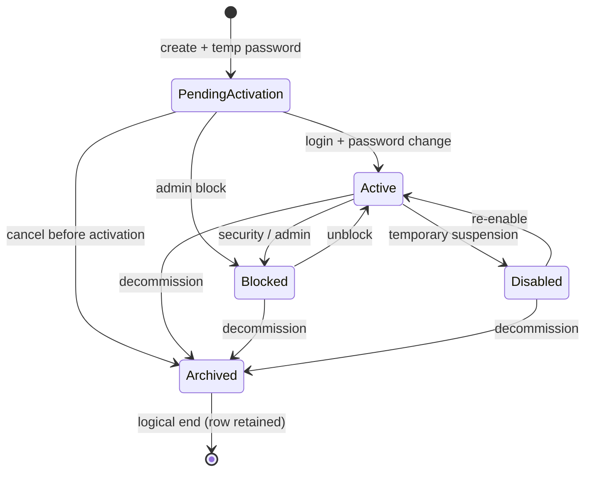

# ADR-052 — Platform Account Lifecycle

| Поле | Значение |
|------|----------|
| **Статус** | **Accepted** |
| **Дата** | 2026-07-01 |
| **Принято** | 2026-07-01 |
| **Контекст** | PROJ-PLATFORM-ACCOUNT-LIFECYCLE Phase A; [assessment](../assessments/PROJ-PLATFORM-ACCOUNT-LIFECYCLE-assessment.md); PROJ-ACCESS-ADMIN Stage 2 closed; [PROJ-PERSONNEL-CONTOUR assessment](../assessments/PROJ-PERSONNEL-CONTOUR-assessment.md) (orthogonal HR contour) |
| **Связанные документы** | [ADR-049](./ADR-049-administrative-roles-and-responsibility-model.md), [ADR-050](./ADR-050-personnel-lifecycle-architecture.md), [ADR-051](./ADR-051-personnel-order-workflow-architecture.md), [PROJ-ACCESS-ADMIN Stage 2 Closure](../assessments/PROJ-ACCESS-ADMIN-stage-2-closure.md), [PROJ-PERSONNEL-CONTOUR assessment](../assessments/PROJ-PERSONNEL-CONTOUR-assessment.md), [ARCHITECTURE_GOVERNANCE](../ARCHITECTURE_GOVERNANCE.md), [HR Domain Glossary](../reference/hr-domain-glossary.md), [документ №15 — RBAC](../../specs/документ_№_15.md) |
| **Область действия** | Жизненный цикл **Platform Account** — учётных записей платформенного контура (`employee_id IS NULL`, platform roles) |
| **Вне scope ADR** | Organization Account lifecycle; Local Admin contour (`/client/{id}#accounts`); RBAC role codes; Person/Employee lifecycle; реализация кода/API/БД/UI |

---

## 1. Контекст и проблема

### 1.1. Зачем нужен документ

[ADR-049 §3.1, §7.5](./ADR-049-administrative-roles-and-responsibility-model.md) фиксирует, что системные учётные записи (`system_admin`, `developer`) **могут существовать без** `employee_id`, и задаёт высокоуровневый lifecycle (создание → активация → block → archive). Реализация as-is ограничена bootstrap через env ([`app/system_admin.py`](../../app/system_admin.py)); UI `/users` содержит placeholder «Платформенные аккаунты»; политики password, audit, recovery **не формализованы**.

[Assessment PROJ-PLATFORM-ACCOUNT-LIFECYCLE](../assessments/PROJ-PLATFORM-ACCOUNT-LIFECYCLE-assessment.md) исследовал варианты ownership, state machine и политики. **ADR-052 принимает решения** для реализации PROJ-PLATFORM-ACCOUNT-LIFECYCLE Phase B+.

### 1.2. Разделение контуров (не меняется)

```text
Platform Account        Organization Account
employee_id IS NULL     employee_id NOT NULL → Employee → Client
Global Admin /users     Local Admin #accounts
system_admin, developer admin, hr, manager, employee
```

**Local Admin contour заморожен** ([Stage 2 Closure](../assessments/PROJ-ACCESS-ADMIN-stage-2-closure.md)). ADR-052 **не изменяет** org-bound accounts API, UI, policies.

### 1.3. Цель ADR-052

Зафиксировать **единую архитектурную модель** Platform Account: ownership, типы, state machine, delete/archive, password/login/security, audit baseline, invariants и границы MVP Phase B.

---

## 2. Решение (summary)

| Область | Решение |
|---------|---------|
| Ownership | Platform Account **без** Employee (`employee_id IS NULL`); optional `display_name` / `owner_note` для human attribution |
| `account_kind` | `standard` \| `service` \| `break_glass` |
| Multiplicity | Один человек: **один** Platform Account + **отдельный** Organization Account допускается; **несколько** Platform Accounts на одного человека — **запрещено** (MVP) |
| Terminal state | **`archived` only**; hard delete Platform Account **запрещён** |
| Last admin | **INV-PA-1:** нельзя archive/block последнего operational `system_admin` |
| Password | Temp on create/reset; `must_change_password`; TTL 72h; history N=5 (Phase C) |
| Lockout | 5 failed logins → 15 min lock (Phase C) |
| Login | Global unique; rename by Global Admin + audit |
| Audit | Append-only baseline 13 event types; scope `platform` |
| Implementation gate | Phase B — после **Accept** ADR-052 |

---

## 3. Определения

### 3.1. Platform Account

**Platform Account** — запись `Account`, для которой одновременно:

1. `employee_id IS NULL`
2. Назначена ≥1 platform role: `system_admin` или `developer` ([`PLATFORM_ROLE_CODES`](../../app/system_admin.py))
3. Non-platform roles **не допускаются** на Platform Account

Platform Account **не является** кадровой сущностью и **не входит** в Employee Aggregate (ADR-050).

### 3.2. Organization Account (reference)

Org-bound `Account` с `employee_id NOT NULL`. Lifecycle — org-tech contour; **вне scope** ADR-052. Hard delete as-is **не пересматривается** этим ADR.

### 3.3. Account Archive vs Employee Archive

| Термин | Контур | Смысл |
|--------|--------|-------|
| `account.status = archived` | Platform / org-tech | Terminal state учётной записи; вход запрещён; audit retained |
| Employee Archive | HR (ADR-050) | Кадровый архив; **не** block/delete Account |

**INV-PA-5:** Account archive **≠** Employee archive (ADR-049 OQ-14).

---

## 4. Ownership model

### 4.1. Принятое решение: service account без Employee

Platform Account **всегда** имеет `employee_id IS NULL`. Связь Person → Employee → Account **не обязательна** для платформенного контура.

**Обоснование:** соответствие ADR-049 §7.5 as-is; разделение platform / org; поддержка service и break-glass без «фиктивных» Employee; bootstrap break-glass без amendment ADR-049.

**Отклонено (MVP):**

- **OW-A** — обязательная привязка Platform Account к Employee (в т.ч. dual-hat на Employee клиента)
- **OW-A2** — platform role на Employee существующего Client

### 4.2. Human attribution (без Employee FK)

| Поле | Обязательность | Назначение |
|------|----------------|------------|
| `login` | required | Уникальный идентификатор входа |
| `display_name` | optional (recommended for `standard`) | UI / audit readable label |
| `owner_note` | optional | Свободный текст: ФИО, контакт, ticket ref |

Audit **actor** — всегда `actor_account_id` (Global Admin, выполнивший операцию). `owner_note` **не заменяет** audit.

### 4.3. Multiplicity (dual-hat без связывания записей)

| Правило | MVP |
|---------|-----|
| **INV-PA-2 (D2):** один человек может иметь **Organization Account** (org login) **и** отдельный **Platform Account** (platform login) | ✅ Allowed |
| **INV-PA-3 (D3):** один человек — **не более одного** Platform Account | ✅ Enforced (policy + UI/API validation; см. OQ-1) |
| Platform Account с `employee_id NOT NULL` | ❌ Forbidden |
| Один login — platform + org roles на одной записи | ❌ Forbidden (platform roles only on `employee_id IS NULL`) |

Org Account: по-прежнему **один Account на Employee** (Stage 2G; frozen).

### 4.4. Optional future: `owner_person_id`

Связь Platform Account → Person **без** Employee — **не входит в MVP**. Может быть добавлена отдельным ADR/amendment (OQ-2).

---

## 5. Account kind (`account_kind`)

### 5.1. Допустимые значения

| `account_kind` | Назначение | Типичные roles | Создание (target) |
|----------------|------------|----------------|-------------------|
| `standard` | Operational Global Admin: handoff, delegation | `system_admin` | UI `/users` + API |
| `service` | Automation, CI, named bot operators | `developer` (primary) | UI + API |
| `break_glass` | Emergency recovery; env-backed | `system_admin` | Bootstrap / env **only** |

Ровно **один** `account_kind` на Platform Account; immutable после create **или** change только через archive + recreate (OQ-3).

### 5.2. Политики по kind

| Policy | `standard` | `service` | `break_glass` |
|--------|------------|-----------|---------------|
| UI create/edit | ✅ | ✅ | ❌ (bootstrap only) |
| Archive via API | ✅ (INV-PA-1) | ✅ | ❌ if last break-glass `system_admin` (OQ-4) |
| Password reset via UI | ✅ | ✅ | ⚠️ Prefer env sync; UI reset allowed with enhanced audit |
| Shared login (team account) | ❌ | ❌ | ❌ |
| `must_change_password` on create | ✅ default | ✅ default | ⚠️ Exception: env bootstrap may set permanent (documented) |

### 5.3. Bootstrap break-glass

Существующий путь [`bootstrap_system_admin`](../../app/system_admin.py) + `SYSTEM_ADMIN_*` env — **канонический** create/sync для `account_kind=break_glass`. При sync: reconcile role, optional password, `employee_id=NULL`.

---

## 6. State machine

### 6.1. Статусы (`account.status`)

| Status | Вход | Описание |
|--------|------|----------|
| `pending_activation` | ❌ | Создан; выдан temp password; `must_change_password=true` |
| `active` | ✅ | Нормальная эксплуатация |
| `blocked` | ❌ | Security / administrative lock |
| `disabled` | ❌ | Временная операционная пауза (отпуск, делегирование) |
| `archived` | ❌ | Terminal; immutable; audit retained |

**Не используется:** отдельный `created` — merge в `pending_activation` при create.

Org accounts **не обязаны** adopt этот enum в MVP (frozen contour).

### 6.2. Диаграмма переходов



### 6.3. Semantics: blocked vs disabled

| | `blocked` | `disabled` |
|---|-----------|------------|
| Причина | Security incident, compromise, offboarding | Planned pause |
| Audit event | `account.blocked` | `account.disabled` |
| Recovery | Unblock + optional password reset | Enable |

### 6.4. Auth gate

Login **разрешён** только при `status = active` **и** не истёк temp password TTL **и** не active lockout **и** `must_change_password` handled (redirect to change-password if true — Phase C).

As-is check `status == active` ([`app/routers/auth.py`](../../app/routers/auth.py)) расширяется в Phase C; Phase B may create accounts in `pending_activation`.

---

## 7. Archive vs hard delete

### 7.1. Решение

| Operation | Platform Account | Organization Account |
|-----------|------------------|----------------------|
| **Hard delete** (`DELETE` row) | ❌ **Forbidden** | As-is (frozen; unchanged by this ADR) |
| **Archive** (`status → archived`) | ✅ **Only** terminal decommission | Out of scope |

### 7.2. Поведение archived Platform Account

- Row и `AccountRole` history **сохраняются** (read-only)
- Mutating operations **запрещены** (PATCH except no-op, reset, delete)
- Login **запрещён**
- Audit events **не удаляются**
- Pseudonymize login (`archived_{id}`) — **Phase D optional** (OQ-5)

### 7.3. API surface (intent)

- `POST /api/platform-accounts/{id}/archive` — canonical decommission
- `DELETE /api/platform-accounts/{id}` — **must return 405 or 403** (implementation Phase B)

---

## 8. Invariants

| ID | Invariant | Enforcement |
|----|-----------|-------------|
| **INV-PA-1** | ≥1 Platform Account с role `system_admin` и `status ∈ {active, disabled}` всегда существует | Archive/block API rejects if violation |
| **INV-PA-2** | Dual-hat: org Account + platform Account — separate rows, separate logins | Allowed |
| **INV-PA-3** | Max **one** Platform Account per natural person (MVP) | API/UI policy (OQ-1) |
| **INV-PA-4** | Platform Account: `employee_id IS NULL` | DB constraint or app invariant |
| **INV-PA-5** | `account.status=archived` ≠ Employee Archive | Documentation + glossary |
| **INV-PA-6** | Platform roles only on Platform Accounts | Existing `_ensure_system_admin_role` pattern |
| **INV-PA-7** | Hard delete Platform Account forbidden | API policy |

**INV-PA-1 scope:** учитываются `account_kind ∈ {standard, break_glass}` с role `system_admin`. `disabled` counts as operational (recoverable). `archived` and `blocked` — not.

---

## 9. Password policy

### 9.1. Create and reset

| Rule | Value |
|------|-------|
| Default on UI create | System-generated **temporary password**; shown **once** in API response |
| On admin reset | New temp password; `must_change_password = true` |
| `must_change_password` | While true: only change-password + logout endpoints allowed (Phase C) |
| Temp password TTL | **72 hours** default; expired → login denied until admin reset (Phase C) |
| Min password length (platform) | **12** characters |
| Password history | Last **N=5** hashes; reuse forbidden (Phase C) |
| Bootstrap break-glass | Env password may bypass temp flow; **documented exception** |

Password **never** logged or stored in audit payload.

### 9.2. Self-service

| Scenario | MVP |
|----------|-----|
| Forgot password (platform) | **No** self-service; another Global Admin resets |
| Change password (authenticated) | Phase C: `POST /api/auth/change-password` |
| Email/SMS delivery of temp | Out of scope Phase B–C (OQ-6) |

---

## 10. Lockout policy

| Parameter | Value | Phase |
|-----------|-------|-------|
| Failed attempts threshold | **5** | C |
| Lock duration | **15 minutes** | C |
| Scope | Platform Account logins only (initially) | C |
| Counter storage | Account fields or login_events table | C |
| Audit | `account.login_failed`; optional alert on lockout | C |

Permanent block after lockout **не применяется** — только temporary lock; repeated abuse → manual `blocked` by admin.

---

## 11. Login policy

### 11.1. Uniqueness

- `login` **globally unique** across all accounts (platform + org) — **сохраняется** as-is
- Case normalization: store/compare **lowercase** (implementation Phase B)

### 11.2. Rename

- Global Admin may change `login` via PATCH
- Mandatory audit: `account.login_changed` with `old_login`, `new_login`
- Uniqueness re-validated on rename

### 11.3. Naming rules

| Rule | Constraint |
|------|------------|
| Length | 3–64 characters |
| Charset | `[a-z0-9._-]` after normalization |
| Reserved words | `root`, `system`, `admin` — warn or block (implementation choice) |
| Shared team logins | **Forbidden** |

### 11.4. Employee name changes

Platform Account **не связан** с Employee → смена ФИО **не влияет** на `login`. Auto-sync login from Employee name **запрещён**.

---

## 12. Audit baseline

### 12.1. Storage

- Append-only table `audit_events` (or `platform_audit_events`) with `scope = platform`
- Fields (minimum): `id`, `event_type`, `actor_account_id`, `target_account_id`, `payload` (JSON), `created_at`
- **Retention:** ≥ **1 year** default (configurable — OQ-7)
- Dual-write to structured logs (SIEM) — Phase D optional

### 12.2. Event types (baseline)

| event_type | Trigger |
|------------|---------|
| `account.created` | Platform account created |
| `account.activated` | First successful login + password change → active |
| `account.roles_changed` | Role assign/unassign |
| `account.blocked` | → blocked |
| `account.unblocked` | blocked → active |
| `account.disabled` | → disabled |
| `account.enabled` | disabled → active |
| `account.password_reset` | Admin reset (no password in payload) |
| `account.password_changed` | User changed password |
| `account.login_success` | Successful auth |
| `account.login_failed` | Failed auth |
| `account.archived` | → archived |
| `account.login_changed` | Login renamed |

**Phase B minimum subset:** `created`, `roles_changed`, `blocked`, `unblocked`, `archived`, `password_reset`.

### 12.3. Visibility

- **Global Admin:** read platform audit
- **Local Admin / HR:** **no access** to platform audit
- Org account audit unified table — **future** (OQ-8)

---

## 13. Recovery

| Scenario | Procedure |
|----------|-----------|
| Forgot password | Global Admin → reset → temp + must_change |
| Blocked account | Global Admin → unblock (+ optional reset) |
| All UI admins locked | **break_glass** via env bootstrap (`SYSTEM_ADMIN_SYNC`) |
| Compromised account | block → reset → audit review → unblock |
| Last `system_admin` at risk | INV-PA-1 prevents archive/block |

---

## 14. Administrative ownership (API / UI)

| Surface | Owner | Notes |
|---------|-------|-------|
| `GET/POST/PATCH /api/platform-accounts` | Global Admin (`system_admin`) | New namespace; **not** `/api/accounts` |
| `/users` → «Платформенные аккаунты» | Global Admin | Wire Phase B |
| Bootstrap break-glass | Ops / env | Existing scripts |
| Organization accounts | Unchanged | Local Admin + Global Admin as today |

**Role codes:** без изменений (`system_admin`, `developer`). Новые codes — **отдельный ADR**.

---

## 15. MVP Phase B — scope

### 15.1. In scope (Phase B implementation)

| Deliverable | ADR reference |
|-------------|---------------|
| ADR-052 **Accepted** | Gate |
| Schema: `account_kind`, `display_name`, `owner_note`, `must_change_password`, `last_login_at`, status enum | §5–6, §9 |
| `GET/POST/PATCH /api/platform-accounts` | §14 |
| `POST .../archive`; deny hard delete | §7 |
| INV-PA-1 guard on archive/block | §8 |
| Audit table + Phase B event subset | §12 |
| `/users` platform section: list, create (temp password once) | §14 |
| Bootstrap: tag/sync existing account as `break_glass` | §5.3 |
| Tests: authz, last-admin guard, audit append | — |

### 15.2. Deferred (Phase C+)

| Item | Phase |
|------|-------|
| Auth: must_change redirect, change-password endpoint | C |
| Temp password TTL enforcement | C |
| Lockout 5/15min | C |
| Password history N=5 | C |
| Full audit event set (login_success/fail) | C |
| Audit viewer UI | D |
| Archive UX with reason field | D |
| Email temp password delivery | D / OQ-6 |
| MFA | E / OQ-9 |

### 15.3. Explicitly out of scope

| Item | Reason |
|------|--------|
| Organization Account lifecycle changes | Local Admin frozen |
| `/api/accounts`, `/client/{id}#accounts` behavior | Stage 2 closure |
| RBAC engine, new role codes | ADR-049 §8 |
| Person / Employee model | ADR-050 |
| Platform Account → Employee FK | Rejected §4.1 |
| HR termination → auto-block org account | ADR-049 OQ-10 |
| Unified org + platform audit UI | Future ADR |
| Event-sourced lifecycle (assessment variant D) | Over-engineering |

---

## 16. Соответствие ADR-049

| ADR-049 | ADR-052 |
|---------|---------|
| §3.1 Global Admin lifecycle | Detailed state machine §6 |
| §7.5 Platform accounts without employee_id | **Confirmed** §4.1 |
| §7.4 Contour separation | Platform API separate; org frozen |
| §7.5 Org account requires Employee | Unchanged |
| OQ-4 reset password actors | Global Admin for platform §9 |
| OQ-14 archive vs HR archive | INV-PA-5 §3.3 |

**Amendment ADR-049 не требуется** при Accept ADR-052.

---

## 17. Открытые вопросы

| # | Question | Blocker? | Default if unresolved |
|---|----------|----------|------------------------|
| OQ-1 | Как enforce INV-PA-3 (one platform account per person) без Person FK? | Phase B | Manual `owner_note` + admin attestation; API rejects duplicate `owner_note` pattern optional |
| OQ-2 | Ввести optional `owner_person_id` UUID? | No | Defer post-MVP |
| OQ-3 | `account_kind` immutable after create? | No | Immutable in MVP |
| OQ-4 | Archive last `break_glass` if another `standard system_admin` exists? | Phase B | Allow archive if INV-PA-1 satisfied |
| OQ-5 | Pseudonymize login on archive? | No | Defer Phase D |
| OQ-6 | Out-of-band temp password (email)? | No | One-time API response only |
| OQ-7 | Audit retention period beyond 1 year? | No | 1 year default |
| OQ-8 | Single `audit_events` table for platform + org? | No | Platform scope column in MVP |
| OQ-9 | MFA for platform accounts? | No | Phase E |

---

## 18. Последствия

### Положительные

- Единая модель Platform Account для Phase B–D
- Согласованность с ADR-049 без amendment
- Break-glass сохранён; operational admins через UI
- Audit trail с первого дня Phase B

### Costs

- Новый API namespace и schema migration
- Phase C auth changes
- Enforcement INV-PA-3 без Person FK — operational discipline

### Зависимые проекты

1. **PROJ-PLATFORM-ACCOUNT-LIFECYCLE** Phase B–D
2. HR Glossary — sync terms: Platform Account, `account_kind`, `archived` (account)
3. Optional **ADR-053** — audit retention / org unification (if needed)

---

## 19. Чеклист для реализации (Phase B)

- [x] ADR-052 **Accepted**
- [ ] Platform Account: `employee_id IS NULL` enforced
- [ ] `account_kind` enum seeded for bootstrap account
- [ ] No hard delete platform endpoint
- [ ] INV-PA-1 tested
- [ ] Audit append on create/archive/role change
- [ ] Local Admin routes untouched
- [ ] Assessment cross-reference updated

---

## 20. История

| Дата | Изменение |
|------|-----------|
| 2026-07-01 | Proposed — первый draft на основе [assessment](../assessments/PROJ-PLATFORM-ACCOUNT-LIFECYCLE-assessment.md) |
| 2026-07-01 | **Accepted** — финальный review: согласовано с ADR-049/050/051, [PROJ-PERSONNEL-CONTOUR assessment](../assessments/PROJ-PERSONNEL-CONTOUR-assessment.md), [Stage 2 Closure](../assessments/PROJ-ACCESS-ADMIN-stage-2-closure.md); противоречий нет; amendment ADR-049 не требуется; Organization Account lifecycle / HR termination (ADR-054) вне scope; Phase B **не начата** |

---

*ADR-052 — Accepted. Жизненный цикл Platform Account (`employee_id IS NULL`, platform roles). Ортогонален кадровому контуру (ADR-050/051). Реализация — PROJ-PLATFORM-ACCOUNT-LIFECYCLE Phase B+ после Accept.*

---

## Appendix A. Assessment → ADR decision map

| Assessment | ADR-052 |
|--------------|---------|
| OW-B service without Employee | §4.1 Accepted |
| OW-C account_kind | §5 Accepted |
| OW-D D2 yes, D3 no | §4.3 INV-PA-2, INV-PA-3 |
| State machine variant B | §6 |
| Archive only (P2) | §7 |
| Password T2, M1+M2, 72h, N=5 | §9 |
| Lockout F1 | §10 |
| Login U1, C2 | §11 |
| Audit 13 events | §12 |
| Phase B scope | §15 |
