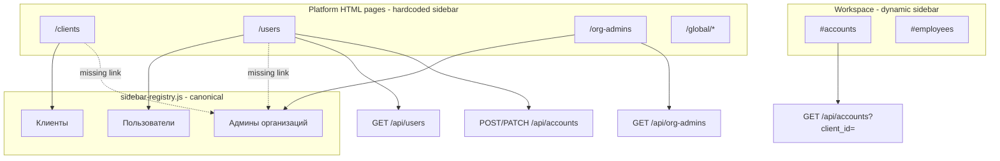

# PROJ-ACCESS-ADMIN Assessment

| Поле | Значение |
|------|----------|
| **Проект** | PROJ-ACCESS-ADMIN — Administrative Access UI & Client Display Names |
| **Дата** | 2026-07-01 |
| **Статус** | Assessment (без реализации) |
| **Основание** | [ARCHITECTURE_GOVERNANCE](../ARCHITECTURE_GOVERNANCE.md), [ADR-049](../adr/ADR-049-administrative-roles-and-responsibility-model.md), [ADR-050](../adr/ADR-050-personnel-lifecycle-architecture.md), [ADR-051](../adr/ADR-051-personnel-order-workflow-architecture.md), [HR Domain Glossary](../reference/hr-domain-glossary.md), [HR Contour Implementation Roadmap](../roadmap/hr-contour-implementation-roadmap.md) |

---

## Executive Summary

Три UX-замечания по административному контуру имеют **общий корень**: платформенный UI доступа построен на **дублирующих экранах и разрозненных sidebar**, а модель клиента не разделяет **юридическое** и **компактное** отображение.

**As-is:**

- Global Admin видит два пересекающихся раздела: «Пользователи» (`/users`) и «Админы организаций» (`/org-admins`).
- Пункт «Админы организаций» **есть только** на странице `/org-admins`; на `/clients`, `/users`, `/global/*`, `/wizard`, `/regulations` — **отсутствует** (hardcoded sidebar).
- Канонический реестр навигации (`sidebar-registry.js`) содержит оба пункта, но **платформенные HTML-страницы его не используют** (динамический sidebar — только в `/client/{id}` workspace).
- Локальный admin уже имеет журнал «Аккаунты» (`#accounts` в workspace); Global Admin управляет теми же сущностями через `/users` + `/api/accounts`, но **без колонки ролей** в списке.
- Модель `Client` имеет `code` и `name`, **без** `display_name`; длинные названия попадают в таблицы, dropdown и sidebar.

**Target (без изменения Accepted ADR):**

- Единый платформенный раздел **«Учётные записи»** (или «Доступы») — все Account по всем организациям с фильтрами; «Админы организаций» — **preset фильтра**, не отдельный раздел.
- Сворачиваемый **role-responsibility banner** для Global Admin и Local Admin.
- `Client.display_name` (nullable) для компактного UI; `name` остаётся полным/юридическим именем.
- Усиление границы HR ↔ admin: sidebar + read API для журнала «Аккаунты».

**Оценка сложности:** **Medium** (2–4 sprint-этапа, ~8–15 dev-days суммарно при поэтапной поставке).

**Критический вывод:** объединение UI **не требует** изменения RBAC, role codes или Accepted ADR-049; достаточно консолидации read-model API, платформенных страниц и sidebar. `display_name` — additive migration без breaking changes.

---

## 1. Current State

### 1.1. Global Admin sidebar

| Источник | Содержимое platform-меню |
|----------|--------------------------|
| [`static/shared/sidebar-registry.js`](../../static/shared/sidebar-registry.js) | Клиенты → **Админы организаций** → Пользователи → Мастer onboarding (+ глобальные справочники) |
| Hardcoded HTML (`/clients`, `/users`, `/global/*`, `/wizard`, `/regulations`) | Клиенты → Пользователи → Мастер onboarding — **без «Админы организаций»** |
| [`static/org-admins/index.html`](../../static/org-admins/index.html) | Клиенты → **Админы организаций** → Пользователи → Мастер onboarding |

**Причина «исчезновения» раздела:** платформенные страницы дублируют sidebar вручную и **не синхронизированы** с `sidebar-registry.js`. Workspace (`/client/{id}`) использует [`static/shared/sidebar.js`](../../static/shared/sidebar.js) + registry и показывает полное меню для Global Admin.

### 1.2. Раздел «Админы организаций»

| Аспект | Реализация |
|--------|------------|
| Route (HTML) | `GET /org-admins` → [`app/main.py`](../../app/main.py), [`static/org-admins/index.html`](../../static/org-admins/index.html) |
| API | `GET /api/org-admins?client_id=` → [`app/routers/org_admins.py`](../../app/routers/org_admins.py) |
| Данные | Account + Employee, фильтр `Role.code == "admin"`, scope — одна организация |
| UI | Dropdown организации; таблица: Логин, Сотрудник, Статус; ссылка «Аккаунты →» в workspace |
| RBAC | Global Admin — полный доступ; Org Admin — только свой `client_id` (`assert_client_access`) |
| Mutations | **Нет** — read-only реестр |

### 1.3. Раздел «Пользователи»

| Аспект | Реализация |
|--------|------------|
| Route (HTML) | `GET /users` → [`static/users/index.html`](../../static/users/index.html) |
| List API | `GET /api/users` → [`app/routers/users.py`](../../app/routers/users.py) |
| CRUD API | `POST/PATCH/DELETE /api/accounts` → [`app/routers/accounts.py`](../../app/routers/accounts.py) |
| Данные списка | Account ⨝ Employee ⨝ Client; поля: login, status, client_id, client_name, employee_name |
| UI таблица | Логин, Сотрудник, Организация, Статус — **без колонки «Роль доступа»** |
| Создание/редактирование | Модалки с выбором org, employee, role checkboxes через `/api/roles` |
| Ограничение | Join только на Account с `employee_id` — **системные УЗ** (`system_admin`, `developer` без Employee) **не попадают** в список |

**Функциональное пересечение с org-admins:** `/users` показывает **все** org-bound accounts; `/org-admins` — **подмножество** с ролью `admin`. Global Admin для управления admin фактически использует `/users` (create/edit roles) или workspace `#accounts`; `/org-admins` — audit-only view.

### 1.4. Account / roles / access backend

**Модель данных** ([`app/models.py`](../../app/models.py)):

```text
Employee ──optional──▶ Account ──▶ AccountRole ──▶ Role
```

| Сущность | Поля / смысл |
|----------|--------------|
| `Account` | `id`, `employee_id` (nullable для platform), `login`, `password_hash`, `status` |
| `AccountRole` | M:N account ↔ role |
| `Role` | codes: `system_admin`, `developer`, `admin`, `hr`, `manager`, `employee` ([`app/seed.py`](../../app/seed.py)) |

**Auth context** ([`app/auth/context.py`](../../app/auth/context.py)):

- `is_global_admin` ← `system_admin` \| `developer`
- `is_org_admin` ← `admin` (и не global admin)
- Platform accounts: `employee_id = NULL`, `allowed_clients` = все клиенты

**Policies** ([`app/auth/policies.py`](../../app/auth/policies.py)):

- Mutate accounts: global admin **или** org admin
- Org admin не может назначать platform roles
- `ORG_ASSIGNABLE_ROLE_CODES = {admin, hr, manager, employee}`

**API surface:**

| Endpoint | Scope | Read | Write |
|----------|-------|------|-------|
| `/api/users` | Global | All org-bound accounts | — |
| `/api/org-admins` | Global + org admin (own client) | Admin role filter | — |
| `/api/accounts` | Client query | Any user with client access | Global + org admin |
| `/api/accounts/{id}` | Client | Any user with client access | Global + org admin |

**Gap (ADR-049):** `GET /api/accounts` использует `require_client_query_access` — **HR может читать** список аккаунтов своей организации, хотя ADR-049 §4.1/§4.2 задаёт для HR руководителя **«Нет доступа»** к журналу «Аккаунты». Sidebar не скрывает `#accounts` от HR ([`organizationAdminNavigation`](../../static/shared/sidebar-registry.js) без `requiresOrgAdmin`).

### 1.5. Local Admin — журнал «Аккаунты»

| Аспект | Реализация |
|--------|------------|
| Навигация | Workspace → «Администрирование» → «Аккаунты» (`tab: accounts`) |
| UI | [`static/workspace/index.html`](../../static/workspace/index.html) `#panel-accounts` |
| Таблица | Логин, Сотрудник, Подразделение, Должность, Статус — **без колонки ролей** в list (роли — в edit modal) |
| Meta | Пояснение: «Журнал учётных записей… кадровые сведения — в разделе «Сотрудники»» |
| Employees tab | Колонки «Аккаунт», «Роль в системе» — read-only индикатор ([`app/routers/employees.py`](../../app/routers/employees.py) `_account_summaries_for_employees`) |

### 1.6. Client model / schema / API / UI

**Model** ([`app/models.py`](../../app/models.py) `Client`):

| Поле | Назначение as-is |
|------|------------------|
| `id` | PK |
| `code` | Технический код организации (slug-like, onboarding) |
| `name` | **Единственное** отображаемое название (до 256 символов) |
| `bin` | БИН (optional) |
| `status` | active / inactive |
| `template_id` | Ссылка на enterprise template |

**Нет:** `display_name`, `short_name`, `legal_name`.

**Schemas** ([`app/schemas.py`](../../app/schemas.py)): `ClientBase`, `ClientCreate`, `ClientPatch`, `ClientOut` — только `code`, `name`, …

**API** ([`app/routers/clients.py`](../../app/routers/clients.py)): CRUD; list доступен system и client-bound users.

### 1.7. Где используются длинные названия клиентов

| Место | Поле | Контекст |
|-------|------|----------|
| [`static/clients/index.html`](../../static/clients/index.html) | `c.name` | Карточки организаций (h3) — **уместно полное имя** |
| [`static/users/index.html`](../../static/users/index.html) | `u.client_name` | Колонка «Организация» в таблице |
| [`static/org-admins/index.html`](../../static/org-admins/index.html) | `c.name` | Dropdown выбора организации |
| [`static/shared/sidebar.js`](../../static/shared/sidebar.js) | `client.name` | Блок «Выбранная организация» в workspace sidebar |
| [`static/wizard/index.html`](../../static/wizard/index.html) | `client_name` | Onboarding form |
| [`psychological_testing/integration/report_storage.py`](../../psychological_testing/integration/report_storage.py) | `_resolve_client_display_name` → `client.name` | Папки экспорта PDF / Drive slug |
| [`app/routers/psychological_testing.py`](../../app/routers/psychological_testing.py) | `client.name` | API metadata |
| [`app/onboarding.py`](../../app/onboarding.py) | `target_client.name` | Audit / notifications |

**Паттерн:** `client.code` используется для технической идентификации; `client.name` — везде как display label. Отдельного compact label **нет**.

---

## 2. ADR-049 Compliance

### 2.1. Соответствие целевой модели

| Требование ADR-049 | As-is | Gap |
|--------------------|-------|-----|
| Account — основная сущность доступа | ✅ Модель и API реализованы | UI Global Admin фрагментирован (`users` + `org-admins`) |
| Global Admin — platform `/users` | ✅ `/users`, `/api/users` | Нет role column; нет system accounts в list |
| Global Admin — org-admins audit | ✅ `/org-admins` | Дублирует subset `/users`; sidebar inconsistent |
| Local Admin — журнал «Аккаунты» | ✅ `#accounts` в workspace | Нет role banner; roles не в list column |
| HR — **не** управляет аккаунтами | ⚠️ Partial | Sidebar показывает «Аккаунты»; GET accounts доступен HR |
| HR — индикатор УЗ в реестре сотрудников | ✅ Колонки в `#employees` | OK |
| Local Admin — **не** HR-модули (target) | ❌ | HR-модули видны всем (ADR-049 §9, OQ-7) — **вне scope этого проекта**, но риск смешения |
| Разделение Employee / Account lifecycle | ✅ | Org Account требует Employee (кроме platform) |
| Single management screen для Account | Local: `#accounts` ✅ | Global: два экрана ❌ |

### 2.2. Рекомендуемая трактовка для PROJ-ACCESS-ADMIN

ADR-049 §6.1 **фиксирует as-is target navigation** с отдельными пунктами «Админы организаций» и «Пользователи». **Accepted ADR не меняем.** Консолидация в «Учётные записи» — **implementation project**, который:

1. Сохраняет семантику: Global Admin остаётся владельцем platform scope (§4.3).
2. Может **deprecate UI-route** `/org-admins` после migration period (redirect + filter preset), не удаляя API сразу.
3. Не затрагивает role codes, RBAC engine, Person/Employee (§8 ADR-049).

### 2.3. Границы контуров (проверка)

```text
Платформенный (system_admin)     → clients, onboarding, global catalogs, platform accounts
Организационно-технический (admin) → local catalogs, #accounts, role assignment
Кадровый (hr)                    → #employees, карточка, HR-modules — NOT #accounts
```

**As-is нарушение:** HR видит пункт «Аккаунты» и может GET `/api/accounts`. Исправление входит в Stage 4 (Local Admin access view + RBAC nav).

---

## 3. Target Access Model

### 3.1. Единая сущность представления: Account Access Row

Для UI (Global и Local) ввести **read-model** «строка доступа»:

| Поле | Источник |
|------|----------|
| `account_id` | Account.id |
| `login` | Account.login |
| `status` | Account.status |
| `employee_id` | Account.employee_id |
| `employee_name` | Employee FIO |
| `client_id` | Employee.client_id |
| `client_display` | `Client.display_name \|\| Client.name` |
| `client_name` | Client.name (full) |
| `role_codes` | AccountRole → Role.code |
| `role_labels` | Role.name (для UI) |

**Platform-only accounts** (без Employee): отдельная секция или filter «Платформенные УЗ» с `client_id = null`.

### 3.2. Объединение «Админы организаций» + «Пользователи»

**Рекомендация: объединить в UI, сохранить API transition.**

| Было | Станет |
|------|--------|
| `/users` — все accounts | `/access` или `/accounts` (platform) — unified table |
| `/org-admins` — admin filter | **Preset:** `role=admin` + optional org filter |
| `/api/users` + `/api/org-admins` | Новый `GET /api/platform/accounts` (или расширение `/api/users`) с query params: `client_id`, `role_code`, `status`, `search` |

**Почему объединение оправдано:**

- Оба экрана показывают Account; org-admins — derived view.
- Global Admin при audit admins сейчас переключается между страницами.
- CRUD уже централизован в `/api/accounts`.

**Что сохранить временно:**

- `/api/org-admins` — backward compat для tests/integrations (deprecated).
- Redirect `/org-admins` → unified page с `?role=admin`.

### 3.3. Naming

| UI level | Рекомендуемый label |
|----------|---------------------|
| Global Admin sidebar | **«Учётные записи»** (preferred) или «Доступы» |
| Local Admin sidebar | **«Аккаунты»** (уже ADR-049 §6.2 — не менять без UX-REF) |
| Page subtitle | «Управление доступом сотрудников организаций» vs «Журнал учётных записей организации» |

---

## 4. Target UI Concept

### 4.1. Global Admin — платформенный кабинет

**Route (target):** `/access` (или переименование `/users` с redirect).

**Layout:**

```text
[Collapsible Role Banner — Global Admin responsibilities]

Filters: [Организация ▼] [Роль ▼] [Статус ▼] [Поиск по логину/FIO]

Table:
  Логин | Сотрудник | Организация | Роль доступа | Статус | Действия

Actions: Создать | Изменить | Block/Unblock (future)
```

**Role banner (collapsible, default expanded first visit):**

- Global Admin видит **все** учётные записи **всех** организаций.
- Управляет platform users и может эскалировать в org workspace.
- **Не** ведёт кадровый учёт клиентов.
- Local Admin и HR — см. их banners (read-only hint для Global Admin).

**Sidebar (target):** единый источник — `sidebar-registry.js` + shared platform renderer; пункты:

```text
Клиенты
Учётные записи      ← replaces Пользователи + Админы организаций
Мастер onboarding
Глобальные справочники …
```

### 4.2. Local Admin — организационный кабинет

**Route:** `/client/{client_id}#accounts` (без изменения entry point).

**Enhancements:**

- Collapsible banner: Local Admin ведёт **только свою** организацию; создаёт Account, назначает role codes; **не** выполняет кадровые процессы; **не** получает HR-модули (target — скрыть modules, отдельный проект OQ-7).
- Таблица: добавить колонку **«Роль доступа»** (из list API, не только edit modal).
- Фильтры: статус, роль, подразделение, должность (частично есть).

### 4.3. HR — кадровый контур

- **Убрать** «Аккаунты» из sidebar для role `hr` (без `admin`).
- **Запретить** `GET /api/accounts` для HR-only context (403 или empty — решить в OQ).
- Реестр «Сотрудники»: сохранить read-only «Есть УЗ / —» и «Роль в системе» (already implemented).
- Banner (optional, Stage 4+): «Кадровый контур не включает управление учётными записями; запрос — через Local Admin».

### 4.4. Collapsible banner — технический паттерн

**Existing reference:** psych-testing info block в workspace (`#psychBotInfoBlock`, toggle `#btnPsychBotToggle`) — тот же UX-паттерн.

**Shared component (target):** `static/shared/role-banner.js` + CSS в `layout.css`:

- `localStorage` key per banner id (`roleBanner.globalAdmin.collapsed`).
- ARIA: `aria-expanded`, keyboard accessible toggle.

---

## 5. Client Display Name Analysis

### 5.1. Текущее состояние

| Вопрос | Ответ |
|--------|-------|
| Поле кода клиента | ✅ `Client.code` |
| Short / display name | ❌ Нет |
| Legal name vs name | ❌ Не разделены; `name` = и юридическое, и UI |
| Fallback today | `name` → `code` → `id` (в psych `_resolve_client_display_name`) |

### 5.2. Рекомендуемая модель (additive)

| Поле | Semantics | Required |
|------|-----------|----------|
| `name` | **Full / legal name** — карточки клиента, onboarding, документы, юридический контекст | ✅ (as today) |
| `display_name` | **Compact label** — таблицы, dropdown, sidebar, exports slug input | ❌ nullable |
| `code` | Stable technical identifier | ✅ (unchanged) |

**Display rule (shared helper):**

```python
def client_label(client, *, prefer_display: bool = True) -> str:
    if prefer_display:
        dn = (client.display_name or "").strip()
        if dn:
            return dn
    return (client.name or client.code or client.id).strip()
```

**Не переименовывать** `name` → `legal_name` в Phase 1 — избыточный breaking change для API consumers.

### 5.3. Затронутые API и UI (при реализации)

| Layer | Change |
|-------|--------|
| DB | `ALTER TABLE clients ADD COLUMN display_name VARCHAR(64) NULL` (или 128) |
| [`app/models.py`](../../app/models.py) | +`display_name` |
| [`app/schemas.py`](../../app/schemas.py) | ClientBase/Create/Patch/Out + optional field |
| [`app/migrate.py`](../../app/migrate.py) | Idempotent migration |
| [`static/clients/index.html`](../../static/clients/index.html) | Edit modal: поле «Краткое название»; card — full name + subtitle display_name |
| [`static/users/index.html`](../../static/users/index.html) / unified access | Compact org column |
| [`static/org-admins/index.html`](../../static/org-admins/index.html) | Dropdown labels (until deprecated) |
| [`static/shared/sidebar.js`](../../static/shared/sidebar.js) | Organization summary — display_name |
| [`psychological_testing/.../report_storage.py`](../../psychological_testing/integration/report_storage.py) | Prefer display_name in slug (optional: keep full name in metadata) |
| Onboarding / wizard | Optional display_name step (not blocking) |

### 5.4. Migration policy

1. Add nullable column — **zero downtime**.
2. Backfill **не обязателен** — empty → fallback to `name`.
3. Admin UI: encourage filling display_name for existing clients (inline hint on long names).
4. Production: no automatic truncation of `name` into `display_name`.

---

## 6. Staged Implementation Plan

> Принцип: **каждый stage — отдельный PR**, backward compatible, с regression tests.

### Stage 0 — Assessment / inventory ✅

**Deliverable:** этот документ.

**Exit criteria:** согласован scope, open questions, порядок stages.

---

### Stage 1 — Stabilize platform sidebar & naming source of truth

**Goal:** устранить «исчезающий» пункт «Админы организаций»; один renderer для platform pages.

**Scope:**

- Extract `renderPlatformSidebar()` в [`static/shared/sidebar.js`](../../static/shared/sidebar.js) (или новый `platform-sidebar.js`).
- Подключить `sidebar-registry.js` + renderer на: `/clients`, `/users`, `/org-admins`, `/wizard`, `/global/*`, `/regulations`.
- Удалить duplicated hardcoded `<aside>` blocks (или generate from registry).
- **Не переименовывать** пункты меню yet — только consistency.

**Files:** `static/clients/index.html`, `static/users/index.html`, `static/org-admins/index.html`, `static/wizard/index.html`, `static/global/*.html`, `static/regulations/index.html`, `static/shared/sidebar.js`.

**Tests:** smoke — все platform links present on every platform page; `test_admin_roles.test_org_admin_global_html_pages_redirect` unchanged.

**Estimate:** 2–3 dev-days.

---

### Stage 2 — Unified platform Accounts / Access table (Global Admin)

**Goal:** один экран вместо «Пользователи» + «Админы организаций».

**Scope:**

- New/enhanced API: extend `GET /api/users` → include `role_codes`, query filters (`client_id`, `role_code`, `status`, `q`).
- Optional: section for platform accounts (`employee_id IS NULL`).
- New page `static/access/index.html` (or refactor `users/index.html`).
- Table columns: Логин, Сотрудник, Организация, **Роль доступа**, Статус, Действия.
- Filters UI; preset `?role=admin` replaces org-admins landing.
- `/org-admins` → 302 to unified page with preset (deprecation period).
- Sidebar: пока оставить оба пункта **или** single «Учётные записи» — **решение OQ-1**.

**Files:** `app/routers/users.py`, `app/schemas.py`, `static/users/` or `static/access/`, `static/shared/sidebar-registry.js`, `app/main.py`, `tests/test_admin_roles.py`.

**Estimate:** 3–5 dev-days.

**Dependency:** Stage 1 (consistent sidebar for new page).

---

### Stage 3 — Collapsible role-responsibility banner (Global Admin)

**Goal:** информационный banner на platform access page.

**Scope:**

- Shared component `role-banner.js`.
- Global Admin banner text (RU): scope all orgs, responsibilities, explicit «не кадровый контур».
- Persist collapsed state in localStorage.
- Unit/smoke test optional (DOM fixture).

**Files:** `static/shared/role-banner.js`, `static/shared/layout.css`, platform access page from Stage 2.

**Estimate:** 1–2 dev-days.

**Dependency:** Stage 2 (page exists).

**Note:** можно параллелить с Stage 5 при другой команде — нет DB dependency.

---

### Stage 4 — Local Admin access view & HR boundary hardening

**Goal:** Local Admin UX parity + ADR-049 enforcement for HR.

**Scope:**

- Local Admin banner on `#panel-accounts` (reuse `role-banner.js`).
- Add **role column** to accounts list: extend `AccountListItem` or workspace fetch (batch role lookup).
- Sidebar: `organizationAdminNavigation` items — `requiresOrgAdmin: true` (new flag in registry + `isItemVisible`).
- API: `GET /api/accounts` — require org admin or global admin for list (**breaking for HR read** — document in changelog; ADR-compliant).
- Verify employees tab account indicator still works for HR.

**Files:** `static/shared/sidebar-registry.js`, `static/shared/sidebar.js`, `static/workspace/index.html`, `app/routers/accounts.py`, `app/schemas.py`, `tests/test_admin_roles.py`, new HR-negative test.

**Estimate:** 3–4 dev-days.

**Dependency:** Stage 1 (sidebar flags); soft dependency Stage 3 (banner component).

---

### Stage 5 — Client `display_name` support

**Goal:** compact client labels in tables/dropdown/sidebar.

**Scope:**

- DB migration + model + schemas.
- `client_label()` helper in `app/utils.py` or `app/client_display.py`.
- API: expose `display_name` in ClientOut; accept in Create/Patch.
- UI: clients edit form; compact labels in access table, org dropdowns, workspace sidebar.
- Update `_resolve_client_display_name` to prefer `display_name`.

**Files:** `app/models.py`, `app/schemas.py`, `app/migrate.py`, `app/routers/clients.py`, static clients/users/workspace, `psychological_testing/integration/report_storage.py`, tests for fallback.

**Estimate:** 2–3 dev-days.

**Dependency:** none (можно выполнить **до** Stage 2, если приоритет — длинные названия в текущих таблицах). **Рекомендуемый порядок:** после Stage 2, чтобы unified table сразу использовала compact names.

---

### Stage 6 — Tests, regression, deprecation cleanup

**Scope:**

- E2E: Global Admin unified access CRUD + filters + admin preset.
- Regression: org admin tenant isolation, role assignment policies.
- HR: 403 on accounts list; sidebar no «Аккаунты».
- Client display_name: fallback, patch, API contract.
- Remove deprecated `/org-admins` HTML (optional, after 1 release) — keep API or merge into users router.
- Update internal docs (not Accepted ADR).

**Estimate:** 2–3 dev-days.

---

### Stage order summary

```text
Stage 0 (assessment)
    ↓
Stage 1 (sidebar) ─────────────────────────┐
    ↓                                      │
Stage 2 (unified global access)            │
    ↓                                      ├─ Stage 5 (display_name) may start after Stage 1
Stage 3 (global banner)                    │
    ↓                                      │
Stage 4 (local admin + HR boundary) ◄──────┘
    ↓
Stage 6 (regression & cleanup)
```

**Обоснование порядка:** sidebar stability — prerequisite для любых nav renames; unified table — центральная UX-ценность; display_name не блокирует access work, но логичнее встроить в unified table (Stage 2→5).

---

## 7. Impact Analysis

### 7.1. Backend models

| Change | Stage | Risk |
|--------|-------|------|
| Account read-model extension | 2 | Low |
| `Client.display_name` column | 5 | Low (additive) |
| Accounts list RBAC tighten | 4 | **Medium** — HR integrations if any relied on read |

### 7.2. Migrations

| Migration | Stage |
|-----------|-------|
| `clients.display_name` nullable | 5 |
| None for access UI | 1–4 |

### 7.3. API schemas

| Endpoint | Change |
|----------|--------|
| `GET /api/users` | +role_codes, filters (Stage 2) |
| `GET /api/accounts` | +role in list item; RBAC (Stage 4) |
| `ClientOut` | +display_name (Stage 5) |
| `/api/org-admins` | Deprecated, kept (Stage 2–6) |

### 7.4. Frontend

| Area | Impact |
|------|--------|
| 7+ platform HTML pages | Sidebar refactor (Stage 1) |
| Users / Access page | Major (Stage 2) |
| Workspace accounts panel | Medium (Stage 4) |
| Clients CRUD | Small (Stage 5) |

### 7.5. RBAC

- Role codes: **no change**
- Policies: optional read restriction on accounts list (Stage 4)
- Sidebar visibility flags (Stage 4)

### 7.6. Tests

| Suite | Updates |
|-------|---------|
| `tests/test_admin_roles.py` | Unified routes, redirects, HR negative |
| New tests for users API filters | Stage 2 |
| Client display_name fallback | Stage 5 |
| E2E auth hardening script | Optional sidebar URLs |

### 7.7. Existing users & production data

- Account data: **unchanged**
- Client rows: `display_name = NULL` → UI unchanged until admin fills
- Bookmarks to `/org-admins`: redirect preserves function
- HR users losing accounts list: **behavior change** — communicate before Stage 4

---

## 8. Risks

| # | Risk | Severity | Mitigation |
|---|------|----------|------------|
| R1 | Смешение Global / Local / HR responsibilities в одном UI | High | Role banners; separate platform vs org workspace routes; sidebar RBAC |
| R2 | Случайная выдача HR-доступа Local Admin через role checkboxes | Medium | Keep `ORG_ASSIGNABLE_ROLE_CODES`; UI hints; audit log (future) |
| R3 | Breaking: HR loses read access to `/api/accounts` | Medium | Stage 4 changelog; verify no HR module depends on accounts API |
| R4 | Breaking: rename `/users` breaks bookmarks | Low | 302 redirect; keep route alias |
| R5 | Unified list performance (N+1 roles) | Low | Single JOIN query; pagination already exists |
| R6 | System accounts invisible in `/users` | Medium | Explicit platform section in Stage 2 |
| R7 | Long client names in legacy exports | Low | Stage 5 fallback; gradual backfill |
| R8 | `display_name` collision / ambiguity | Low | Unique not required; optional validation max length |
| R9 | Incompatible with Accepted ADR | Low | ADR-049 explicitly allows UI follow-up projects; no RBAC change |
| R10 | Parallel hardcoded sidebars regress again | Medium | Stage 1 mandatory shared renderer; lint/check script |

---

## 9. Open Questions

| # | Question | Owner / Stage |
|---|----------|---------------|
| OQ-1 | Final sidebar label: «Учётные записи» vs «Доступы» vs keep «Пользователи» | UX / Stage 2 |
| OQ-2 | Route name: `/access` vs `/users` vs `/accounts` (platform) | Stage 2 |
| OQ-3 | Include platform accounts (`employee_id NULL`) in unified table? | Stage 2 |
| OQ-4 | Deprecation timeline for `/org-admins` API and page | Stage 6 |
| OQ-5 | HR accounts API: 403 vs 404 vs empty list | Stage 4 |
| OQ-6 | Max length for `display_name` (64 vs 128) | Stage 5 |
| OQ-7 | Auto-suggest display_name from initials (ММЦ) — helper or manual only? | Stage 5 |
| OQ-8 | Global Admin read-only in `/client/{id}#accounts` — separate banner? (ADR OQ-11) | Stage 4 |
| OQ-9 | Role column in accounts list: codes vs localized Role.name | Stage 2/4 |
| OQ-10 | Coordination with PROJ-PERSON (employee_name → person display) | Cross-project |

---

## 10. Recommended Next Step

1. **Review & approve** this assessment (no code).
2. **Resolve OQ-1, OQ-2** (naming) before Stage 2.
3. **Implement Stage 1** — platform sidebar unification (smallest risk, fixes visible inconsistency immediately).
4. Schedule Stage 2 as primary UX deliverable; Stage 5 in same sprint if client name pain is urgent.

---

## Appendix A. File inventory (reference)

| Category | Paths |
|----------|-------|
| Platform pages | `static/clients/`, `static/users/`, `static/org-admins/`, `static/wizard/`, `static/global/`, `static/regulations/` |
| Workspace | `static/workspace/index.html` |
| Sidebar | `static/shared/sidebar-registry.js`, `static/shared/sidebar.js` |
| Backend access | `app/routers/users.py`, `app/routers/org_admins.py`, `app/routers/accounts.py`, `app/auth/context.py`, `app/auth/policies.py` |
| Client domain | `app/models.py` (Client), `app/routers/clients.py`, `app/schemas.py` |
| Tests | `tests/test_admin_roles.py`, `tests/test_auth_mvp.py` |
| ADR | `docs/architecture/adr/ADR-049-administrative-roles-and-responsibility-model.md` |

## Appendix B. As-is navigation diagram


