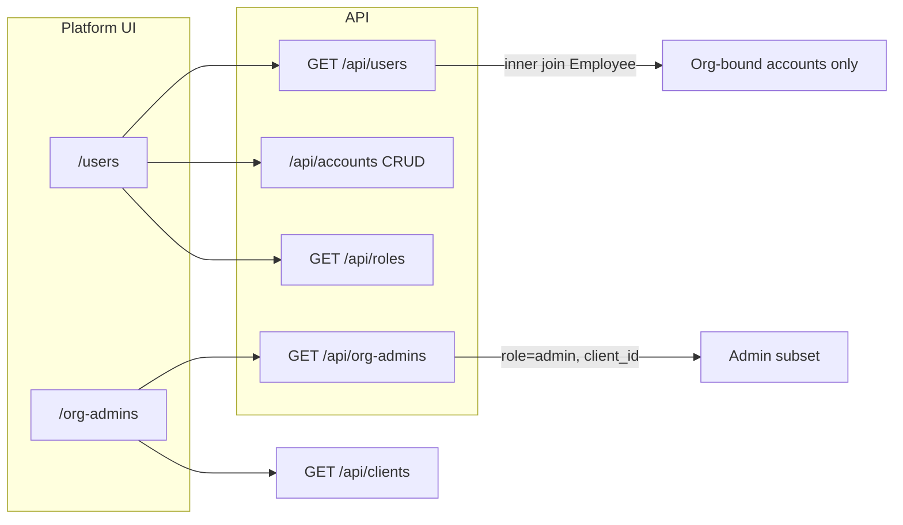

# PROJ-ACCESS-ADMIN — Stage 2 Design Check

| Поле | Значение |
|------|----------|
| **Проект** | PROJ-ACCESS-ADMIN — Stage 2 (Unified «Учётные записи») |
| **Дата** | 2026-07-01 |
| **Статус** | Design check (без реализации) |
| **Предпосылка** | Stage 1 (platform sidebar unification) ✅ |
| **Основание** | [PROJ-ACCESS-ADMIN-assessment](./PROJ-ACCESS-ADMIN-assessment.md), [ADR-049](../adr/ADR-049-administrative-roles-and-responsibility-model.md), [ARCHITECTURE_GOVERNANCE](../ARCHITECTURE_GOVERNANCE.md), [HR Domain Glossary](../reference/hr-domain-glossary.md) |

---

## Executive Summary

Stage 2 объединяет платформенные экраны **«Пользователи»** и **«Админы организаций»** в единую модель **«Учётные записи»** (Global Admin), не меняя Accepted ADR, RBAC и role codes.

**Ключевой вывод:** объединение — прежде всего **UI + read-model** задача. CRUD уже централизован в `/api/accounts`. Главные gaps as-is:

1. `/api/users` не возвращает **role_codes** и **исключает platform accounts** (`employee_id IS NULL`).
2. `/api/org-admins` — дублирующий read-only subset (role `admin`, один client).
3. Термин «Пользователи» в UI смешивает **Account** (org-tech) с бытовым «user».

**Рекомендации design check:**

| Решение | Выбор |
|---------|--------|
| Route | **A** — `/users` остаётся canonical HTML route; `/org-admins` → redirect + preset |
| Sidebar label | «Учётные записи» (registry); route `/users` без переименования на Stage 2 |
| API (первая поставка) | Расширить `GET /api/users` (role_codes + query filters); `/api/org-admins` — deprecated alias |
| HR boundary | **Не Stage 2** (Stage 4 assessment); зафиксировать known gap |
| Person | **Не в scope** Stage 2; display label = Employee FIO as-is |

---

## 1. Current UI Model

### 1.1. HTML routes (Global Admin)

| Route | File | Назначение | Mutations |
|-------|------|------------|-----------|
| `/users` | [`static/users/index.html`](../../static/users/index.html) | Список всех org-bound accounts; create/edit/delete | ✅ через `/api/accounts` |
| `/org-admins` | [`static/org-admins/index.html`](../../static/org-admins/index.html) | Read-only: local admins (`admin`) по одной организации | ❌ |

**Sidebar (после Stage 1):** оба пункта из [`sidebar-registry.js`](../../static/shared/sidebar-registry.js):

- `platform.orgAdmins` → `/org-admins` (order 15)
- `platform.users` → `/users` (order 20)

### 1.2. `/users` — UI as-is

**Заголовок:** «Пользователи» — *«Уполномоченные работники клиентов с доступом к системе»*.

**Таблица (list):**

| Колонка | Источник |
|---------|----------|
| Логин | `UserOut.login` |
| Сотрудник | `UserOut.employee_name` (FIO из Employee) |
| Организация | `UserOut.client_name` → link `/client/{id}` |
| Статус | `UserOut.status` |
| Действия | Изменить / Удалить / В организацию |

**Нет в list:** role codes, employee_id, account type, email.

**Create modal:** Client → Employee (без УЗ) → Login → Password → **Role checkboxes** (`GET /api/roles`).

**Edit modal:** Login, Password, **Role checkboxes** (`GET /api/accounts/{id}` → `role_codes`).

**List API:** `GET /api/users` only — roles подгружаются **только при edit**, не в таблице.

### 1.3. `/org-admins` — UI as-is

**Заголовок:** «Админы организаций» — *«Локальные администраторы (роль admin)…»*.

**Toolbar:** dropdown «Организация» (`GET /api/clients`).

**Таблица:**

| Колонка | Источник |
|---------|----------|
| Логин | `OrgAdminOut.login` |
| Сотрудник | `OrgAdminOut.employee_name` |
| Статус | `OrgAdminOut.status` |
| — | Link «Аккаунты →» `/client/{id}#accounts` |

**Нет:** CRUD, role column (implicit `admin`), cross-org view.

### 1.4. API endpoints

#### `GET /api/users` — [`app/routers/users.py`](../../app/routers/users.py)

| Аспект | Поведение |
|--------|-----------|
| RBAC | `require_global_admin` |
| Query | `limit`, `offset` only |
| Join | `Account` ⨝ `Employee` ⨝ `Client` — **INNER JOIN Employee** |
| Response | `UserOut`: id, login, status, client_id, client_name, employee_name |
| Исключения | Accounts с `employee_id IS NULL` (**system_admin**, **developer**) **не возвращаются** |

#### `GET /api/org-admins` — [`app/routers/org_admins.py`](../../app/routers/org_admins.py)

| Аспект | Поведение |
|--------|-----------|
| RBAC | `get_current_account` + `assert_client_access` (Global Admin или Org Admin своего client) |
| Query | **`client_id` required** |
| Filter | `Role.code == "admin"` |
| Response | `OrgAdminOut`: account_id, login, status, employee_id, employee_name, client_id |
| Mutations | None |

#### `/api/accounts` — [`app/routers/accounts.py`](../../app/routers/accounts.py)

| Method | Scope | RBAC read | RBAC write |
|--------|-------|-----------|------------|
| `GET ?client_id=` | One client | `require_client_query_access` (any role with client access) | — |
| `GET /{id}` | Single account | `load_account_for_ctx` | — |
| `POST/PATCH/DELETE` | — | — | `assert_account_management_allowed` (global or org admin) |

**List item (`AccountListItem`):** id, employee_id, login, status, timestamps — **без roles**.

**Detail (`AccountWithRolesOut`):** + `role_codes`.

**Create (`AccountCreate`):** requires `employee_id` — org accounts only; platform accounts создаются иначе (seed / manual).

### 1.5. Roles и role checkboxes

**Каталог:** [`app/seed.py`](../../app/seed.py) — `system_admin`, `developer`, `admin`, `hr`, `manager`, `employee`.

**API:** `GET /api/roles` — [`app/routers/roles.py`](../../app/routers/roles.py):

- Global Admin: все active roles.
- Org Admin: `filter_roles_for_context` → только `ORG_ASSIGNABLE_ROLE_CODES` (`admin`, `hr`, `manager`, `employee`).

**UI `/users` create/edit:** все roles из API как checkboxes — Global Admin может назначать platform roles при create (policy enforced server-side in `assert_role_assignment_allowed`).

**Policies:** [`app/auth/policies.py`](../../app/auth/policies.py):

- `ORG_ASSIGNABLE_ROLE_CODES = {admin, hr, manager, employee}`
- Platform roles forbidden for org admin assignment

### 1.6. employee_id / system accounts

| Тип Account | employee_id | Контур | В `/api/users` | Создание через UI `/users` |
|-------------|-------------|--------|----------------|----------------------------|
| Org-bound | required (ADR-049 §7.5) | Client org-tech | ✅ | ✅ POST `/api/accounts` |
| Platform (`system_admin`, `developer`) | `NULL` | Platform | ❌ | ❌ (нет UI) |

**Auth:** platform accounts → `is_system=True`, `allowed_clients=all`, `client_id=None` ([`app/auth/context.py`](../../app/auth/context.py)).

**Gap:** Global Admin не видит platform УЗ в едином реестре; audit только через seed/DB/login.

### 1.7. Local Admin parallel (не объединяется в Stage 2)

Workspace `#accounts` ([`static/workspace/index.html`](../../static/workspace/index.html)):

- Scope: один `client_id`
- API: `GET /api/accounts?client_id=`
- Таблица: Login, Employee, Org unit, Position, Status — без roles в list
- Label sidebar: **«Аккаунты»** (не «Учётные записи») — ADR-049 §6.2

Stage 2 затрагивает **только platform Global Admin** экран.

### 1.8. Диаграмма as-is



---

## 2. Target Concept

### 2.1. Единый раздел «Учётные записи» (Global Admin)

**Смысл (Glossary + ADR-049):**

- **Account** — учётная запись, средство доступа (org-tech).
- **Access** — role codes на Account.
- **Employee** — организационная/кадровая запись; org Account **обязан** ссылаться на Employee.
- **Person** — identity aggregate (target ADR-050); **не отображается** в Stage 2 (FIO из Employee).

**UI terminology:**

| Было | Станет (platform) |
|------|-------------------|
| «Пользователи» | **«Учётные записи»** |
| «Админы организаций» (отдельный раздел) | **Preset фильтра** «Локальные администраторы» (`role=admin`) |
| «Сотрудник» (колонка) | **«Сотрудник / ФИО»** — linked Employee display, не Person |

**Не смешивать:**

- Таблица **не** заменяет реестр «Сотрудники» (`#employees`).
- CRUD Employee — кадровый контур (`hr`); CRUD Account — org-tech (`admin` / Global Admin).
- Колонка «Сотрудник» — **ссылка на кадровую запись**, не редактирование кадровых данных.

### 2.2. «Админы организаций» как preset, не контур

| As-is | Target |
|-------|--------|
| Отдельный route + sidebar item + page | Один route; preset активирует фильтры |
| `/api/org-admins?client_id=` | `GET /api/users?role_code=admin&client_id=` (target API) или временно client-side merge |
| Read-only, no CRUD | Те же actions, что на unified page (edit roles через `/api/accounts`) |

**Preset UX:**

- URL: `/users?preset=org-admins` или `/users?role=admin`
- Banner/chip: «Показаны локальные администраторы (роль admin)»
- Optional: org filter pre-selected from query `client_id`

### 2.3. Entity distinction (для колонок и copy)

```text
Person (🔜 PROJ-PERSON)     — не в Stage 2 UI
    ↓
Employee                    — колонка «Сотрудник», source link
    ↓ optional
Account                       — строка таблицы (login, status)
    ↓
Access (role codes)           — колонка «Роль доступа»
```

**Account type (derived, не DB column):**

| `account_type` | Условие |
|----------------|---------|
| `organization` | `employee_id` set |
| `platform` | `employee_id IS NULL` + platform role |

---

## 3. Proposed Table Columns

### 3.1. Global unified table (recommended)

| # | Column (RU) | Field | Source | Priority |
|---|-------------|-------|--------|----------|
| 1 | **Логин** | `login` | Account | P0 — must |
| 2 | **Сотрудник** | `employee_name` | Employee FIO; «—» для platform | P0 |
| 3 | **Организация** | `client_name` / link | Client; «Платформа» для system | P0 |
| 4 | **Роль доступа** | `role_codes` / labels | AccountRole → Role | P0 — closes main gap |
| 5 | **Статус** | `status` | Account (`active`, …) | P0 |
| 6 | **Тип** | `account_type` | derived | P1 |
| 7 | **Email** | `employee.email` | Employee (optional) | P2 — not login |
| 8 | **Связь** | `employee_id` | link to `#employees` or card | P1 — actions area |
| 9 | **Действия** | — | Edit / Delete / Open org | P0 |

**Не включать в Stage 2:**

- Person fields
- Org unit / position (остаются в workspace `#accounts`)
- Password / hash

### 3.2. Column notes

- **Login vs email:** login — технический идентификатор Account; email — атрибут Employee (может совпадать, не обязан).
- **Source / linked employee:** в actions — «Карточка сотрудника» (future) или «В организацию»; не duplicate HR CRUD.
- **Role display:** prefer `Role.name` (localized seed labels) with `code` in tooltip.

---

## 4. Filters

### 4.1. Minimum filter set (Global)

| Filter | Query param (target) | As-is support |
|--------|----------------------|---------------|
| **Организация** | `client_id` | org-admins only; users — no |
| **Роль** | `role_code` | org-admins hardcoded `admin` |
| **Статус** | `status` | none |
| **Тип account** | `account_type=organization\|platform` | none |
| **Есть связь с Employee** | `has_employee=true\|false` | implicit in users join |
| **Поиск** | `q` (login, FIO) | none |

### 4.2. Presets (saved filter combinations)

| Preset ID | Filters | Replaces |
|-----------|---------|----------|
| `all` | none | default `/users` |
| `org-admins` | `role_code=admin` (+ optional client) | `/org-admins` |
| `platform` | `account_type=platform` | *(new visibility)* |

### 4.3. Client-side vs server-side

| Approach | Pros | Cons |
|----------|------|------|
| Client-side filter on full `/api/users` list | No API change in 2A | No roles in list → **cannot filter by role**; poor scale |
| Server-side on extended `/api/users` | Correct, scalable | Requires API change (2B/2E) |
| Hybrid: preset `org-admins` calls `/api/org-admins` | Works without extending users API | Dual API on one page — tech debt |

**Recommendation:** server-side filters on extended `GET /api/users` in sub-stage **2B**; **2A** may ship unified layout with columns from extended API in same PR as 2B if API change is small.

---

## 5. Route Strategy

### 5.1. Options compared

| | **A. Keep `/users`** | **B. `/accounts` + `/users` alias** | **C. Keep `/org-admins`** |
|---|---------------------|--------------------------------------|---------------------------|
| Description | Canonical route `/users`; rename UI only | New `/accounts` (platform HTML); redirect `/users` | No merge; two sections remain |
| ADR-049 alignment | §6.1 mentions «Пользователи (platform)» — route unchanged, label can evolve in implementation | ADR text says platform users — route rename needs doc note, not ADR edit | Matches ADR §6.1 literally but **fails product goal** |
| Collision risk | Low | **High** — `/api/accounts` is client-scoped REST | N/A |
| Bookmarks / tests | Minimal churn | Medium — update tests, redirects | Status quo — confusion remains |
| Semantics | «Users» ambiguous but known | «Accounts» clearer for platform | Duplicate mental model |
| Stage 2 effort | **Low** | Medium | Zero merge benefit |

### 5.2. Recommendation: **Option A**

1. **Canonical HTML route:** `/users` (unchanged in Stage 2).
2. **UI label / sidebar:** «Учётные записи» (registry `platform.users.label`).
3. **Legacy redirect:** `GET /org-admins` → **302** `/users?preset=org-admins` (+ preserve `client_id` if present).
4. **Optional Stage 3+:** introduce `/access` as alias if needed — **not** `/accounts` (API namespace collision).

**Не выбирать C** — противоречит цели объединения.

**Не выбирать B** для Stage 2 — путаница с `/api/accounts?client_id=` и workspace tab `#accounts`.

---

## 6. API Strategy

### 6.1. Duplication map

| Concern | `/api/users` | `/api/org-admins` | `/api/accounts?client_id=` |
|---------|--------------|-------------------|----------------------------|
| Scope | All clients (global admin) | One client, admin role | One client, all accounts |
| Roles in list | ❌ | ❌ | ❌ |
| Employee join | ✅ inner | ✅ inner | ✅ inner |
| Platform accounts | ❌ | ❌ | ❌ |
| CRUD | ❌ | ❌ | ✅ |
| Filters | ❌ | client_id implicit | org_unit, position |

**Duplication:** `/api/org-admins` ⊆ `/api/users` (when users extended with role filter).

### 6.2. Can we use existing API temporarily?

| Stage | Feasible with existing API? | Notes |
|-------|---------------------------|-------|
| Unified page layout only | ✅ | Same table as today |
| Role column | ⚠️ | Requires N× `GET /api/accounts/{id}` — **unacceptable** |
| Admin preset filter | ⚠️ | Keep calling `/api/org-admins` until users API extended |
| Platform accounts section | ❌ | Requires API change |
| Server-side role filter | ❌ | Requires API change |

### 6.3. Target API evolution (implement later, design now)

**Extend `GET /api/users`** (preferred over new `/api/platform/accounts` for backward compat):

```python
# Target query params (design only)
client_id: str | None = None
role_code: str | None = None          # e.g. admin
status: str | None = None
account_type: Literal["organization", "platform"] | None = None
q: str | None = None                  # login / FIO search
limit, offset
```

**Extend `UserOut` → `PlatformAccountOut` (or extend in place):**

```python
role_codes: list[str]
role_labels: list[str]   # optional
employee_id: str | None
employee_email: str | None
account_type: str        # organization | platform
```

**Query change for platform accounts:** `LEFT JOIN Employee` + `OR employee_id IS NULL` with separate branch for platform rows.

### 6.4. `/api/org-admins` fate

| Phase | Action |
|-------|--------|
| Stage 2C–2D | Mark deprecated in OpenAPI comment; UI stops calling |
| Stage 2D | Redirect `/org-admins` page; tests keep API until 2E |
| Stage 2E | API returns `Deprecation` header or doc; remove in Stage 6 |

**Do not delete** in Stage 2 — [`tests/test_admin_roles.py`](../../tests/test_admin_roles.py) depends on it.

### 6.5. System accounts (`employee_id IS NULL`)

**Design:**

- Separate section or filter `account_type=platform` at bottom/top of table.
- Columns: Login, Roles, Status, Actions (edit roles — not create Employee).
- **No onboarding impact** — seed accounts unchanged.

**Requires:** API extension only; **no DB migration**.

### 6.6. CRUD — no change in Stage 2

Continue using:

- `POST/PATCH/DELETE /api/accounts`
- `GET /api/accounts/{id}` for edit modal
- `GET /api/roles` for checkboxes

---

## 7. Access Boundary (ADR-049)

### 7.1. Target visibility

| Actor | Platform «Учётные записи» | Org `#accounts` | HR `#employees` |
|-------|---------------------------|-----------------|-----------------|
| **Global Admin** | **Владелец** — all org accounts + platform audit | Просмотр | Просмотр |
| **Local Admin** | Нет доступа (platform pages blocked) | **Владелец** — own client | Делегированные / просмотр |
| **HR** | Нет доступа | **Нет доступа** (target) | **Владелец** — кадровые данные |
| **HR** account indicator | — | — | Read-only «Есть УЗ / роль» в реестре ✅ |

### 7.2. ADR-049 compliance check

| Requirement | Stage 2 impact |
|-------------|----------------|
| Global Admin owns platform users | ✅ Unified view strengthens this |
| Local Admin owns org accounts journal | ✅ Unchanged (workspace) |
| HR does not manage accounts | ⚠️ **Not fixed in Stage 2** — Stage 4 |
| Terminology Account vs Employee | ✅ UI rename helps |
| Accepted ADR §6.1 nav text | Implementation project; sidebar label change without ADR edit (per assessment §2.2) |

### 7.3. Current boundary violations (document, do not fix in Stage 2)

| Endpoint / UI | Issue | ADR-049 |
|---------------|-------|---------|
| `GET /api/accounts?client_id=` | HR can **read** list | §4.1 «Аккаунты» — HR: Нет доступа |
| Sidebar `#accounts` | Visible to HR | Same |
| `GET /api/accounts/{id}` | HR can read detail | Same |
| `GET /api/org-admins` | Org Admin can read own client admins | OK (admin audit) |

**Stage 2 scope:** Global Admin platform page only — **does not widen** HR access.

---

## 8. Compatibility and Migration

### 8.1. Without DB changes (Stage 2 feasible)

- Unified HTML page at `/users`
- Sidebar registry label → «Учётные записи»
- Remove sidebar item `platform.orgAdmins` (or point to preset URL)
- Redirect `/org-admins` → `/users?preset=org-admins`
- Extend `GET /api/users` response (additive fields)
- Client-side preset chips / filter UI

### 8.2. Requires API change (no DB)

| Change | Breaking? |
|--------|-----------|
| Add optional fields to `UserOut` | **Non-breaking** (additive JSON) |
| Add query params to `GET /api/users` | **Non-breaking** (optional) |
| Include platform accounts in list | **Behavior change** — more rows for global admin (desired) |
| Deprecate `/api/org-admins` | **Non-breaking** if kept |

### 8.3. Requires DB migration

**None for Stage 2.**

*(Stage 5 `Client.display_name` — separate track.)*

### 8.4. Potential breaking changes (avoid in Stage 2)

| Change | Risk |
|--------|------|
| Remove `/users` route | Bookmarks, tests, `login_next=/users` |
| Remove `/api/users` | Global admin integrations |
| Rename `/api/accounts` | High — workspace + tests |
| Tighten HR read on `/api/accounts` | **Stage 4** — HR may rely on read today |

### 8.5. Onboarding flow

**Untouched:** onboarding creates Client + Employee + Account(`admin`) via [`app/onboarding.py`](../../app/onboarding.py).

Unified list will **show** onboarding-created admin when API extended — no workflow change.

---

## 9. Risks

| # | Risk | Severity | Mitigation |
|---|------|----------|------------|
| R1 | **Случайная выдача HR через role checkboxes** on Global Admin create | Medium | Server policy exists; UI: hide platform roles in org context only — Global Admin may still assign `hr` (intended) |
| R2 | **Смешение Employee и Account** in copy/columns | Medium | Glossary terms in column headers; subtitle explains org-tech scope |
| R3 | **Потеря system accounts** if merge only uses inner join | High | Explicit `account_type=platform` section in 2E |
| R4 | **Onboarding regression** if create flow changed | Low | Do not touch POST `/api/accounts` contract |
| R5 | **Route `/users` confusion** after rename to «Учётные записи» | Low | Subtitle + banner; keep URL |
| R6 | **Dual API** during hybrid 2A | Medium | Time-box; complete 2B quickly |
| R7 | **N+1 role fetch** if role column without API | High | Block 2A release without role_codes in list API |
| R8 | **Org Admin loses `/org-admins`** as dedicated audit | Low | Org admin can use workspace `#accounts` + filter; preset for global only |
| R9 | **ADR-049 nav drift** | Low | Document as implementation of assessment; ADR frozen |

---

## 10. Recommended Stage 2 Implementation Plan

### 2A — Unified UI shell (minimal API)

**Goal:** One page, one sidebar entry; layout + presets wiring.

| Task | Files (expected) |
|------|------------------|
| Refactor [`static/users/index.html`](../../static/users/index.html) → unified accounts page (title «Учётные записи») | `static/users/index.html` |
| Parse URL presets (`preset=org-admins`, `role=admin`, `client_id`) | same |
| Filter toolbar UI (disabled until 2B if no API) | same |
| **Optional:** merge org-admins HTML into users; deprecate duplicate page content | `static/org-admins/index.html` (redirect stub later) |

**Exit:** Single page renders; preset shows chip; **may** still dual-fetch org-admins for admin preset if 2B not ready.

### 2B — Role visibility + list API extension

**Goal:** Role column + server-side filters.

| Task | Files (expected) |
|------|------------------|
| Extend `UserOut` + `list_users()` with role_codes, employee_id, filters | `app/routers/users.py`, `app/schemas.py` (if extracted) |
| Table columns: + «Роль доступа» | `static/users/index.html` |
| Wire filters to query params | same + tests |

**Exit:** Admin preset works via `GET /api/users?role_code=admin` without `/api/org-admins`.

### 2C — Route / preset / sidebar

| Task | Files (expected) |
|------|------------------|
| Sidebar: one item «Учётные записи» → `/users`; remove or repoint `platform.orgAdmins` | `static/shared/sidebar-registry.js` |
| `GET /org-admins` → redirect `/users?preset=org-admins` | `app/main.py` |
| Preserve `client_id` query through redirect | `app/main.py`, UI init |

### 2D — Deprecate `/org-admins` UI

| Task | Files (expected) |
|------|------------------|
| Remove standalone page or thin redirect HTML | `static/org-admins/index.html` |
| Update tests for redirect | `tests/test_admin_roles.py` |
| Deprecation comment on `/api/org-admins` | `app/routers/org_admins.py` |

### 2E — Platform accounts visibility (API hardening)

| Task | Files (expected) |
|------|------------------|
| Include `employee_id IS NULL` accounts in `GET /api/users` | `app/routers/users.py` |
| Filter `account_type=platform` | same |
| UI section / filter for platform accounts | `static/users/index.html` |
| Tests: system admin visible in list | new/updated tests |

**Dependency graph:**

```text
2A (UI shell)
  ↓
2B (roles + filters API)  ← blocker for role column
  ↓
2C (sidebar + redirects)   ← can parallel 2B if careful
  ↓
2D (deprecate org-admins page)
  ↓
2E (platform accounts)     ← can defer to end of Stage 2
```

**Estimated effort:** 2A–2D ≈ 4–6 dev-days; 2E + tests ≈ 1–2 dev-days.

---

## 11. Open Questions

| # | Question | Blocks |
|---|----------|--------|
| OQ-S2-1 | Sidebar: один пункт «Учётные записи» или два (второй — deep link preset)? | 2C |
| OQ-S2-2 | Удалять `platform.orgAdmins` из registry или оставить shortcut `?preset=org-admins`? | 2C |
| OQ-S2-3 | Email column in table — P2 or skip? | 2A |
| OQ-S2-4 | Platform accounts in same table vs separate tab? | 2E |
| OQ-S2-5 | `UserOut` rename vs additive fields (OpenAPI clients)? | 2B |
| OQ-S2-6 | Search `q` — login only or FIO + login? | 2B |
| OQ-S2-7 | Coordination with Stage 5 `display_name` for org column | Later |
| OQ-S2-8 | HR boundary fix in Stage 2 or strictly Stage 4? | **Recommend Stage 4** |

---

## 12. Recommended Next Implementation Task

**Start with 2B (API extension) + 2A (UI)** in one PR pair or single PR:

1. Extend `GET /api/users` with `role_codes`, `employee_id`, optional `role_code` / `client_id` / `status` query params.
2. Refactor `static/users/index.html`: title «Учётные записи», role column, filter bar.
3. Add preset handler for `?preset=org-admins`.

**Do not start with** sidebar removal / redirects until unified table proves admin preset via extended API.

**Tests to add/update:**

- `GET /api/users?role_code=admin` returns subset of all users
- `role_codes` present in list response
- `/org-admins` redirect (after 2C)
- Platform sidebar single «Учётные записи» entry (after 2C)

---

## Appendix A. Files referenced in analysis

| Area | Paths |
|------|-------|
| Platform UI | `static/users/index.html`, `static/org-admins/index.html` |
| Workspace (out of scope) | `static/workspace/index.html` |
| Sidebar | `static/shared/sidebar-registry.js`, `static/shared/sidebar.js` |
| API | `app/routers/users.py`, `app/routers/org_admins.py`, `app/routers/accounts.py`, `app/routers/roles.py` |
| Auth | `app/auth/context.py`, `app/auth/policies.py`, `app/auth/tenant.py` |
| Routes | `app/main.py` |
| Tests | `tests/test_admin_roles.py` |
| Docs | `PROJ-ACCESS-ADMIN-assessment.md`, ADR-049, HR Glossary |

## Appendix B. Terminology quick reference (Glossary)

| Term | RU | Stage 2 UI |
|------|-----|------------|
| Account | Учётная запись | Row entity; page title |
| Access | Доступ / role codes | Column «Роль доступа» |
| Employee | Сотрудник | Column «Сотрудник»; link |
| Person | — | Not shown (PROJ-PERSON) |
| User (colloquial) | Пользователь | **Avoid** in platform admin UI |
