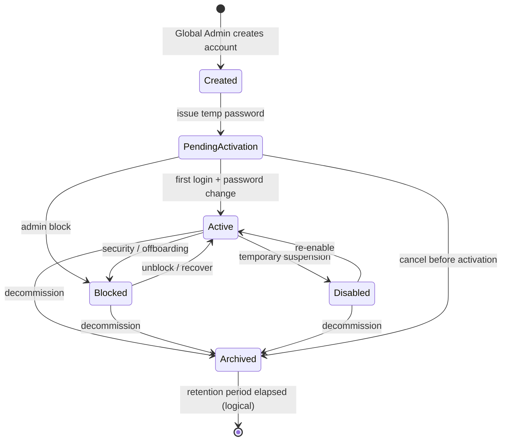

# PROJ-PLATFORM-ACCOUNT-LIFECYCLE — Phase A Assessment

| Поле | Значение |
|------|----------|
| **Проект** | PROJ-PLATFORM-ACCOUNT-LIFECYCLE — Platform Account Lifecycle Architecture |
| **Фаза** | **Phase A** (Architecture only — без реализации) |
| **Дата** | 2026-07-01 |
| **Обновление** | 2026-07-01 — Architecture Review Addendum (§4 Ownership) |
| **Статус** | Assessment (Phase A complete; decisions in [ADR-052](../adr/ADR-052-platform-account-lifecycle.md)) |
| **Основание** | [ARCHITECTURE_GOVERNANCE](../ARCHITECTURE_GOVERNANCE.md), [ADR-049](../adr/ADR-049-administrative-roles-and-responsibility-model.md), [ADR-052](../adr/ADR-052-platform-account-lifecycle.md) (Proposed), [PROJ-ACCESS-ADMIN Stage 2 Closure](./PROJ-ACCESS-ADMIN-stage-2-closure.md), [HR Domain Glossary](../reference/hr-domain-glossary.md), [концептуальная модель данных](../концептуальная_модель_данных_и_erd_типовая_инфраструктура_b_2_b.md), [документ №15 — RBAC](../../specs/документ_№_15.md) |

---

## Executive Summary

**Platform Account** — учётная запись платформенного контура: `Account` с `employee_id IS NULL` и platform role codes (`system_admin`, `developer`). Она не привязана к Employee и Client, управляется **Global Admin** и используется для администрирования платформы, передачи полномочий, делегирования и аварийного восстановления доступа.

**Organization Account** — org-bound учётная запись (`Account → Employee → Client`), жизненный цикл которой ведёт **Local Admin** через `/client/{id}#accounts`. Контур **заморожен** после PROJ-ACCESS-ADMIN Stage 2A–2G; изменения — только UX-улучшения или новый ADR.

**As-is:** платформенные аккаунты создаются только через bootstrap (`.env`, seed, `bootstrap_system_admin`); UI `/users` содержит placeholder-секцию «Платформенные аккаунты»; модель `Account` минимальна (`status`, `login`, `password_hash`); полноценного lifecycle, audit, password policy и recovery **нет**.

**Цель Phase A:** спроектировать жизненный цикл Platform Accounts, согласованный с ADR-049 и двухуровневой моделью, **без** изменений кода, API, UI, БД, миграций и RBAC.

**Рекомендация (lifecycle):** расширенная state machine, soft-delete через `archived`, audit trail, ADR-052 перед Phase B.

**Addendum (§4):** ownership проанализирован в assessment; **принятые решения** — [ADR-052 §4–§5](../adr/ADR-052-platform-account-lifecycle.md).

---

## 1. Scope и границы

### 1.1. In scope (Phase A)

| Область | Содержание |
|---------|------------|
| Platform Account Lifecycle | Состояния, переходы, политики для `employee_id IS NULL` + platform roles |
| Global Admin UI/API design intent | Секция `/users` → «Платформенные аккаунты» (сейчас placeholder) |
| Cross-cutting policies | Password, login, audit, recovery — **для platform contour** |
| ADR alignment | ADR-049 §3.1, §7.5; ARCHITECTURE_GOVERNANCE; разделение Platform / Organization Accounts |

### 1.2. Out of scope (заморожено или другие проекты)

| Область | Причина |
|---------|---------|
| Organization Account lifecycle (Local Admin) | PROJ-ACCESS-ADMIN Stage 2 closed; `/client/{id}#accounts` frozen |
| RBAC, role codes, seed | ADR-049 §8; отдельный ADR при расширении |
| Person / Employee lifecycle | ADR-050 |
| Реализация (код, API, UI, миграции) | Phase B+ |
| Platform Account Ownership | §4 — addendum; решение в ADR-052 |
| Написание ADR | Только **proposal** в §13 |

### 1.3. Терминологическая фиксация

```text
Platform Account     = Account WHERE employee_id IS NULL AND role ∈ {system_admin, developer}
Organization Account = Account WHERE employee_id IS NOT NULL (→ Employee → Client)
Global Admin         = holder of system_admin (platform contour)
Local Admin          = holder of admin (org-tech contour)
```

Согласно [PROJ-ACCESS-ADMIN Stage 2 Closure](./PROJ-ACCESS-ADMIN-stage-2-closure.md): Global Admin → `/users`; Local Admin → `/client/{id}#accounts`. Разделение **не нарушается** проектом Platform Account Lifecycle.

---

## 2. Анализ существующей реализации

### 2.1. Модель данных

**Таблица `accounts`** ([`app/models.py`](../../app/models.py)):

| Поле | As-is | Концептуальная модель (ERD §6.1) |
|------|-------|-----------------------------------|
| `id` | PK | `user_id` |
| `employee_id` | nullable | nullable FK |
| `login` | unique (app-level) | `login` |
| `password_hash` | bcrypt | `password_hash` |
| `status` | `String(16)`, без enum | `account_status`: active / blocked / invited / archived |
| `created_at`, `updated_at` | ✅ | ✅ |
| `must_change_password` | ❌ | ✅ |
| `last_login_at` | ❌ | ✅ |
| `email`, `phone` | ❌ | optional |

**Вывод:** реализация **существенно беднее** целевой концептуальной модели; lifecycle выражен одним полем `status` без семантики.

### 2.2. Создание Platform Accounts

| Путь | Поведение |
|------|-----------|
| [`app/system_admin.py`](../../app/system_admin.py) `bootstrap_system_admin` | Создаёт/синхронизирует `system_admin` без `employee_id`; status сразу `active`; пароль из env |
| [`scripts/bootstrap_system_admin.py`](../../scripts/bootstrap_system_admin.py) | CLI-обёртка bootstrap |
| Seed / dev bootstrap | `DEV_SYSTEM_ADMIN_LOGIN = "gladmin"` |
| Onboarding | Создаёт **только** org-bound admin (`employee_id` обязателен) |
| `POST /api/accounts` | **Требует** `employee_id` — platform account через API **невозможен** |
| `/users` UI | Placeholder: «Раздел находится в разработке» ([`static/users/index.html`](../../static/users/index.html)) |

**Вывод:** единственный операционный канал — bootstrap/env; нет UI, нет API, нет audit.

### 2.3. Аутентификация и статусы

[`app/routers/auth.py`](../../app/routers/auth.py):

- Проверка credentials → `verify_password`
- Единственная проверка состояния: `account.status != "active"` → 403 `account_inactive`
- Нет: `must_change_password`, lockout, temp password expiry, login attempt logging

[`app/auth/context.py`](../../app/auth/context.py):

- Platform account: `is_system = True`, `employee_id = None`, `allowed_clients` = все клиенты
- Account без `employee_id` и без platform role → `AccountMisconfiguredError` (403)

**Используемые значения `status` в коде и тестах:** `active`, `blocked`. Значения `invited`, `archived`, `disabled` **не реализованы**, но `blocked` уже используется в `/users` filter и PATCH.

### 2.4. Управление паролями

| Механизм | As-is |
|----------|-------|
| Хеширование | bcrypt ([`app/utils.py`](../../app/utils.py)) |
| Temp password | `generate_temp_password()` → `token_urlsafe(12)` |
| Reset | `POST /api/accounts/{id}/reset-password` — генерирует temp, **не возвращает** пароль клиенту; **не** ставит флаг смены |
| Onboarding admin | Temp или явный пароль; account сразу `active` |
| Self-service change | ❌ |
| Password history / reuse | ❌ |
| Failed login lockout | ❌ |

### 2.5. Удаление и блокировка

| Операция | Platform | Organization |
|----------|----------|--------------|
| `PATCH status=blocked` | Теоретически через общий API (если account существует) | ✅ Local/Global Admin |
| `DELETE /api/accounts/{id}` | Hard delete + cascade AccountRole | ✅ — **без** soft archive |
| ADR-049 target | block → archived; audit сохраняется | block/unblock admin |

**Gap:** hard delete противоречит ADR-049 §3.1 («Архив — audit сохраняется») и концептуальной модели ERD.

### 2.6. Global Admin UI `/users`

После PROJ-ACCESS-ADMIN Stage 2:

| Секция | Состояние |
|--------|-----------|
| «Платформенные аккаунты» | Placeholder + modal stub; TODO: «API, audit, lifecycle, policy» |
| «Учётные записи организаций» | Рабочий список через `GET /api/users` (только org-bound) |
| CRUD org accounts | PATCH login/password/roles; filter by status `active`/`blocked` |

[`GET /api/users`](../../app/routers/users.py) **inner join Employee** — platform accounts **не попадают** в список (by design until lifecycle project).

### 2.7. Audit

**As-is:** централизованного audit log для account events **нет**. OnboardingRun хранит traceability создания admin account, но не block/reset/login.

---

## 3. Соответствие ADR-049 и ARCHITECTURE_GOVERNANCE

### 3.1. Checklist соответствия

| Требование | Статус | Комментарий |
|------------|--------|-------------|
| Platform accounts без `employee_id` (§7.5) | ✅ As-is + target | Исключение зафиксировано |
| Org accounts требуют Employee (§7.5) | ✅ | `AccountCreate.employee_id` required |
| Global Admin — владелец platform users (§3.1, §6.1) | ⚠️ Partial | Bootstrap only; UI placeholder |
| Local Admin не управляет platform accounts | ✅ | `filter_roles_for_context`, policies |
| Двухуровневая модель Global/Local (Stage 2 closure) | ✅ | Не затрагивается |
| Block account; role history сохраняется (§3.1 lifecycle) | ⚠️ Partial | Block есть; archive/audit — нет |
| ADR freeze — изменения через ADR | ✅ | Этот assessment → proposed ADR-052 |
| RBAC без изменений | ✅ | Phase A не предлагает новых role codes |

**Противоречий с Accepted ADR-049 не выявлено.** Выявлены **gaps реализации** относительно target ADR-049 §3.1 и концептуальной модели.

### 3.2. ARCHITECTURE_GOVERNANCE

- Assessment — производный документ (Phase A), **не принимает** архитектурных решений (§3 Governance).
- Рекомендуемая модель lifecycle (§12) и ownership (§4.7) — input для **proposed ADR-052**; реализация — только после Accept ADR (§5–6 Governance).
- Organization Account lifecycle **не перепроектируется** — соответствует freeze Local Admin contour.

### 3.3. Organization Accounts (reference only)

Для полноты контекста — as-is org account lifecycle ( **не менять** без ADR):

```text
Create (onboarding / Local Admin modal) → status=active immediately
    ↔ block/unblock (PATCH status)
    → hard DELETE (optional, destructive)
```

Связь с Employee: один Account на Employee (enforced в bulk create; Stage 2G client check). Termination → auto-block — **открытый вопрос** ADR-049 OQ-10; вне scope Platform Lifecycle.

---

## 4. Platform Account Ownership (Architecture Review Addendum)

> **Статус раздела:** аналитический addendum Phase A.  
> **Принятые решения:** [ADR-052 §4–§5](../adr/ADR-052-platform-account-lifecycle.md) (Proposed).

### 4.1. Постановка вопроса

**Ownership** Platform Account — это ответ на вопрос: **кому принадлежит** платформенная учётная запись в смысле идентификации, ответственности и восстановления доступа.

```text
                    ┌─────────────────────────────────────┐
                    │         Platform Account            │
                    └─────────────────────────────────────┘
                                      │
          ┌───────────────────────────┼───────────────────────────┐
          ▼                           ▼                           ▼
   OW-A: Employee-bound        OW-B: Service (no Employee)   OW-C: Break-glass type
   (Person → Employee)         (employee_id IS NULL)         (subtype / kind flag)
          │                           │                           │
          └───────────────────────────┴───────────────────────────┘
                                      │
                              OW-D: Multiplicity
                    (сколько Platform Accounts на одного Employee?)
```

**As-is (ADR-049 §7.5):** Platform Account = `employee_id IS NULL` + platform role (`system_admin`, `developer`). Это соответствует **OW-B**. Bootstrap break-glass (`system_admin.py`, env) — de facto **OW-C** без явной типизации.

**Organization Account (reference):** всегда `employee_id NOT NULL`; один Account на Employee в org contour (Stage 2G). Platform ownership **не должен** размывать это правило без ADR.

### 4.2. OW-A — Platform Account всегда связан с Employee

**Описание.** Каждая Platform Account обязана иметь `employee_id`, указывающий на Employee. Employee может принадлежать:

- **A1** — специальной «платформенной организации» (virtual Client платформы);
- **A2** — Employee существующего клиента (dual-hat: сотрудник клиента + platform role);
- **A3** — Person-level Employee без Client (требует расширения модели Employee).

```text
Person → Employee (platform org OR client org) → Account (system_admin) → Access
```

| Критерий | Оценка |
|----------|--------|
| **Преимущества** | Прямая привязка к физическому лицу; единая цепочка Person → Employee → Account; offboarding через кадровые/HR-процессы; audit «кто» = Employee FIO; согласуется с общей моделью ADR-049 §1.2 |
| **Недостатки** | Требует «платформенного Client» или dual-hat; смешение platform и org контуров при A2; сервисные/бот-аккаунты (`developer` automation) не имеют natural Person; bootstrap break-glass без Employee **противоречит** правилу; миграция существующих `employee_id IS NULL` |
| **Безопасность** | (+) Named human accountability; (-) dual-hat риск privilege escalation (org + global); (-) termination Employee может не синхронизироваться с platform access |
| **Аудит** | (+) `actor_employee_id` в событиях; (+) cross-link с кадровой историей; (-) смешение platform audit с HR audit при A2 |
| **Восстановление** | (+) Recovery через известное лицо / HR contact; (-) увольнение Employee блокирует platform access без явного handoff; break-glass env-path **нарушает** invariant |
| **ADR-049** | ⚠️ **Требует amendment §7.5** — сегодня явное исключение «могут существовать без employee_id». A1 частично совместим (platform org), A2 — риск смешения контуров §7.4 |

### 4.3. OW-B — Platform Account может быть сервисным (без Employee)

**Описание.** Platform Account с `employee_id IS NULL`; идентификация через `login`, optional `display_name`, role codes. Человек-оператор не обязателен. **Текущая модель as-is.**

```text
Account (employee_id NULL, system_admin | developer) → Access
         ↑
   no Employee link
```

| Критерий | Оценка |
|----------|--------|
| **Преимущества** | Полное совпадение с ADR-049 §3.1, §7.5 as-is; чёткое разделение platform / org; сервисные и automation accounts без «фиктивных» Employee; простая auth (`is_system`); bootstrap без кадровых сущностей |
| **Недостатки** | Слабая human attribution без доп. полей; риск «обезличенных» admin login; offboarding = ручной archive, не HR-trigger; два namespace login без Employee anchor |
| **Безопасность** | (+) Минимальная attack surface модели; (-) shared/service login без MFA/person binding; требует строгий naming + audit actor (кто создал/использовал) |
| **Аудит** | (-) `target` account не связан с Person; (+) `actor_account_id` Global Admin сохраняет «кто выполнил действие»; нужен `display_name` / owner note |
| **Восстановление** | (+) Bootstrap break-glass natively; (+) не зависит от Employee lifecycle; (-) recovery «забыл пароль» только через другого Global Admin |
| **ADR-049** | ✅ **Полная совместимость** — прямое следствие §7.5 exception |

### 4.4. OW-C — Break-glass account как отдельный тип Platform Account

**Описание.** Break-glass — **отдельный класс** Platform Account с усиленными ограничениями, не управляемый через обычный UI CRUD (или с restricted UI).

**Варианты реализации (не mutually exclusive с OW-A/B):**

| Подвариант | Механизм |
|------------|----------|
| C1 `account_kind=break_glass` | Флаг/kind на Account; policies: env-only create, no archive if last, enhanced audit |
| C2 Bootstrap-only registry | Учётные записи вне `/api/platform-accounts`; только `bootstrap_system_admin` |
| C3 Dual: one break-glass + N operational | 1 env-backed + остальные UI-managed `standard` platform accounts |

```text
Platform Accounts
├── kind: break_glass   (env bootstrap, SYSTEM_ADMIN_SYNC)
├── kind: standard      (UI CRUD, handoff, delegation)
└── kind: service       (developer automation, optional)
```

| Критерий | Оценка |
|----------|--------|
| **Преимущества** | Явное разделение emergency vs operational; stricter policy на break-glass (TTL password, no UI delete); соответствует operational practice (env seed); INV-PA-1 natural fit |
| **Недостатки** | Дополнительное измерение модели (`account_kind`); риск drift «все через break-glass»; два пути создания — complexity |
| **Безопасность** | (+) Break-glass isolated, auditable, env-gated; (+) operational accounts revocable без потери emergency path; (-) env secret = single point of failure |
| **Аудит** | (+) Filter `kind=break_glass` events — mandatory alert; (+) distinct event subtype `break_glass.login` |
| **Восстановление** | (+) **Primary recovery path** — documented bootstrap; (+) last-resort when all UI accounts locked; (-) env compromise = total platform compromise |
| **ADR-049** | ✅ **Совместим** как refinement OW-B; не меняет §7.5; дополняет §3.1 lifecycle («Seed / ручное создание») |

**Сочетание:** OW-C **накладывается** на OW-B (break-glass = service account + kind). OW-C **конфликтует** с OW-A, если break-glass обязан иметь Employee — env bootstrap теряет смысл.

### 4.5. OW-D — Допускается ли несколько Platform Accounts у одного Employee

**Контекст зависит от OW-A vs OW-B:**

| Сценарий | При OW-A (Employee-bound) | При OW-B (service, no Employee) |
|----------|---------------------------|----------------------------------|
| **D1** Один Employee → один Platform Account | Natural 1:1 | N/A (no Employee) |
| **D2** Один Employee → org Account **и** platform Account | Dual accounts, different roles/contours | Allowed: org account (employee_id set) + separate service platform account (no link) |
| **D3** Один Employee → **несколько** Platform Accounts | Multiple logins same person | N/A unless hybrid OW-A for some |
| **D4** Один login → platform + org roles на **одном** Account | Single Account, multiple roles spanning contours | **Запрещено** политикой: platform roles only on `employee_id NULL` ([`system_admin.py`](../../app/system_admin.py) strips non-platform roles) |

**As-is enforcement:** один org Account на Employee (bulk/onboarding); platform account без Employee; `_ensure_system_admin_role` удаляет non-platform roles с platform account.

#### D2 — Dual: org Account + platform Account (разные записи, один человек)

| Критерий | Оценка |
|----------|--------|
| **Преимущества** | Разделение контуров: day-to-day org work vs platform ops; least privilege per context |
| **Недостатки** | Два login для одного человека; confusion; credential sprawl |
| **Безопасность** | (+) Separation; (-) org account compromise + weak platform password |
| **Аудит** | (+) Clear contour in logs; (-) correlating same person across two account_ids |
| **Recovery** | Org path vs platform path — different admins |
| **ADR-049** | ✅ Compatible if platform account remains `employee_id NULL` (OW-B) or platform-org Employee (OW-A1) |

#### D3 — Несколько Platform Accounts на одного Employee (только OW-A)

| Критерий | Оценка |
|----------|--------|
| **Преимущества** | Role separation (admin vs developer hat); delegation with different logins |
| **Недостатки** | Redundant; violates «named account» simplicity; audit noise |
| **Безопасность** | (-) Expanded surface; rarely justified |
| **Аудит** | (-) Multiple identities one person |
| **Recovery** | Complex — which account to restore? |
| **ADR-049** | ⚠️ Not addressed; needs explicit ADR-052 rule |

#### D4 — Запрет: max 1 Platform Account per Employee

| Критерий | Оценка |
|----------|--------|
| **Преимущества** | Simple invariant `UNIQUE(employee_id) WHERE contour=platform` |
| **Недостатки** | No role-split via multiple logins |
| **ADR-049** | ✅ Aligns with org-side 1:1 Employee:Account spirit |

### 4.6. Сравнительная матрица

| Критерий | OW-A Employee-bound | OW-B Service (no Employee) | OW-C Break-glass type | OW-D Multi per Employee |
|----------|--------------------|-----------------------------|----------------------|-------------------------|
| ADR-049 as-is | ⚠️ Amendment | ✅ | ✅ (refinement B) | Depends on OW-A/B |
| As-is code fit | ❌ Major change | ✅ | ⚠️ Partial (bootstrap) | ✅ D2; ❌ D3 |
| Human accountability | High | Medium | High (ops) / Low (env) | High if OW-A |
| Service/automation | Poor | Excellent | Excellent (`kind=service`) | N/A |
| Break-glass | Awkward | Natural | **Best** | Independent |
| Implementation cost | High | Low | Medium | Low (policy) |
| Org contour freeze | Risk (A2) | ✅ Safe | ✅ Safe | ✅ if B+D2 |

### 4.7. Preliminary recommendations (не финальное решение)

> **Окончательное решение принимает ADR-052.** Ниже — input для draft.

| # | Рекомендация | Rationale | Альтернатива в ADR-052 |
|---|--------------|-----------|------------------------|
| R-O1 | **Базовая ownership-модель: OW-B** (service, `employee_id IS NULL`) | As-is + ADR-049 §7.5 без amendment | OW-A1 platform org — если нужна human binding |
| R-O2 | **Наложить OW-C:** `account_kind` ∈ {`break_glass`, `standard`, `service`} | Разделить env emergency vs UI operational | C2 bootstrap-only registry без kind field |
| R-O3 | Break-glass: **минимум 1**, env/bootstrap path; **не архивируется** если last `system_admin` | INV-PA-1 + recovery R5 | All accounts UI-managed |
| R-O4 | **OW-D:** разрешить D2 (человек с org + отдельным service platform account); **запретить D3** (несколько platform на одного Employee) | Практика dual-hat без model bloat | OW-A with 1:1 only |
| R-O5 | Optional `display_name` + `owner_note` на platform account для audit attribution при OW-B | Компенсация отсутствия Employee | Mandatory Employee (OW-A) |
| R-O6 | **Не использовать OW-A2** (platform role на Employee клиента) в MVP | Риск смешения контуров §7.4 | Explicit dual-hat ADR amendment |

**Composite target (для обсуждения в ADR-052):**

```text
OW-B + OW-C + D2/D4:
  - Platform accounts: employee_id IS NULL
  - account_kind: break_glass | standard | service
  - Human operator may also hold separate org Account (D2)
  - Max one platform account per natural person (policy, not FK) — via display_name/owner_note + audit
  - NOT: multiple platform accounts linked to same Employee row
```

### 4.8. Open questions для ADR-052 (ownership)

| # | Question |
|---|----------|
| OQ-OW-1 | Нужна ли «платформенная организация» (OW-A1) для human-bound platform admins? |
| OQ-OW-2 | `account_kind` vs отдельная таблица `platform_account_metadata`? |
| OQ-OW-3 | Break-glass: env-only forever или migrate to HSM/vault later? |
| OQ-OW-4 | Корреляция audit: link `owner_person_id` optional UUID без Employee? |
| OQ-OW-5 | Developer automation accounts: shared или per-service named? |
| OQ-OW-6 | Amendment ADR-049 §7.5 — нужен ли вообще при выборе OW-B? (**скорее нет**) |

---

## 5. Platform Account Lifecycle — варианты

### 5.1. Вариант A — «Minimal MVP» (близко к as-is)

| Состояние | Описание |
|-----------|----------|
| `active` | Может входить |
| `blocked` | Вход запрещён; роли сохраняются |

Переходы: create → `active`; `active` ↔ `blocked`; delete — hard DELETE.

**Плюсы:** минимальные изменения модели.  
**Минусы:** нет temp password flow, нет audit trail, противоречит ADR-049 §3.1 (archive), не поддерживает handoff/delegation безопасно.

### 5.2. Вариант B — «Extended status field» (рекомендуемый baseline)

| Состояние | Описание |
|-----------|----------|
| `created` | Запись создана; вход запрещён до активации |
| `pending_activation` | Выдан временный пароль; первый вход или явная активация |
| `active` | Нормальная эксплуатация |
| `blocked` | Административная блокировка (security / offboarding) |
| `disabled` | Временное отключение (отпуск, делегирование); обратимо |
| `archived` | Terminal; вход запрещён; запись read-only для audit |

Дополнительный флаг (не status): `must_change_password` — обязательная смена при следующем входе.

**Плюсы:** покрывает все требуемые состояния; согласуется с ERD; soft terminal state.  
**Минусы:** нужна миграция + auth logic; больше UI/API work.

### 5.3. Вариант C — «Status + substate» (composite)

`status` = `active` | `blocked` | `archived`  
`activation_state` = `none` | `pending_password` | `activated`  
`must_change_password` = bool

**Плюсы:** обратная совместимость с текущим `active`/`blocked` в org accounts.  
**Минусы:** два поля для одной семантики; риск рассинхрона.

### 5.4. Вариант D — «Event-sourced lifecycle»

Состояние — projection из `AccountLifecycleEvent` (created, activated, blocked, …).

**Плюсы:** полный audit by design; replay.  
**Минусы:** over-engineering для текущего масштаба (2–5 platform accounts); Phase D+ at earliest.

---

## 6. Account State Machine

### 6.1. Рекомендуемая диаграмма (Вариант B)



### 6.2. Альтернативные состояния — обоснование

| Состояние | Нужно? | Обоснование |
|-----------|--------|-------------|
| `created` vs `pending_activation` | Optional merge | Можно объединить в `pending_activation` если create всегда с temp password |
| `disabled` vs `blocked` | **Да** | Block — security; disabled — операционная пауза без stigma блокировки |
| `invited` (ERD) | Alias | `pending_activation` покрывает invited + temp password |
| Hard `deleted` | **Нет** для platform | Заменяется `archived` + retention policy |

### 6.3. ASCII (краткая форма)

```text
Created
    ↓
PendingActivation (temp password, must_change_password=true)
    ↓
Active ←──────────────────┐
   ↙    ↘                 │
Blocked  Disabled         │
   ↓        ↓             │
   └───► Active ──────────┘
              ↓
          Archived (terminal, audit retained)
```

---

## 7. Account Policy — варианты

### 7.1. Удаление Platform Account

| Вариант | Описание | Рекомендация |
|---------|----------|--------------|
| P1 Hard delete | `DELETE` row | ❌ Против ADR-049; теряется audit |
| P2 Soft archive only | `status=archived`; row immutable | ✅ **Recommended** |
| P3 Anonymize + archive | login → hash; PII scrub | Для GDPR-style; optional Phase D |

**Рекомендация:** **P2** — удаление platform account **не допускается**; только `archived`. Hard delete API для platform accounts **запретить** на уровне policy (org accounts — frozen as-is unless ADR).

### 7.2. Audit trail при archive

| Вариант | Поведение |
|---------|-----------|
| A1 Keep all | Account row + AccountRole history + audit events — read-only |
| A2 Role unassign on archive | Roles снимаются, но история в audit |
| A3 Pseudonymize login | login заменяется на `archived_{id}` |

**Рекомендация:** **A1** для MVP platform; role codes остаются на archived record для forensic; mutating operations запрещены.

### 7.3. Login history

| Вариант | Поведение |
|---------|-----------|
| L1 No storage | As-is |
| L2 `last_login_at` only | Минимум на Account |
| L3 Separate `account_login_events` | success/fail, IP, timestamp |

**Рекомендация:** **L2** Phase B; **L3** Phase C (security baseline).

### 7.4. История административных действий

Минимум — append-only `platform_audit_events` (или общий `audit_events` с `scope=platform`):

- actor_account_id, target_account_id, event_type, payload JSON, timestamp
- **Не удаляется** при archive account

---

## 8. Password Policy — варианты

### 8.1. Временный пароль

| Вариант | Описание |
|---------|----------|
| T1 Admin sets permanent password at create | As-is bootstrap |
| T2 System generates temp; shown once to admin | Onboarding pattern |
| T3 Temp sent via secure channel (email/SMS) | Future integration |

**Рекомендация:** **T2** для UI-created platform accounts; bootstrap/env — **exception path** (T1) с documented break-glass policy.

### 8.2. Обязательная смена

| Вариант | Описание |
|---------|----------|
| M1 `must_change_password` flag | Block normal operations until changed |
| M2 Temp password expires (TTL) | Account → blocked after N days |
| M1+M2 Combined | **Recommended** |

Auth flow: if `must_change_password` → redirect to change-password screen; only change-password + logout allowed.

### 8.3. Срок действия временного пароля

| TTL | Trade-off |
|-----|-----------|
| 24h | Strict security |
| 72h | Operational convenience |
| 7d | Weak; только dev |

**Рекомендация:** **72h** default; configurable platform setting (Phase C).

### 8.4. Сброс пароля

| Сценарий | Actor | Target behavior |
|----------|-------|-----------------|
| Admin reset | Global Admin | New temp + `must_change_password=true` |
| Self forgot | Platform account | **Phase D** — break-glass via another Global Admin (no self-service email yet) |
| Bootstrap sync | Env `SYSTEM_ADMIN_SYNC` | Existing break-glass |

Org accounts: existing `reset-password` API — **frozen**; cross-policy alignment — optional future ADR.

### 8.5. Повторное использование паролей

| Вариант | Complexity |
|---------|------------|
| R0 No check | As-is |
| R1 Last N hashes in `account_password_history` | Recommended for platform |
| R2 Complexity rules only | min length, character classes |

**Рекомендация:** **R1** (N=5) + min length 12 for platform accounts.

### 8.6. Блокировка после неудачных попыток

| Вариант | Behavior |
|---------|----------|
| F0 No lockout | As-is |
| F1 Temporary lock (15 min after 5 fails) | Recommended |
| F2 Permanent block after N fails | Requires admin recover |

**Рекомендация:** **F1** platform-only initially; counter on Account or login_events table.

---

## 9. Login Policy — варианты

### 9.1. Уникальность login

**As-is:** global unique across all accounts (`_assert_login_unique`).  
**Варианты:**

| Вариант | Scope |
|---------|-------|
| U1 Global unique (current) | Simple; one login = one identity |
| U2 Unique per contour | `login` + `account_kind` — unnecessary complexity |

**Рекомендация:** **U1** — сохранить; platform login namespace отделён convention (prefix `platform_` optional, not required).

### 9.2. Изменение login

| Вариант | Policy |
|---------|--------|
| C1 Immutable after create | Safest audit |
| C2 Mutable by Global Admin | As-is PATCH allowed |
| C3 Mutable once | Compromise |

**Рекомендация:** **C2** with mandatory audit event; для platform accounts — allow (Global Admin only).

### 9.3. Влияние смены фамилии

Platform accounts **не связаны** с Employee → смена ФИО **не влияет** на login.  
Organization accounts: login independent of Employee name (as-is); auto-sync **не рекомендуется** (login stability).

### 9.4. Служебные аккаунты

| Тип | Пример | Policy |
|-----|--------|--------|
| Break-glass | `system_admin` bootstrap | 1+ mandatory; env bootstrap |
| Delegation | второй `system_admin` | Allowed via UI |
| Automation | `developer` bot account | Allowed; `developer` role; no Employee |
| Shared login | `admin@platform` | **Запрещить** — named accounts only |

**Рекомендация:** named service accounts; display label optional (`display_name` on Account — Phase B schema).

### 9.5. Политика именования login

| Rule | Platform |
|------|----------|
| Min/max length | 3–64 chars |
| Charset | `[a-z0-9._-]` (lowercase normalize) |
| Prefix | optional `p-` / `platform-` for visual distinction |
| Reserved | `admin`, `root`, `system` — warn or block |

---

## 10. Audit — минимальный набор событий

### 10.1. Обязательные event types (platform scope)

| event_type | Trigger | Payload (minimal) |
|------------|---------|-------------------|
| `account.created` | Create platform account | login, role_codes, actor |
| `account.activated` | First login / explicit activate | account_id |
| `account.roles_changed` | Role assign/unassign | before, after |
| `account.blocked` | status → blocked | reason (optional) |
| `account.unblocked` | blocked → active | actor |
| `account.disabled` | status → disabled | reason |
| `account.enabled` | disabled → active | actor |
| `account.password_reset` | Admin reset | actor (never log password) |
| `account.password_changed` | User changed password | actor |
| `account.login_success` | Successful auth | ip, user_agent (Phase C) |
| `account.login_failed` | Failed auth | login attempted, ip |
| `account.archived` | Decommission | reason |
| `account.login_changed` | Login PATCH | old_login, new_login |

### 10.2. Хранение

| Вариант | Description |
|---------|-------------|
| S1 DB table `audit_events` | Queryable; backup with DB |
| S2 Structured log (JSON lines) | External SIEM-ready |
| S1+S2 Dual write | Enterprise; Phase D |

**Рекомендация:** **S1** Phase B; retention ≥ 1 year (configurable).

### 10.3. Visibility

- Global Admin — read platform audit
- Local Admin — **no access** to platform audit (contour separation)
- Org account audit — future separate project

---

## 11. Recovery — сценарии

| # | Сценарий | As-is | Target |
|---|----------|-------|--------|
| R1 | Пользователь забыл пароль | Нет self-service | Global Admin reset → temp + must_change |
| R2 | Admin сбросил пароль | `reset-password` (org only); no flag | Platform API symmetric; audit |
| R3 | Восстановление blocked | PATCH status=active | `unblock` action + audit; optional cooldown |
| R4 | Повторная выдача temp password | regenerate on reset | Same as R2; invalidate previous temp |
| R5 | Last Global Admin locked out | Env bootstrap / DB break-glass | Documented: `bootstrap_system_admin` + `SYSTEM_ADMIN_SYNC` |
| R6 | All platform admins archived | Critical | Require ≥1 active `system_admin`; guard in archive API |
| R7 | Compromised account | Manual | block → reset password → audit review → unblock |

### 11.1. Invariant: minimum active Global Admin

**INV-PA-1:** система должна иметь ≥1 Account с role `system_admin` и status ∈ {`active`, `disabled`} (not archived/blocked simultaneously for all).

Archive/block API **must** reject if last `system_admin`.

---

## 12. Рекомендуемая модель (summary)

### 12.1. Lifecycle

- Принять **Вариант B** (extended statuses)
- Merge `created` → `pending_activation` at create time (single initial state)
- Terminal state: **`archived` only** (no hard delete for platform)

### 12.2. Policies

| Domain | Decision |
|--------|----------|
| Delete | Archive only (platform) |
| Password | Temp on create/reset; must_change; 72h TTL; history N=5 |
| Lockout | 5 fails → 15 min lock (platform) |
| Login | Global unique; mutable with audit |
| Service accounts | Named; no shared logins |
| Audit | 13 event types minimum; DB table |
| Recovery | Admin-mediated; break-glass bootstrap documented |

### 12.3. API/UI intent (Phase B+ — not implemented now)

| Surface | Purpose |
|---------|---------|
| `GET/POST /api/platform-accounts` | List/create platform accounts (Global Admin) |
| `PATCH /api/platform-accounts/{id}` | status, login, roles |
| `POST .../reset-password` | temp + must_change |
| `POST .../archive` | soft decommission |
| `GET /api/platform-audit-events` | read audit |
| `/users` § Platform Accounts | Wire list/create/edit/archive |

Organization accounts API (`/api/accounts`, `/api/users`) — **без изменений** в Phase B–C unless separate ADR.

### 12.4. Auth extensions (Phase C)

- Check `must_change_password`, temp TTL, lockout counter
- `POST /api/auth/change-password` (authenticated, must_change flow)

### 12.5. Ownership (зафиксировано в ADR-052 §4–§5)

- **OW-B + OW-C:** `employee_id IS NULL`; `account_kind`: `standard` \| `service` \| `break_glass`
- D2 allowed; D3 forbidden (MVP)
- См. [ADR-052](../adr/ADR-052-platform-account-lifecycle.md)

---

## 13. ADR-052 (draft → review)

**Документ:** [ADR-052 — Platform Account Lifecycle](../adr/ADR-052-platform-account-lifecycle.md) (**Proposed**).

Assessment Phase A служит **обоснованием** ADR-052. Mapping решений — ADR-052 Appendix A.

### 13.1. ~~ADR-052 proposal~~ → см. ADR-052

Решения перенесены в ADR-052. Ниже — историческая заметка scope draft:

- Определения Platform Account vs Organization Account
- Platform Account Ownership (§4) — OW-A/B/C/D decision
- State machine §6
- Account / password / login policies §7–9
- Audit events §10
- Invariants (INV-PA-1, …)
- API ownership: Global Admin only
- Relationship to bootstrap break-glass

**Зависимости:** ADR-049 §3.1, §7.5

**Не включает:** org account lifecycle changes, RBAC codes, Person/Employee

### 13.2. ADR-053 — Account Audit & Retention (optional split)

Если audit model окажется общей для platform + org:

- Retention periods
- PII in audit payloads
- Export for compliance

**Alternative:** включить audit как § в ADR-052; split только если org contour подключается позже.

### 13.3. Amendment consideration — ADR-049 OQ-4, OQ-10, OQ-14

| OQ | Topic | Action |
|----|-------|--------|
| OQ-4 | Reset password actors | Partially resolved for platform in ADR-052 |
| OQ-10 | Termination auto-block org account | **Не трогать**; separate HR project |
| OQ-14 | Archive account vs HR archive | ADR-052 must state: `account.status=archived` ≠ Employee Archive |
| OQ-OW-* | Ownership models §4.8 | **Resolved** → ADR-052 §4–§5 |

---

## 14. Выявленные пробелы (consolidated)

| # | Gap | Severity | Phase |
|---|-----|----------|-------|
| G1 | No API/UI for platform account CRUD | High | B |
| G2 | No lifecycle states beyond active/blocked | High | B |
| G3 | No `must_change_password` / temp TTL | High | C |
| G4 | No audit trail | High | B |
| G5 | Hard DELETE contradicts ADR-049 target | Medium | B (policy) |
| G6 | reset-password doesn't set must_change | Medium | C |
| G7 | No login attempt tracking / lockout | Medium | C |
| G8 | No password history | Low | C |
| G9 | Platform accounts invisible in `/api/users` | Expected | B (new API) |
| G10 | ERD fields (`last_login_at`, …) missing | Medium | B–C |
| G11 | No last-system-admin guard | High | B |
| G12 | Self-service password change missing | Medium | D |
| G13 | Ownership model undecided (OW-A/B/C/D) | — | **Closed** → ADR-052 §4 |

---

## 15. Open Questions (для ADR / Phase B kickoff)

| # | Question | Options | Recommendation |
|---|----------|---------|----------------|
| OQ-1 | Merge `created` and `pending_activation`? | yes / no | yes — single initial state |
| OQ-2 | Separate API namespace `/platform-accounts` vs extend `/accounts`? | separate / unified | **separate** — contour clarity |
| OQ-3 | Allow `developer` role on platform accounts via UI? | yes / bootstrap only | yes — named service accounts |
| OQ-4 | Temp password: return in API response once? | yes / out-of-band | yes with one-time display + audit |
| OQ-5 | Archive: keep roles visible or strip? | keep / strip | keep (A1) |
| OQ-6 | Align org account status enum later? | same enum / separate | separate enums — frozen org contour |
| OQ-7 | Password complexity validator scope | platform only / all | platform first |
| OQ-8 | MFA for platform accounts | Phase E / never | defer Phase E |
| OQ-9 | `display_name` on Account for platform UI | add / login only | add optional |
| OQ-10 | Single vs dual audit table (platform/org) | single scoped / dual | single `audit_events` + `scope` column |
| OQ-11 | Ownership base model (§4) | OW-A / OW-B / hybrid | **OW-B + OW-C** (preliminary) |
| OQ-12 | `account_kind` field vs bootstrap-only break-glass | kind enum / registry | kind enum (preliminary) |
| OQ-13 | Multiple platform accounts per person (OW-D) | allow D3 / allow D2 only | D2 yes, D3 no (preliminary) |

---

## 16. Preliminary Roadmap — Phase B–D

> **Phase A** (this document): architecture only — **complete after review**.  
> **No code** until ADR-052 Accepted.

### Phase B — Foundation (data + API + minimal audit)

**Goal:** Platform accounts manageable without bootstrap-only path.

| Deliverable | Details |
|-------------|---------|
| ADR-052 Accepted | Gate for implementation |
| Schema migration | `must_change_password`, `password_changed_at`, `temp_password_expires_at`, optional `display_name`, `last_login_at`, optional `account_kind`; status enum docs |
| `platform_accounts` API | CRUD minus hard delete; archive endpoint |
| INV-PA-1 guard | Last system_admin protection |
| Audit table + core events | created, blocked, unblocked, archived, roles_changed, password_reset |
| `/users` platform section | List + create (temp password shown once) |
| Tests | API authz, last-admin guard, audit append |

**Estimate:** 5–8 dev-days  
**Dependency:** ADR-052 Accepted

### Phase C — Security hardening (password + auth)

**Goal:** Enforce lifecycle at login boundary.

| Deliverable | Details |
|-------------|---------|
| Auth: must_change flow | Redirect; `POST /auth/change-password` |
| Temp password TTL | 72h default |
| Lockout | 5 fails / 15 min |
| Password history | N=5 for platform |
| Login events | success/fail in audit |
| reset-password parity | Platform endpoint sets must_change |
| UI | Change-password page; status badges |

**Estimate:** 5–7 dev-days  
**Dependency:** Phase B

### Phase D — Operations & recovery UX

**Goal:** Production-ready operability.

| Deliverable | Details |
|-------------|---------|
| Audit viewer UI | Filter by account, event type, date |
| Recovery playbooks | Documented break-glass; UI hints |
| Archive UX | Confirm + reason; read-only archived list |
| Optional: email notification | Temp password delivery |
| Regression + security review | Lockout bypass, audit tampering |
| Glossary sync | Terms: Platform Account, archived, … |

**Estimate:** 4–6 dev-days  
**Dependency:** Phase C

### Phase order

```text
Phase A (assessment) ← current
    ↓
ADR-052 review & Accept
    ↓
Phase B (foundation: API, schema, audit, UI list/create)
    ↓
Phase C (auth hardening: must_change, TTL, lockout)
    ↓
Phase D (ops UX: audit viewer, recovery, archive)
```

**Total estimate (B–D):** ~14–21 dev-days after ADR acceptance.

---

## 17. Risks

| # | Risk | Severity | Mitigation |
|---|------|----------|------------|
| R1 | Lockout all Global Admins | Critical | INV-PA-1; bootstrap break-glass documented |
| R2 | Scope creep into org account lifecycle | High | Explicit freeze; separate API namespace |
| R3 | Silent drift vs ADR-049 | High | ADR-052 before code; governance checklist |
| R4 | Temp password exposure in logs | High | Never log password; one-time API field |
| R5 | Breaking org account DELETE consumers | Medium | Platform-only archive policy first |
| R6 | Over-engineering event sourcing | Low | Variant B, not D |
| R7 | Confusion Platform vs Organization in `/users` | Medium | Two UI sections (already present); clear labels |
| R8 | Wrong ownership model locks future Person integration | Medium | ADR-052 §4 input; defer OW-A2 |

---

## 18. Что НЕ делать (подтверждение)

| Запрет | Статус Phase A |
|--------|----------------|
| Изменять код | ✅ Не изменялся |
| Изменять API | ✅ |
| Изменять UI | ✅ |
| Изменять БД / миграции | ✅ |
| Изменять RBAC / role codes | ✅ |
| Менять Local Admin contour | ✅ |
| Писать ADR (только proposal §13) | ✅ |
| Реализовы Phase B+ | ✅ Deferred |

---

## 19. Recommended Next Steps

1. **Review** this assessment with architecture owner (including §4 Ownership addendum).
2. **Resolve OQ-1…OQ-13 and OQ-OW-1…OQ-OW-6** (or delegate to ADR-052 draft).
3. **Review & Accept [ADR-052](../adr/ADR-052-platform-account-lifecycle.md)** — отдельный workflow Accept.
4. **Sync HR Glossary** after ADR-052 Accept (Platform Account, archived account status).
5. **Kick off Phase B** only after ADR-052 Accepted.

---

## Appendix A. File inventory (reference)

| Category | Paths |
|----------|-------|
| Platform bootstrap | `app/system_admin.py`, `scripts/bootstrap_system_admin.py`, `app/settings.py` |
| Auth | `app/routers/auth.py`, `app/auth/context.py`, `app/auth/deps.py`, `app/auth/policies.py` |
| Org accounts API | `app/routers/accounts.py`, `app/routers/users.py` |
| Models | `app/models.py` (Account, AccountRole) |
| UI | `static/users/index.html` |
| Tests | `tests/test_users_api.py`, `tests/test_auth_mvp.py`, `tests/test_admin_roles.py` |
| Architecture | `docs/architecture/adr/ADR-049-*.md`, `PROJ-ACCESS-ADMIN-stage-2-closure.md` |

---

## Appendix B. ADR-049 §3.1 lifecycle mapping

| ADR-049 этап (Global Admin) | Target state | As-is |
|-----------------------------|--------------|-------|
| Создание | Seed / manual, no employee_id | Bootstrap only ✅ |
| Активация | role + active | active immediately ✅ |
| Эксплуатация | platform cabinet | ✅ |
| Деактивация | block | PATCH blocked ⚠️ (no dedicated flow) |
| Архив | blocked/archived; audit retained | ❌ no archive; no audit |

Platform Account Lifecycle project **closes gaps** in last two rows without contradicting ADR-049.

---

## История изменений

| Дата | Изменение |
|------|-----------|
| 2026-07-01 | Phase A assessment — первоначальная версия |
| 2026-07-01 | Architecture Review Addendum — §4 Platform Account Ownership (OW-A/B/C/D) |
| 2026-07-01 | Cross-reference [ADR-052](../adr/ADR-052-platform-account-lifecycle.md) (Proposed) |
