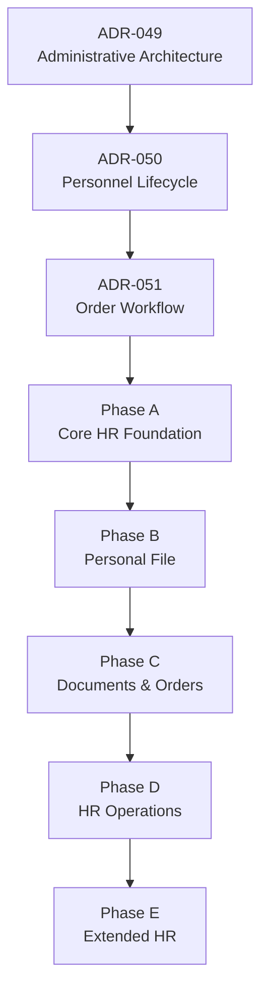
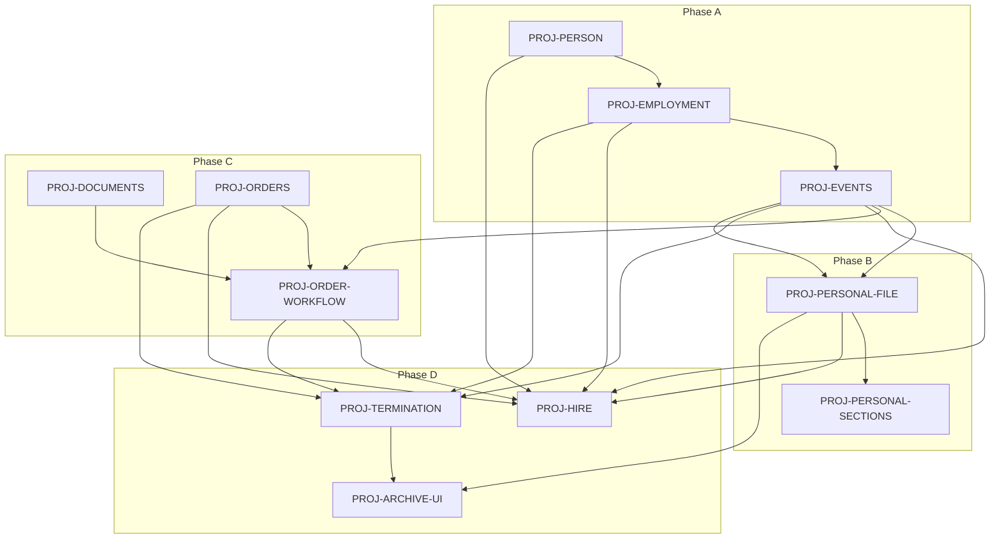

# HR Contour — Architecture Implementation Roadmap

| Поле | Значение |
|------|----------|
| **Тип документа** | Implementation Roadmap (не ADR) |
| **Дата** | 2026-06-30 |
| **Статус** | Active |
| **Основание** | [ADR-049](../adr/ADR-049-administrative-roles-and-responsibility-model.md), [ADR-050](../adr/ADR-050-personnel-lifecycle-architecture.md), [ADR-051](../adr/ADR-051-personnel-order-workflow-architecture.md) |
| **Governance** | [ARCHITECTURE_GOVERNANCE.md](../ARCHITECTURE_GOVERNANCE.md) |
| **Терминология** | [HR Domain Glossary](../reference/hr-domain-glossary.md) |
| **Область действия** | План реализации кадрового контура мультитенантной платформы |
| **Вне scope** | Новые архитектурные решения; код; API; БД; UI; миграции |

---

## 1. Назначение документа

Документ является **технической дорожной картой реализации кадрового контура**. Он **не принимает новых архитектурных решений** и не заменяет ADR. Его задача — раскладывать уже принятые решения на последовательные проекты реализации (Phase A–E, PROJ-*).

### 1.1. Роль принятых ADR

| ADR | Что определяет |
|-----|----------------|
| **[ADR-049](../adr/ADR-049-administrative-roles-and-responsibility-model.md)** | Person / Employee / Account / Access; три административных контура (platform, org-tech, HR); матрица ответственности; разделение кадрового и технического администрирования |
| **[ADR-050](../adr/ADR-050-personnel-lifecycle-architecture.md)** | Employment, Personal File, Archive, Rehire; Personnel Events; aggregate boundaries; инварианты lifecycle |
| **[ADR-051](../adr/ADR-051-personnel-order-workflow-architecture.md)** | Orders, Documents, Order workflow; юридический след; Draft → Effective; связь Order → Event → Employment |

### 1.2. Каноническая цепочка (из ADR)

```text
Person → Employee → Employment → Personal File → Orders → Documents → Archive
         ↑ Aggregate Root (ADR-050)
         Order workflow (ADR-051): Draft → Review → Approved → Signed → Effective → Archived
         └────────────► Account → Access   (ADR-049, org-tech)
```

Реализация следует этой цепочке **снизу вверх по фазам**: сначала фундамент (Person, Employment, Events), затем Personal File, юридический слой (Documents, Orders), операционные сценарии (Hire, Transfer, …), расширения.

---

## 2. Базовые архитектурные ограничения

Реализация **не должна нарушать** следующие ограничения. При конфликте с задачей — см. §9 (Implementation Guardrails).

| # | Ограничение | Источник |
|---|-------------|----------|
| 1 | **Employee** — HR Aggregate Root; единая точка mutating access к Employment, Personal File, Events, Orders, Documents, Archive | ADR-050 §4, INV-17 |
| 2 | **Person** — identity aggregate; устойчивая идентичность человека в рамках клиента | ADR-050 §3.1 |
| 3 | **Account / Access** — отдельный org-tech контур; не часть кадрового агрегата Employee | ADR-049, ADR-050 INV-13 |
| 4 | **Employee создаётся один раз** на пару Person + Client; не пересоздаётся при повторном приёме | ADR-050 INV-2 |
| 5 | **Rehire не создаёт новый Employee**; реактивирует существующий Aggregate Root | ADR-050 §4.3, INV-2 |
| 6 | **Rehire создаёт новый Employment**; terminated Employment не reopen | ADR-050 INV-3, INV-4 |
| 7 | **Employment не изменяется прямым PATCH** для lifecycle-изменений | ADR-050 INV-12 |
| 8 | Кадровые изменения проходят через **Personnel Event** (append-only history) | ADR-050 INV-6, INV-12 |
| 9 | Lifecycle **Personnel Event требует Order** (юридическое основание) | ADR-050 INV-11 |
| 10 | **Signed Order immutable**; после Signed — только compensating Order | ADR-050 INV-8; ADR-051 §4 |
| 11 | **Documents append-only**; версии как lineage, не overwrite | ADR-050 INV-7 |
| 12 | **Archive** — read-only logical mode; не delete personnel history | ADR-050 INV-9, INV-10 |

---

## 3. Phase A — Core HR Foundation

Первая реализационная фаза. Закладывает identity, периоды работы и event-driven lifecycle до Personal File и юридического слоя.

### PROJ-PERSON

**Цель:**

- ввести / стабилизировать **Person** как identity aggregate;
- устранить модель Employee без Person (`employee.person_id` обязателен в целевой модели);
- подготовить dedup / reconciliation Person как **отдельный будущий вопрос** (не блокирует Phase A).

**Ключевые результаты:** сущность Person; связь Employee → Person; запрет «сиротского» Employee без identity anchor.

**ADR:** ADR-049 (Person в цепочке), ADR-050 §3.1, будущий ADR-053 (migration).

---

### PROJ-EMPLOYMENT

**Цель:**

- вынести период работы из плоской модели Employee в **Employment**;
- поддержать **несколько Employment** на одного Employee (история + текущий период);
- подготовить **rehire** (новый Employment при том же Employee);
- определить **current employment projection** для реестра и карточки.

**Ключевые результаты:** Employment entity; статусы периода; projection layer; migration path от flat Employee fields.

**ADR:** ADR-050 §3.2–3.3, INV-3, INV-4.

---

### PROJ-EVENTS

**Цель:**

- ввести **Personnel Events** как механизм кадровых lifecycle-изменений;
- **запретить** прямые lifecycle PATCH Employee / Employment;
- подготовить **timeline** для будущего Personal File (хронология событий).

**Ключевые результаты:** event catalog; append-only event store; projection rules; audit trail.

**ADR:** ADR-050 §3.6, INV-6, INV-12; подготовка к INV-11 (Order binding — Phase C).

---

### Зависимости Phase A

```text
PROJ-PERSON  →  PROJ-EMPLOYMENT  →  PROJ-EVENTS
```

- Employment ссылается на Employee, Employee — на Person.
- Events мутируют projections Employment / Employee status только через event handlers, не через PATCH.

---

## 4. Phase B — Personal File

Фаза кадрового дела: content hub внутри агрегата Employee.

### PROJ-PERSONAL-FILE

**Цель:**

- создать **Personal File** как content hub внутри Employee aggregate;
- связать Personal File с Employee, Employment и Personnel Events;
- зафиксировать lifecycle Personal File: `open` ↔ `read_only` (при archive) ↔ `open` (rehire).

**Ключевые результаты:** shell Personal File; навигация из карточки сотрудника (INV-16); timeline hook для Events.

**ADR:** ADR-050 §3.4, INV-5, INV-16.

---

### PROJ-PERSONAL-SECTIONS

**Цель:** поэтапная реализация разделов личного листка:

| Раздел | Привязка данных |
|--------|-----------------|
| Фото | Personal File |
| Персональные сведения | Person |
| Документы личности | Person / Documents |
| Образование | Person |
| Сертификаты | Person / Documents |
| Семейное положение | Person |
| Воинский учёт | Person |
| Награды | Personal File / Events |
| Взыскания | Personal File / Events |
| История работы | Employment / Events |
| Контакты | Person |
| Языки | Person |
| Прочие сведения | Person / Personal File |
| Кадровая хронология | Personnel Events (timeline) |
| Приказы и основания | Orders / Documents |

**Примечание:** UI layout, wireframes и детальные правила редактирования по разделам могут быть вынесены в **отдельный проект или ADR** (например ADR-058 PII classification) при необходимости.

**ADR:** ADR-050 §9; ADR-049 (точка входа — карточка сотрудника, роль `hr`).

---

## 5. Phase C — Documents and Orders

Юридический слой: доказательная база и workflow приказов.

### PROJ-DOCUMENTS

**Цель:**

- ввести **append-only Document lineage** (версии, не overwrite);
- поддержать типы артефактов: Word draft, generated PDF, signed PDF, signed scan;
- подготовить **storage policy** (конкретный provider — ADR-052, вне scope roadmap).

**ADR:** ADR-050 §3.7, INV-7; ADR-051 §7.

---

### PROJ-ORDERS

**Цель:**

- реализовать **Order** как юридическое основание Personnel Event;
- поддержать номер, тип, статус, дату, **client/year numbering**;
- связать Orders с Documents и Personnel Events.

**ADR:** ADR-050 §3.5, INV-11; ADR-051 §3.

---

### PROJ-ORDER-WORKFLOW

**Цель:**

- реализовать lifecycle Order:

```text
Draft → Review → Approved → Signed → Effective → Archived
```

- **Void** — только до Signed;
- после Signed — отмена только через **compensating Order**;
- **Effective** — единственная точка автоматического создания Personnel Event (не PATCH Employment).

**E-sign:** адаптер электронной подписи **не входит в первую реализацию** Phase C; архитектурно предусмотрен в ADR-051 (§9, PROJ-ORDER-ESIGN — Phase C+). Первая реализация — manual sign + signed scan.

**Зависимости внутри Phase C:** PROJ-DOCUMENTS и PROJ-ORDERS могут параллелиться частично; PROJ-ORDER-WORKFLOW зависит от обоих.

**ADR:** ADR-051 §4–§5, LR-1…LR-5, OW-3, OW-17.

---

## 6. Phase D — HR Operations

Операционные кадровые сценарии поверх фундамента и юридического слоя.

### PROJ-HIRE

**Цель:** штатный сценарий приёма — создание Employee (если первый раз), Employment, Personal File через **HIRE** event + Order workflow.

**Зависимости:** Person, Employment, Events, Orders, Order Workflow, Personal File (shell).

---

### PROJ-TRANSFER

**Цель:** перевод между должностями / подразделениями через Order + Personnel Event (`TRANSFER`, `ORG_UNIT_CHANGE`, `POSITION_CHANGE`, …).

**Зависимости:** Employment projections, Events, Orders.

---

### PROJ-LEAVE

**Цель:** отпуска и отсутствия как Personnel Events (`LEAVE_START`, `RETURN_FROM_LEAVE`, …); статусы Employment `on_leave`.

**Зависимости:** Events, Orders (по политике типа приказа).

---

### PROJ-TERMINATION

**Цель:** увольнение через Order + Event; закрытие Employment (`terminated`); переход Employee в `archived`.

**Зависимости:** Employment, Events, Orders, Archive semantics.

---

### PROJ-ARCHIVE-UI

**Цель:**

- **read-only** архив после увольнения;
- сохранение полной истории (Events, Orders, Documents);
- подготовка UX / API для **rehire** (reactivation flow).

**Зависимости:** Archive mode (INV-9), Personal File read_only, Termination.

---

## 7. Phase E — Extended HR

Расширения контура; опциональные и специализированные сценарии.

### PROJ-CANDIDATE

**Цель:** опциональная **pre-hire** фаза Candidate (до Employee); конвертация Candidate → Person + Employee при HIRE.

**ADR:** ADR-050 §2.1; будущий ADR-057.

---

### PROJ-TERMS-CHANGE

**Цель:** изменение условий труда (`SALARY_CHANGE`, `TERMS_CHANGE`) **без пересоздания Employee** — через Order + Event.

---

### PROJ-AWARDS-DISCIPLINE

**Цель:** награды и взыскания как Personnel Events и разделы Personal File (`AWARD`, `DISCIPLINE`); без обязательной mutation Employment (по ADR-051 §3.2).

---

## 8. Dependency Map

### 8.1. Фазы и ADR



### 8.2. Проекты Phase A


### 8.3. Ключевые cross-phase зависимости



| Проект | Зависит от |
|--------|------------|
| **PROJ-HIRE** | Person, Employment, Events, Orders, Order Workflow, Personal File (shell) |
| **PROJ-TERMINATION** | Employment, Events, Orders, Order Workflow, Archive |
| **PROJ-PERSONAL-FILE** | Employee (aggregate), Events (timeline) |
| **PROJ-ORDER-WORKFLOW** | Documents, Orders, Events (Effective → Event) |

---

## 9. Implementation Guardrails

Правила для **будущих задач реализации** (в т.ч. заданий Cursor). Каждая задача должна явно фиксировать:

| Поле | Содержание |
|------|------------|
| **Затрагиваемые ADR** | ADR-049 / ADR-050 / ADR-051 (и amendment ADR при необходимости) |
| **Проверяемые invariants** | INV-1…INV-17 (ADR-050), LR/OW (ADR-051) — какие именно |
| **Изменяемые сущности** | Person, Employee, Employment, Event, Order, Document, Personal File, … |
| **Lifecycle-сценарии** | HIRE, REHIRE, TRANSFER, TERMINATION, … — или «infra only» |
| **Тесты** | unit / integration: invariant checks, event projection, workflow transitions |
| **Миграции** | требуются / не требуются; если да — ссылка на PROJ-* и ADR-053 |
| **Соответствие ADR** | явное «не нарушает ADR-049/050/051» или блокер |

### 9.1. Правило изменения архитектуры

> **Если реализация требует нарушения ADR-049, ADR-050 или ADR-051** — сначала создаётся **новый ADR или amendment** к существующему ADR, а **не** прямое изменение кода «в обход» решения.

### 9.2. Чеклист перед merge (минимум)

- [ ] Не создаётся второй Employee при rehire (INV-2).
- [ ] Rehire создаёт новый Employment, не reopen terminated (INV-4).
- [ ] Lifecycle-изменения не через PATCH Employee/Employment (INV-12).
- [ ] Lifecycle Event имеет Order (INV-11) — после Phase C.
- [ ] Signed Order не редактируется (INV-8).
- [ ] Documents / Events append-only (INV-6, INV-7).
- [ ] Archive — logical read-only, не delete (INV-9, INV-10).
- [ ] Account / Access не создаются в HR flow без org-tech контура (INV-13).
- [ ] Mutations в контексте Employee aggregate root (INV-17).

### 9.3. Шаблон описания задачи

```markdown
## [PROJ-*] Task title

**ADR:** ADR-050 §…, ADR-051 §…
**Invariants:** INV-12, INV-11, OW-3
**Entities:** Employment, PersonnelEvent
**Scenario:** TRANSFER (or: infrastructure — projection layer)
**Tests:** test_no_patch_lifecycle; test_transfer_creates_event_with_order
**Migrations:** required — PROJ-EMPLOYMENT migration step 2
**ADR compliance:** does not violate ADR-049/050/051
```

---

## 10. Out of Scope

Данный roadmap **намеренно не определяет**:

| Область | Делегирование |
|---------|---------------|
| Конкретные таблицы БД, индексы | Backend projects, ADR-052, ADR-053 |
| Конкретные API endpoints, OpenAPI | Backend projects per PROJ-* |
| UI-макеты, wireframes, navigation | Отдельные UX / frontend projects |
| Конкретный storage provider (S3, blob, …) | ADR-052 |
| E-sign provider (НУЦ, DocuSign, …) | PROJ-ORDER-ESIGN, integration ADR |
| OCR / распознавание документов | Отдельный проект |
| Payroll, GL, бухгалтерские начисления | Integration ADR |
| Кадровая аналитика, BI, dashboards | Отдельный проект |
| Импорт исторических данных | ADR-059, PROJ-* migration |

---

## 11. Связанные документы

| Документ | Назначение |
|----------|------------|
| [ARCHITECTURE_GOVERNANCE](../ARCHITECTURE_GOVERNANCE.md) | Иерархия ADR → Glossary / Roadmap → Implementation |
| [ADR README](../adr/README.md) | Реестр ADR и базовый стек |
| [ADR-049](../adr/ADR-049-administrative-roles-and-responsibility-model.md) | Административная архитектура |
| [ADR-050](../adr/ADR-050-personnel-lifecycle-architecture.md) | Lifecycle, сущности, инварианты |
| [ADR-051](../adr/ADR-051-personnel-order-workflow-architecture.md) | Order workflow |
| [Концептуальная модель данных](../концептуальная_модель_данных_и_erd_типовая_инфраструктура_b_2_b.md) | ERD, as-is / target gap |

---

## 12. История изменений

| Дата | Изменение |
|------|-----------|
| 2026-06-30 | Первая версия roadmap на основе ADR-049/050/051 Accepted |
