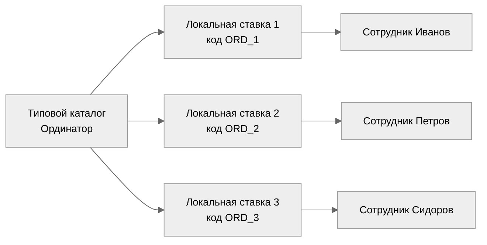

# Должности: типовая роль и несколько ставок в отделении

Краткое руководство для HR и администраторов организации в рабочем пространстве `/client/{id}`.

**Файлы в этой папке:** [HTML для браузера и скриншота](руководство_должности_тип_и_ставки.html) · [оглавление руководств](README.md)

---

## 1. Два уровня (не путать)

| Уровень | Где в системе | Сколько записей «Ординатор» |
|--------|----------------|-----------------------------|
| **Типовая должность** | Глобальный справочник `/global/positions` (`PositionCatalog`) | **Одна** — роль для регламентов, KPI и матрицы навыков |
| **Штатная должность (ставка)** | «Локальные должности» организации (`Position`) | **Столько, сколько людей/мест** в подразделении |

Три ординатора в «Хирургии 1» — это **три строки** в локальных должностях, а не три записи в глобальном каталоге.

При **развёртывании типовой оргструктуры** вторая строка с тем же кодом каталога в том же отделении **не создаётся** (идемпотентность). Если вручную копируете из каталога (**+ Скопировать** в локальных должностях) во второй раз — система создаст ставку с кодом `ORDINATOR_2`, `ORDINATOR_3`, … и покажет сообщение вида: *«Уже есть: ORDINATOR. Создана ставка с кодом ORDINATOR_2.»*

---

## 2. Схема связей

Ниже — диаграмма для вставки в руководство. В Markdown-редакторах с поддержкой Mermaid (VS Code, GitHub, Obsidian) она рисуется на **светлом фоне** (`theme: neutral`).



**Смысл стрелок:** из каталога берётся **тип** (`position_catalog_code`); на каждую локальную ставку через **«Назначить»** вешается **один** сотрудник.

---

## 3. Та же схема текстом (для Word без Mermaid)

```
  [ Типовой каталог: Ординатор ]
           |
     +-----+-----+-----+
     |     |     |     |
  [ORD_1][ORD_2][ORD_3]   <- локальные коды в отделении
     |     |     |
  Иванов Петров Сидоров   <- «Назначить» на каждую ставку
```

---

## 4. Пошагово в интерфейсе

1. В глобальном справочнике — одна должность «Ординатор» (код, например `ORDINATOR`).
2. В организации → **Локальные должности**:
   - первая строка: из каталога или вручную, код `ORDINATOR` (или как в шаблоне);
   - для 2-й и 3-й ставки: **+ Скопировать** из каталога или **Действия → Копировать** у строки — в обоих случаях коды `ORDINATOR_2`, `ORDINATOR_3`, … (без суффикса `_COPY` и без «(Копия)» в названии);
   - поле **«Код типовой должности (каталог)»** у всех трёх — один и тот же `ORDINATOR`;
   - **название** может быть одинаковым («Ординатор»); в таблице видно назначенного сотрудника.
3. На каждую строку: **Действия → Назначить** → выбрать человека.

**Не рекомендуется:** заводить в глобальном каталоге «Ординатор 1», «Ординатор 2» — усложняются регламенты и навыки.

**Секции** (`section` в оргдереве) — для группировки по постам/сменам, а не вместо нескольких ставок в одном отделении.

---

## 5. Как вложить схему в руководство (светлый фон)

### Вариант A — картинка (Word, PDF, Confluence)

1. Откройте [mermaid.live](https://mermaid.live).
2. Вставьте блок из раздела 2 (от `flowchart` до конца, без обёртки ` ```mermaid `).
3. В панели справа выберите тему **Neutral** или **Default** (светлый фон).
4. **Actions → PNG** или **SVG** — вставьте файл в документ.

### Вариант B — Markdown / GitHub / Obsidian

Откройте этот файл в редакторе с предпросмотром Mermaid — диаграмма на светлом фоне.

### Вариант C — только текст

Используйте раздел 3 — подходит для любого редактора без поддержки диаграмм.

### Вариант D — HTML для печати и скриншота

Откройте в браузере **[руководство_должности_тип_и_ставки.html](руководство_должности_тип_и_ставки.html)** — белый фон, готовая схема. Ctrl+P → «Сохранить как PDF» или скриншот блока «2. Схема».

---

## 6. Связанные материалы в репозитории

- [Справочники: глобальные и данные организации](../architecture/reference_catalogs_global_and_client.md)
- Рабочее пространство: вкладка **«Локальные должности»**, действия **Назначить** / **Копировать**

---

*Версия для вставки в пользовательское руководство. Май 2026.*
