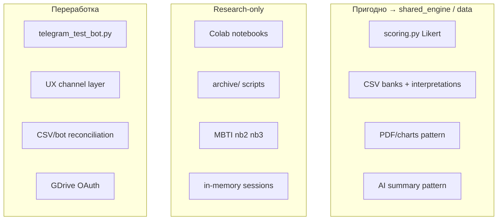

# 01 — AS-IS Analysis

Версия: Draft 0.1

---

## 1. Резюме

Модуль `psychological_testing/` **отсутствует** в репозитории `10 Typical_infrastructure`. Психологическое тестирование зафиксировано в архитектуре HR OS как operational module (Stage 2), но реализован только UI-placeholder.

Фактическая legacy-реализация — sibling-проект **`07 PsychTest`**: Telegram-бот с 4 тестами (PAEI, DISC, HEXACO, Soft Skills). MBTI — в Colab-прототипах (3 ноутбука), не в production-коде.

---

## 2. Состояние в HR OS (`10 Typical_infrastructure`)

| Компонент | Статус | Путь |
|-----------|--------|------|
| UI placeholder | Muted sidebar tab | `static/shared/sidebar-registry.js`, `static/workspace/index.html` |
| Architecture agreement | Draft 0.1 | `docs/hr-os/architecture/HR_Operating_System_Architecture_Agreement.md` |
| Conceptual entity | `AssessmentSession` | `docs/architecture/концептуальная_модель_данных_и_erd_...md` §8.1 |
| Module code | **Отсутствует** | — |
| API | **Отсутствует** | — |
| DB tables (`pt_*`) | **Отсутствуют** | — |

### Reference: единственный реализованный HR plugin

`skill_assessment/` — эталон plugin-архитектуры:

- bootstrap → domain → services → infrastructure → integration → adapters;
- mount в `app/main.py` как `/api/skill-assessment/*`;
- таблицы `sa_*` на shared `app.db` Base;
- Telegram + STT + AI внутри модуля.

Psychological Testing должен повторить **форму** plugin, но не **домен** Skill Assessment.

---

## 3. Legacy: `07 PsychTest`

### 3.1. Dual architecture (ключевая проблема)

```text
07 PsychTest
├── telegram_test_bot.py      ← PRODUCTION (~1300 lines, monolith)
│   ├── inline keyboard UX
│   ├── inline scoring (NOT using scoring.py)
│   └── in-memory user_sessions
└── src/psytest/              ← PROTOTYPE (Streamlit/CLI)
    ├── scoring.py            ← generic Likert (22 lines)
    ├── bank.py + data/bank/  ← CSV item banks
    └── web_app.py            ← Streamlit UI
```

Два параллельных scoring path без общей абстракции.

### 3.2. Четыре теста (legacy)

| Test | UX (legacy bot) | Scoring (legacy bot) | Scoring (src/psytest) |
|------|-----------------|----------------------|------------------------|
| **PAEI** | Inline A/B forced choice | Count P/A/E/I picks | `score_paei()` via CSV |
| **DISC** | Inline Likert 1–5 | Sum + average per scale | `score_disc()` via CSV |
| **HEXACO** | Inline Likert 1–5 | 6 hardcoded questions | `score_hexaco()` via CSV |
| **Soft Skills** | Inline Likert 1–5 | 10 hardcoded skills | **Not in scoring.py** |

### 3.3. Пригодно для reuse

| Asset | Путь (07 PsychTest) | Назначение в target |
|-------|---------------------|---------------------|
| Generic Likert scorer | `src/psytest/scoring.py` | `shared_engine` → `likert_sum` |
| Item bank schema | `data/bank/*.csv` | `data/banks/v1/` |
| Interpretation bands | `data/interpretations/*.csv` | `interpretation_engine` |
| Question + AI prompts | `data/prompts/` | test plugins |
| AI interpreter pattern | `src/psytest/ai_interpreter.py` | AI gateway slot (summary only) |
| PDF + charts | `enhanced_pdf_report_v2.py`, `charts.py` | `report_builder` |
| Colab lineage | `docs/Тестирование_психолог_...ipynb` | `research/colab/` |

### 3.4. Research-only (не переносить as-is)

- In-memory `user_sessions` — no persistence, no multi-instance
- `data/schema.sql` + `init_db.py` — unused by bot
- `archive/` (~88 scripts), `tests/archived/` (~100 scripts)
- Standalone GDrive OAuth (`oauth_google_drive.py`)
- Hardcoded HEXACO 6 questions, Soft Skills map in Python
- Streamlit stack on production server

### 3.5. Требует переработки

| Issue | Detail |
|-------|--------|
| Monolithic bot | parsing + state + scoring + reporting в одном файле |
| UX mismatch | Legacy: inline-only; Target: text + buttons + voice hint |
| Dual scoring | Bot inline vs `scoring.py` — unify under pipeline |
| CSV drift | DISC: 4 items in CSV vs 8 in bot; banks ≠ live questions |
| ScaleNormalizer | Passthrough, misnamed |
| interpretation_utils | Regex tied to specific prompt files |

---

## 4. MBTI — Colab prototypes (не в 07 PsychTest)

| # | Notebook | Scoring | Status |
|---|----------|---------|--------|
| 1 | `Тест_MBTI_по_вопросам_выводы.ipynb` | Deterministic `calculate_type_from_answers` | Production candidate |
| 2 | `Тест_OpenAI_MBTI.ipynb` | AI-generated questions + count | Research only |
| 3 | `Process_AI_Orchestrator_v3_universal.ipynb_` | Episodic axis validation | Advanced research |

Подробнее: [13_MBTI_EXTENSION_POINT.md](13_MBTI_EXTENSION_POINT.md).

---

## 5. Классификация: пригодно / research / rework



---

## 6. Gap analysis: AS-IS → Target

| Capability | AS-IS | Target |
|------------|-------|--------|
| Universal test engine | ❌ | `shared_engine/` |
| Test plugins | ❌ (hardcoded in bot) | `tests/{paei,disc,...}/` |
| HR OS integration | ❌ | `integration/hr_core.py` |
| Multi-tenant | ❌ | `client_id` on `pt_*` |
| Voice + buttons UX | ❌ (inline only) | Text + buttons + voice |
| MBTI | Colab only | `tests/mbti/` plugin |
| Persistence | In-memory | `pt_*` tables (Phase 4) |
| RBAC | ❌ | org-scoped roles (Phase 4) |

---

## 7. Выводы

1. **Greenfield module** в HR OS с migration source в `07 PsychTest`.
2. Переносить **алгоритмы и data assets**, не **monolith bot**.
3. Channel layer (Telegram) проектируется заново: text + buttons + voice.
4. MBTI добавляется как 5-й test plugin через extension point, не через core hardcoding.
