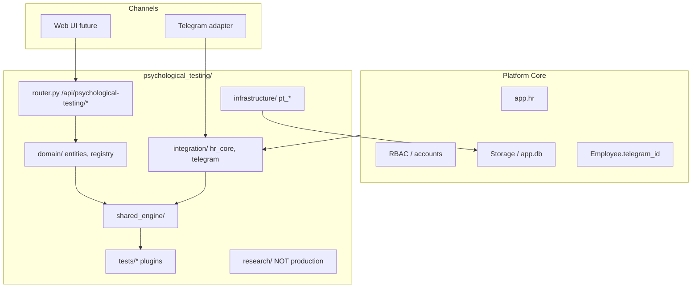
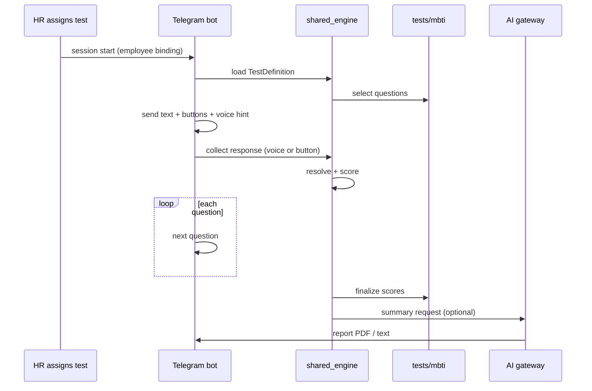

# 02 — Target Architecture

Версия: Draft 0.1

---

## 1. Позиционирование

Psychological Testing — **operational HR module** (Level 3) в [HR Operating System](../architecture/HR_Operating_System_Architecture_Agreement.md):

```text
Platform Core (app/)
    ↓
Organization Layer (clients, employees, org_units)
    ↓
HR Operating System
    ├── psychological_testing/    ← этот модуль
    ├── skill_assessment/       ← отдельный модуль (не смешивать)
    └── … (future HR modules)
```

**Не является:**

- global catalog / sidebar classifier;
- частью Skill Assessment;
- standalone Telegram bot (как 07 PsychTest).

**Является:**

- Universal Psychological Testing Platform;
- plugin-based test engine + test-specific plugins;
- channel-agnostic core (Telegram first, web later).

---

## 2. Архитектурные принципы

| # | Принцип | Источник |
|---|---------|----------|
| 1 | HR modules = separate operational domain | HR OS Agreement §4, §12 |
| 2 | Unified Engine Approach — один engine, много тестов | HR OS Agreement §6.1 |
| 3 | Reuse platform: RBAC, audit, storage, AI gateway | HR OS Agreement §6.2–6.3 |
| 4 | No AI-psychologist, no auto HR decisions | HR OS Agreement §11 |
| 5 | No hardcoded MBTI in core | Architecture decision |
| 6 | Psych Testing ≠ Skill Assessment | Domain separation |
| 7 | Scoring deterministic; AI for summary only | UX + compliance |

---

## 3. Layer diagram



---

## 4. Universal Test Platform — core concept

```text
TestDefinition (config)
    → ItemBankLoader
    → SessionStateMachine
    → ResponseCollector (voice / button / text)
    → AnswerResolver (voice/text → structured)
    → ScoringPipeline (strategy dispatch)
    → Normalization
    → InterpretationEngine (bands + AI summary slot)
    → ReportBuilder
```

Каждый тест (PAEI, DISC, HEXACO, Soft Skills, MBTI) — **plugin** с:

- `definition.yaml` — metadata, scoring_type, version;
- optional custom scorer;
- test-specific item bank, interpretation, answer patterns.

Core engine **не знает** про MBTI, PAEI и т.д. — только про `scoring_type` и contracts.

---

## 5. Separation from Skill Assessment

| Aspect | Skill Assessment | Psychological Testing |
|--------|-----------------|----------------------|
| Package | `skill_assessment/` | `psychological_testing/` |
| API prefix | `/api/skill-assessment/*` | `/api/psychological-testing/*` |
| DB prefix | `sa_*` | `pt_*` |
| Domain | Competency, regulation exam, rubric | Psychometric profiles, typology |
| Scoring | Embedding similarity, rubric 0–3 | Likert, forced-choice, dichotomy |
| Primary UX | Part1 voice interview + LLM eval | Structured Q&A + deterministic resolver |
| AI role | Case generation, answer evaluation | Post-score summary only |
| Shared | `app.hr`, platform storage, RBAC foundation | Same |

**Запрещено:**

- общие таблицы sessions/results между модулями;
- общий scoring engine (разные домены);
- вынос psych tests в global catalogs.

---

## 6. Internal entities (HR OS §8)

Допустимые **internal** metadata (без global UI):

- `test_templates` / TestDefinition
- `scoring_schemas`
- `interpretation_schemas`
- AI prompt templates

Хранятся в `psychological_testing/data/` и `tests/*/`, не в platform global layer.

---

## 7. Channel strategy

**Phase 1 channel:** Telegram (adapter pattern from `skill_assessment`).

**UX contract:**

- Outbound: текстовый вопрос + inline-кнопки + подсказка «🎤 Можно ответить голосом»
- Inbound (priority): voice → STT → answer_resolver
- Inbound (equal fallback): inline button tap → structured answer (no STT)
- Inbound (secondary fallback): text message → answer_resolver

Подробнее: [06_TELEGRAM_INTEGRATION.md](06_TELEGRAM_INTEGRATION.md).

---

## 8. Data flow (happy path)



---

## 9. Target package location

```text
10 Typical_infrastructure/
├── psychological_testing/          # future HR module (Phase 1+)
├── skill_assessment/               # existing, do not merge
├── app/                            # platform core
└── docs/hr-os/psychological_testing/   # this documentation
```

---

## 10. Non-goals (current phase)

- Production FastAPI router implementation
- DB migrations (`pt_*`)
- Workspace UI activation
- AI hiring automation
- Cross-module analytics dashboard

См. [10_IMPLEMENTATION_ROADMAP.md](10_IMPLEMENTATION_ROADMAP.md).
