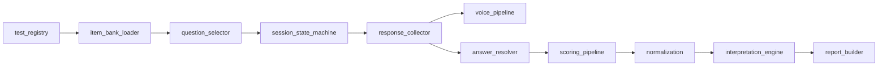
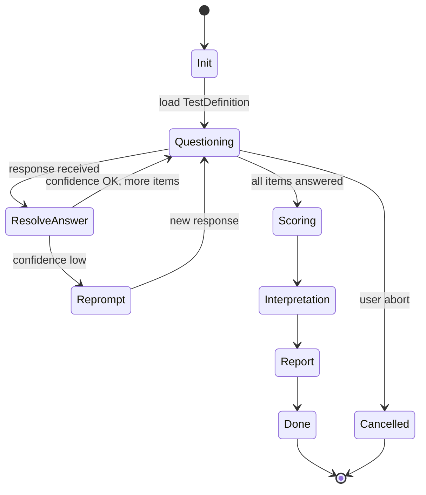

# 04 — Universal Test Engine

Версия: Draft 0.1

---

## 1. Назначение

Universal Test Engine (`shared_engine/`) — ядро платформы, которое:

- загружает TestDefinition;
- управляет session lifecycle;
- собирает ответы (voice / button / text);
- dispatch scoring по `scoring_type`;
- нормализует и интерпретирует результаты;
- генерирует отчёт.

Engine **не содержит** test-specific контента (вопросы MBTI, шкалы PAEI).

---

## 2. Core abstractions

### 2.1. TestDefinition

Декларативный дескриптор теста (YAML):

```yaml
test_id: mbti
version: "1.0.0"
scoring_type: dichotomy_weighted_choice
display_name: "MBTI (structured)"
item_bank: data/banks/v1/mbti_items.yaml
channel:
  question_format: text_with_buttons
  voice_hint: true
  allowed_inputs: [voice, button, text]
selection:
  questions_per_axis: 4
  max_per_axis: 12
  sort_by: weight_desc
  shuffle_axes: true
  seed: 42
scoring:
  tie_break: first_pole
  expression_levels: [0.3, 0.7]
normalization:
  method: none
interpretation: data/interpretations/v1/mbti.yaml
ai:
  role: summary_only
  prompt: data/prompts/v1/mbti_summary.txt
```

### 2.2. TestSession

```yaml
session_id: uuid
client_id: string
employee_id: string
test_id: mbti
test_version: "1.0.0"
status: in_progress | completed | cancelled
started_at: datetime
responses: []          # structured answers
raw_transcripts: []    # voice audit trail
current_item_index: int
```

### 2.3. StructuredAnswer

```yaml
item_id: string
input_channel: voice | button | text
raw_input: string          # transcript or button payload
resolved_value: any        # pole, 1-5, P/A/E/I
confidence: float          # 0.0 - 1.0
resolver_method: regex | keyword | exact_button
```

### 2.4. ScoreResult

```yaml
raw_scores: { scale: number }
normalized_scores: { scale: number }
typology_code: string | null    # e.g. INTJ
axis_details: { axis: { dominant, level, counts } }
metadata:
  scoring_type: string
  test_version: string
```

---

## 3. Scoring types (extensible enum)

| scoring_type | Used by | Engine component |
|--------------|---------|------------------|
| `likert_sum` | DISC, HEXACO | `scoring_pipeline.likert` |
| `forced_choice_count` | PAEI | `scoring_pipeline.forced_choice` |
| `likert_per_dimension` | Soft Skills | `scoring_pipeline.per_dimension` |
| `dichotomy_weighted_choice` | MBTI structured | `dichotomy_scorer` |
| `dichotomy_simple_count` | MBTI nb2 (research) | `dichotomy_scorer` |
| `orchestrated_episode` | MBTI nb3 (research) | custom plugin only |
| `custom` | escape hatch | `tests/*/scorer.py` |

Adding new test = add plugin + scoring_type if needed. **Never** hardcode test name in engine.

---

## 4. Component responsibilities



| Component | Responsibility |
|-----------|----------------|
| `test_registry` | Load and validate TestDefinition; plugin discovery |
| `item_bank_loader` | CSV/YAML → validated item list |
| `question_selector` | Weight-based sampling, axis shuffle, seed |
| `session_state_machine` | States: init → questioning → scoring → report → done |
| `response_collector` | Unified intake: voice, button callback, text |
| `voice_pipeline` | Download Telegram audio → STT → transcript |
| `answer_resolver` | Transcript/text → structured value + confidence |
| `scoring_pipeline` | Dispatch by scoring_type |
| `dichotomy_scorer` | Generic 4-pole typology (MBTI and future) |
| `normalization` | Config-driven scale transforms |
| `interpretation_engine` | Band lookup + AI summary slot |
| `report_builder` | PDF/charts assembly |

---

## 5. Session state machine



### Reprompt policy

При `confidence < threshold` (default 0.7):

- Не записывать score;
- Отправить: «Не удалось распознать ответ. Выберите кнопку или повторите голосом: A или B»;
- Inline-кнопки остаются активными.

---

## 6. Response collector — tri-mode input

| Channel | Priority | Processing |
|---------|----------|------------|
| **Inline button** | Equal (deterministic) | Direct structured value from callback_data |
| **Voice** | Primary UX | STT → answer_resolver |
| **Text** | Fallback | answer_resolver (same rules as voice transcript) |

Все три канала converging в `StructuredAnswer` перед scoring.

---

## 7. Test registry API (conceptual)

```python
# Conceptual — not implemented
registry.get("mbti")           # → TestDefinition
registry.list_enabled(client)  # → per-org enabled tests (future)
registry.validate(definition)  # → schema errors
```

---

## 8. Extension: adding a new test

1. Copy `tests/_template/` → `tests/new_test/`
2. Fill `definition.yaml` with scoring_type
3. Add item bank to `data/banks/v1/`
4. Add `answer_patterns.yaml` for voice/text resolver
5. Register via filesystem scan (no core code change)
6. If new scoring_type needed — add strategy to `scoring_pipeline`, not test-specific hack

---

## 9. Relationship to HR OS internal entities

| HR OS entity | Engine mapping |
|--------------|----------------|
| `test_templates` | TestDefinition YAML files |
| `scoring_schemas` | scoring_type + scoring config block |
| `interpretation schemas` | interpretation YAML/CSV + bands |
| AI prompt templates | `ai.prompt` in TestDefinition |

Internal metadata — no global UI sidebar entry.

---

## 10. Non-goals

- LLM-based answer interpretation in engine
- Test-specific branching hardcoded in state machine
- Shared engine imports from `research/`

См. также: [05_SHARED_SCORING_ARCHITECTURE.md](05_SHARED_SCORING_ARCHITECTURE.md), [09_SHARED_VS_TEST_SPECIFIC.md](09_SHARED_VS_TEST_SPECIFIC.md).
