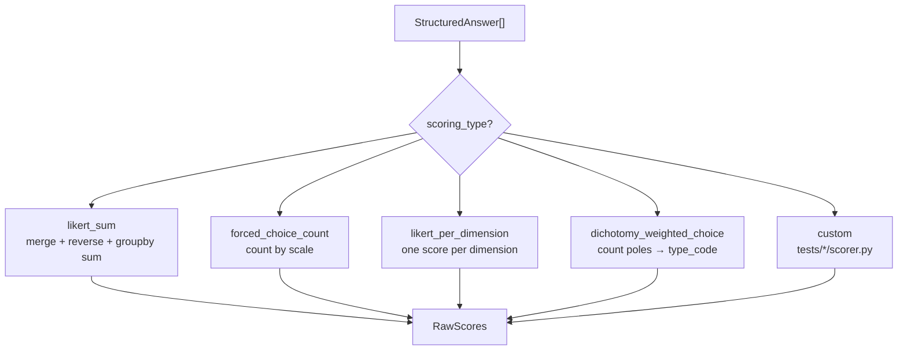

# 05 — Shared Scoring Architecture

Версия: Draft 0.1

---

## 1. Pipeline overview

```text
StructuredAnswer[]
    → ScoringPipeline.dispatch(scoring_type)
    → RawScores
    → Normalization (config-driven)
    → ScoreResult
    → InterpretationEngine (bands + optional AI summary)
```

Scoring **всегда детерминированный**. LLM не участвует в pipeline.

---

## 2. ScoringPipeline



---

## 3. Strategy: `likert_sum`

**Source:** `07 PsychTest/src/psytest/scoring.py`

**Algorithm:**

1. Merge responses with item metadata (scale, reverse)
2. Reverse coding: `max_val + 1 - answer` when `reverse == 1`
3. `groupby('scale').sum()` → raw sums

**Used by:** DISC, HEXACO

```yaml
# tests/disc/definition.yaml
scoring_type: likert_sum
response_scale: { min: 1, max: 5 }
normalization: { method: average_per_scale }
```

**Legacy note:** bot used average per scale; CSV scorer uses sum. Target normalization config resolves this.

---

## 4. Strategy: `forced_choice_count`

**Source:** PAEI logic in `telegram_test_bot.py`

**Algorithm:**

1. Each item maps to one of scales P, A, E, I
2. Count selections per scale
3. No reverse coding

**Used by:** PAEI (Adizes)

```yaml
scoring_type: forced_choice_count
scales: [P, A, E, I]
normalization: { method: percentage_of_total }
```

---

## 5. Strategy: `likert_per_dimension`

**Source:** Soft Skills in `telegram_test_bot.py`

**Algorithm:**

1. One question per dimension/skill
2. Direct Likert 1–5 (or 1–10) per skill
3. Output: `{ skill_name: score }`

**Used by:** Soft Skills

```yaml
scoring_type: likert_per_dimension
response_scale: { min: 1, max: 5 }
scales: [communication, leadership, ...]
```

---

## 6. Strategy: `dichotomy_weighted_choice`

**Source:** `Тест_MBTI_по_вопросам_выводы.ipynb` → `calculate_type_from_answers`

**Algorithm:**

1. Input: `[(axis_id, pole), ...]` e.g. `[("E/I", "E"), ("S/N", "N")]`
2. Count per pole per axis
3. Dominant: `pos_count >= neg_count` → first pole (configurable tie_break)
4. Expression level 1–3: `ratio = |diff|/total`; thresholds `[0.3, 0.7]`
5. Output: `type_code` (4 letters) + `axis_details`

**Component:** `shared_engine/dichotomy_scorer.py` — **generic**, poles configured in TestDefinition.

**Used by:** MBTI structured (production candidate)

```yaml
scoring_type: dichotomy_weighted_choice
axes:
  - { id: "E/I", poles: [E, I] }
  - { id: "S/N", poles: [S, N] }
  - { id: "T/F", poles: [T, F] }
  - { id: "J/P", poles: [J, P] }
```

### Question selection (pre-scoring)

`shared_engine/question_selector.py`:

- Sort items by `weight` desc per axis
- Take top `questions_per_axis` (2–12)
- Shuffle axis order (seed for reproducibility)

---

## 7. Research-only strategies

| Strategy | Source | Status |
|----------|--------|--------|
| `dichotomy_simple_count` | `Тест_OpenAI_MBTI.ipynb` | Research — AI-generated questions |
| `orchestrated_episode` | `Process_AI_Orchestrator_v3` | Research — episodic inference |

**Not allowed in production** without explicit promotion. See [13_MBTI_EXTENSION_POINT.md](13_MBTI_EXTENSION_POINT.md).

---

## 8. Normalization

Config-driven post-scoring transforms:

| Method | Applied to | Formula |
|--------|-----------|---------|
| `none` | MBTI | Raw pole counts / type_code as-is |
| `average_per_scale` | DISC | sum / item_count per scale |
| `percentage_of_total` | PAEI | count / total × 100 |
| `scale_0_60` | Legacy reports | map to 0–60 for interpretation CSV |
| `scale_0_100` | Future | percentage display |

Legacy `ScaleNormalizer` (passthrough) — **replace** with explicit normalization config.

---

## 9. Interpretation layer

After scoring:

1. **Band lookup** — CSV/YAML: `scale, range_low, range_high, level, text`
2. **Static fallback** — template text when no AI key
3. **AI summary slot** — optional narrative (post-score only)

Interpretation **never changes** raw scores.

---

## 10. Test mapping summary

| Test | scoring_type | Item bank | Normalization | AI role |
|------|-------------|-----------|---------------|---------|
| PAEI | `forced_choice_count` | `paei_items.csv` | percentage | summary |
| DISC | `likert_sum` | `disc_items.csv` | average_per_scale | summary |
| HEXACO | `likert_sum` | `hexaco_items.csv` | average or 0-60 | summary |
| Soft Skills | `likert_per_dimension` | `soft_skills_items.csv` | none | summary |
| MBTI | `dichotomy_weighted_choice` | `mbti_items.yaml` | none | summary; **lookup 16 types** |

---

## 11. Voice/button → scoring path

Scoring pipeline receives **only** `StructuredAnswer` with resolved values:

```text
Voice "вариант А" → resolver → { pole: E } → dichotomy_scorer
Button tap "A"    → collector  → { pole: E } → dichotomy_scorer  (same path)
Text "A"          → resolver   → { pole: E } → dichotomy_scorer
```

Button path bypasses STT — highest confidence (1.0).

---

## 12. Validation rules

On item bank load:

- All scales in items exist in TestDefinition.scales/axes
- Response values within `response_scale` bounds
- No duplicate item_id within version
- MBTI: exactly 2 poles per axis in each item
- Weight in range 1–3 for MBTI

On session complete:

- Minimum response count met
- All required axes have ≥1 response (MBTI: configurable min per axis)

---

## 13. Migration from 07 PsychTest

| Legacy | Target |
|--------|--------|
| Bot inline `+= 1` counters | `ScoringPipeline` |
| `scoring.py` pandas | `likert_sum` strategy (same algorithm) |
| `calculate_type_from_answers` (Colab) | `dichotomy_scorer.py` |
| `interpretation_utils.py` regex | `interpretation_engine` + YAML bands |
| `ScaleNormalizer` passthrough | explicit `normalization` config |

---

## 14. Open items

- Reconcile DISC/HEXACO CSV item counts with bot question sets
- HEXACO dimension mapping review (A/C naming risk in legacy)
- Norm tables (`norms_hexaco.csv`) — integrate in Phase 2 or defer

См. [11_TECHNICAL_DEBT.md](11_TECHNICAL_DEBT.md).
