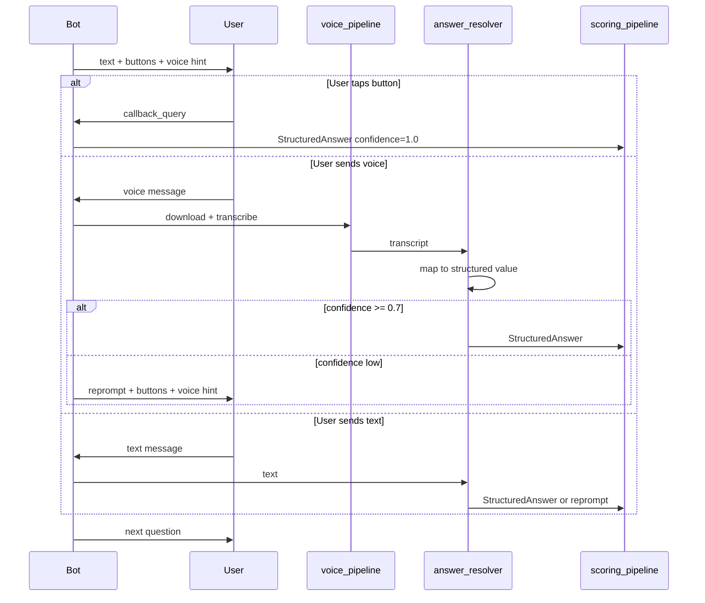

# 06 — Telegram Integration

Версия: Draft 0.1

---

## 1. UX contract (зафиксировано)

### Outbound (бот → пользователь)

Каждый вопрос отправляется **текстовым сообщением** с:

1. Номер вопроса и контекст (ось, шкала — если применимо)
2. Формулировка вопроса
3. Явный список вариантов (A/B, 1–5, P/A/E/I)
4. **Inline-кнопки** с вариантами ответа
5. **Подсказка о голосе** — обязательная строка в каждом сообщении

### Inbound (пользователь → бот) — три равноправных канала

| Канал | Приоритет UX | Processing | Confidence |
|-------|-------------|------------|------------|
| **Inline button** | Recommended for precision | `callback_data` → structured value | 1.0 |
| **Voice message** | Recommended for convenience | STT → answer_resolver | 0.0–1.0 |
| **Text message** | Fallback | answer_resolver | 0.0–1.0 |

**Design intent:** голос — для удобства; кнопки — для точности; пользователь выбирает сам. Бот **явно сообщает**, что можно ответить голосом.

---

## 2. Message template

### MBTI (A/B example)

```text
[3/16] Ось: Экстраверсия / Интроверсия

При знакомстве с новой командой вы…

A) быстро завожу контакты
B) сначала наблюдаю со стороны

🎤 Можно ответить голосом (скажите «А» или «Б»)
или нажмите кнопку ниже.
```

Inline keyboard:

```text
[ A ]  [ B ]
```

### DISC (Likert 1–5 example)

```text
[2/8] Шкала: D (Dominance)

Я предпочитаю принимать решения быстро.

1 — совсем не согласен … 5 — полностью согласен

🎤 Можно ответить голосом («три», «четыре»…)
или нажмите кнопку ниже.
```

Inline keyboard:

```text
[ 1 ] [ 2 ] [ 3 ] [ 4 ] [ 5 ]
```

### Voice hint — constants

```yaml
# config/channel.yaml (future)
voice_hint_ru: "🎤 Можно ответить голосом или нажмите кнопку ниже."
voice_hint_short: "🎤 Голосом или кнопкой"
show_voice_hint: true   # always true in production
```

---

## 3. Sequence diagram



---

## 4. Architecture components

```text
psychological_testing/
├── integration/
│   └── telegram_adapter.py       # session ↔ Telegram chat
├── adapters/
│   └── telegram_outbound.py      # sendMessage + inline keyboard
└── shared_engine/
    ├── response_collector.py     # tri-mode intake
    ├── voice_pipeline.py         # STT wrapper
    └── answer_resolver.py        # transcript/text → value
```

### Worker process

Mirror `skill_assessment/telegram_worker.py`:

- Standalone polling: `python -m psychological_testing.telegram_worker`
- Avoids uvicorn `--reload` 409 conflict
- Env: `TELEGRAM_ENABLE_POLLING=1`, `PSYCH_TESTING_*`

---

## 5. Reuse from skill_assessment

| Pattern | Source | Adaptation |
|---------|--------|------------|
| Voice download + STT | `skill_assessment/integration/telegram_poller.py` | `_download_and_transcribe_telegram_voice()` |
| STT service | `skill_assessment/services/stt_service.py` | New wrapper with `PSYCH_TESTING_STT_*` prefix |
| Post-STT blacklist | `skill_assessment/services/llm_post_stt_blacklist.py` | Reuse or shared platform service |
| Outbound adapter | `skill_assessment/adapters/telegram_outbound.py` | Add `sendMessage` with `reply_markup` |
| Bindings | `sa_examination_telegram_bindings` pattern | Future `pt_telegram_bindings` |
| Separate worker | `skill_assessment/telegram_worker.py` | Same pattern |

**Do NOT reuse:** skill_assessment Part1 LLM eval flow (open-ended speech evaluation).

---

## 6. Voice pipeline

```text
Telegram voice/audio file_id
    → Bot API getFile + download
    → transcribe_audio_bytes() [Whisper / mock]
    → post-STT blacklist check
    → raw_transcript (stored in session for audit)
    → answer_resolver
```

Env:

```bash
PSYCH_TESTING_STT_PROVIDER=mock|openai
PSYCH_TESTING_OPENAI_API_KEY=...
PSYCH_TESTING_STT_MAX_BYTES=26214400
```

---

## 7. Answer resolver

Deterministic mapping — **no LLM**.

### Input sources

| Source | Example input | Expected output |
|--------|--------------|-----------------|
| Button | `callback_data: "ans:mbti:E/I:E"` | `{ axis: "E/I", pole: "E" }` |
| Voice | «вариант а», «первый», «быстро завожу контакты» | pole A |
| Text | «A», «б» | pole B |
| Voice Likert | «три», «3», «согласен» | `3` |

### Test-specific rules

`tests/{test_id}/answer_patterns.yaml`:

```yaml
# tests/mbti/answer_patterns.yaml
patterns:
  - match: ["^а$", "^a$", "вариант а", "первый", "первое"]
    maps_to: option_a
  - match: ["^б$", "^b$", "вариант б", "второй", "второе"]
    maps_to: option_b
fuzzy_match_option_text: true   # match spoken words against option_a/b text
confidence_threshold: 0.7
```

### Reprompt on low confidence

```text
Не удалось распознать ответ.

A) быстро завожу контакты
B) сначала наблюдаю со стороны

🎤 Повторите голосом или нажмите кнопку.
```

Buttons remain attached on reprompt.

---

## 8. Inline keyboard design

### Callback data format

```text
pt:{session_id}:{item_id}:{value}
```

Example: `pt:abc123:q007:E`

- Prefix `pt:` distinguishes from skill_assessment callbacks
- Short payload (< 64 bytes Telegram limit)

### Button labels

- MBTI: `A`, `B` (short) with full text in message body
- Likert: `1` `2` `3` `4` `5`
- PAEI: `P` `A` `E` `I` or role names abbreviated

---

## 9. Session binding

Future table `pt_telegram_bindings`:

| Field | Type | Description |
|-------|------|-------------|
| telegram_chat_id | string | Telegram chat.id |
| client_id | string | Organization |
| employee_id | string | Employee |
| session_id | string | Active test session |
| process_context | string | State for dispatcher |

Link to core: `Employee.telegram_id` in `app/models.py`.

Dev shortcuts (mirror skill_assessment):

```bash
TELEGRAM_DEV_CLIENT_ID=...
TELEGRAM_DEV_EMPLOYEE_ID=...
```

---

## 10. Dispatcher

`telegram_adapter.py` routes updates by process context:

| Context | Handler |
|---------|---------|
| `idle` | Welcome / bind employee |
| `psych_testing:{session_id}` | Question flow |
| `psych_testing:reprompt` | Retry current item |

**Not** monolithic `ConversationHandler` with 6 hardcoded states (legacy anti-pattern).

---

## 11. Difference from legacy 07 PsychTest

| Aspect | Legacy bot | Target |
|--------|-----------|--------|
| Question delivery | Text in message | Text + buttons + voice hint |
| Answer input | Inline buttons only | Voice + buttons + text |
| Scoring trigger | Callback handler inline | response_collector → pipeline |
| State | ConversationHandler states | session_state_machine |
| Persistence | In-memory dict | pt_* tables (Phase 4) |

Legacy inline-only UX preserved as **button path**, extended with voice.

---

## 12. Error handling

| Error | User message | Action |
|-------|-------------|--------|
| STT not configured | «Голосовой ввод временно недоступен. Используйте кнопки.» | Buttons still work |
| Empty audio | «Не удалось распознать аудио. Повторите или нажмите кнопку.» | Reprompt |
| Audio too large | «Файл слишком большой. Короткое голосовое или кнопка.» | Reprompt |
| Blacklisted content | Policy message | No score recorded |
| Session expired | «Сессия завершена. Обратитесь к HR.» | Cleanup |

---

## 13. Audit trail

Per response store:

```yaml
item_id: q007
input_channel: voice | button | text
raw_input: "вариант а"           # transcript or callback
resolved_value: E
confidence: 0.92
telegram_file_id: "..."          # voice only, optional
timestamp: ...
```

Required for STT dispute resolution and compliance.

---

## 14. Phase plan

| Phase | Deliverable |
|-------|-------------|
| 0 | Document UX templates (this doc) |
| 1 | response_collector + answer_resolver spec |
| 2 | voice_pipeline wrapper + mock STT |
| 3 | telegram_adapter + worker + bindings |
| 4 | Production STT + pt_* persistence |

См. [10_IMPLEMENTATION_ROADMAP.md](10_IMPLEMENTATION_ROADMAP.md).
