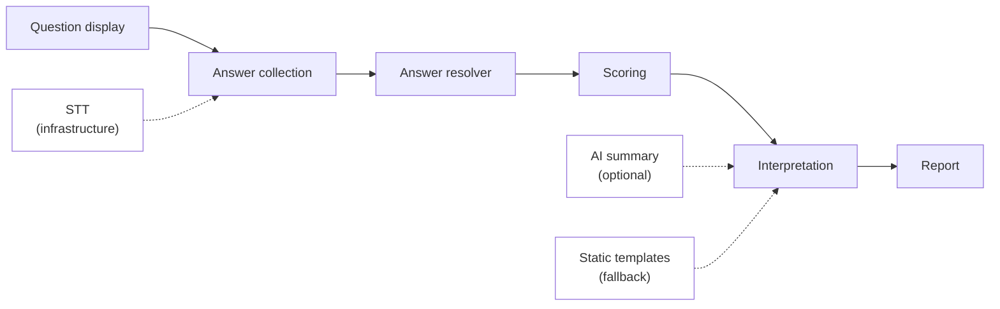

# 07 — AI Integration Boundaries

Версия: Draft 0.1  
Основа: [HR OS Agreement §11](../architecture/HR_Operating_System_Architecture_Agreement.md)

---

## 1. Принцип

AI в Psychological Testing — **вспомогательный слой**, не decision engine.

```text
Deterministic path:  questions → answers → scoring → results
AI path (optional):  results → narrative summary / interpretation text
```

---

## 2. Allowed vs forbidden

| Allowed | Forbidden |
|---------|-----------|
| STT (Whisper): voice → transcript | AI-psychologist persona |
| AI text summary **after** scoring | AI determines test type / score |
| AI interpretation of numeric results | Automated hiring reject |
| Template fallback (no API key) | Psychometry as sole HR criterion |
| Cost tracking per AI call | AI cadre decisions |
| Post-STT content filter (blacklist) | LLM maps voice answer → score |

---

## 3. AI roles by pipeline stage



| Stage | AI allowed? | Component |
|-------|-------------|-----------|
| Question generation | ❌ (production) | item bank only |
| Voice transcription | ✅ STT only | `voice_pipeline` |
| Answer mapping | ❌ | `answer_resolver` (deterministic) |
| Scoring | ❌ | `scoring_pipeline` |
| Normalization | ❌ | `normalization` |
| Interpretation text | ✅ optional | `interpretation_engine` |
| Report narrative | ✅ optional | `report_builder` + AI slot |

---

## 4. STT boundary

STT (Speech-to-Text) — **infrastructure**, не «AI-психолог»:

- Provider: Whisper via OpenAI API or mock
- Input: audio bytes from Telegram
- Output: plain text transcript
- Config: `PSYCH_TESTING_STT_PROVIDER`, `PSYCH_TESTING_OPENAI_API_KEY`

STT output goes to **answer_resolver**, not to LLM for interpretation.

Post-STT blacklist (reuse pattern from `skill_assessment/services/llm_post_stt_blacklist.py`) — content safety, not scoring.

---

## 5. AI summary slot

After deterministic scoring:

```text
ScoreResult + TestDefinition.ai.prompt
    → Platform AI Gateway (future)
    → Narrative summary text
    → Report PDF section
```

### Fallback chain

1. AI gateway available → LLM summary (temperature 0)
2. No API key → static template from `interpretation.yaml`
3. AI failure → static template + log error

Legacy pattern: `07 PsychTest/src/psytest/ai_interpreter.py` + `interpretation_utils.py` regex fallback.

---

## 6. MBTI-specific AI boundary

From Colab notebook 1 (`Тест_MBTI_по_вопросам_выводы.ipynb`):

- **48 structured questions** — no AI generation
- **Scoring** — `calculate_type_from_answers` (deterministic)
- **AI** — exactly **1 call** for final psychological portrait text

Notebook 2 (AI-generated questions) — **research only**, not production.

Notebook 3 (Orchestrator) — LLM for scene generation allowed in research; **must not** produce final `type_code` via LLM inference in production.

---

## 7. Platform AI gateway (future)

Production path:

```text
psychological_testing → platform AI gateway → provider (OpenAI / VseGPT / other)
```

Research path (Colab, `research/`):

- Direct VseGPT / OpenAI API allowed
- Must not leak into production imports

Env separation:

| Environment | API access |
|-------------|------------|
| `research/` | Direct API keys in Colab secrets |
| Production module | Platform gateway only |

---

## 8. Cost tracking

Mirror `skill_assessment/services/llm_costs.py`:

- Track tokens per summary call
- Env rates: `PSYCH_TESTING_LLM_USD_PER_1K_INPUT`, etc.
- Include in session metadata for HR reporting

STT costs tracked separately (Whisper per-minute).

---

## 9. Compliance notes

Per HR OS §11:

- Results are **informational**, not automatic HR actions
- Manager view ≠ permission to auto-decide
- Disclaimer in report: «Не является единственным критерием оценки»
- Sensitive psych data — stricter RBAC (see [08_RBAC_STORAGE_VERSIONING.md](08_RBAC_STORAGE_VERSIONING.md))

---

## 10. Anti-patterns

| Anti-pattern | Why forbidden | Alternative |
|--------------|---------------|-------------|
| LLM interprets «ну типа интроверт» → I | Non-reproducible | answer_resolver + reprompt |
| GPT generates MBTI questions live | No item bank, no audit | Structured item bank |
| AI chooses PAEI role from free speech | Subjective | forced-choice items |
| Orchestrator v3 LLM → type_code | Inference not validated | dichotomy_scorer only |
| AI-psychologist chat persona | HR OS §11 | Factual summary only |

---

## 11. Research exceptions

In `research/mbti/` only:

- AI question generation (notebook 2)
- Orchestrator scenes + Guard Agent LLM (notebook 3)
- Direct VseGPT API

Promotion to production requires checklist in [03_MODULAR_STRUCTURE.md](03_MODULAR_STRUCTURE.md).

---

## 12. Configuration sketch

```yaml
# TestDefinition ai block
ai:
  role: summary_only          # summary_only | none
  prompt: data/prompts/v1/mbti_summary.txt
  model: gpt-4o-mini
  temperature: 0
  max_tokens: 2000
  gateway: platform_ai_slot   # never direct in production
  fallback: static_template
```

```bash
# Environment
PSYCH_TESTING_AI_ENABLED=1
PSYCH_TESTING_STT_PROVIDER=openai
PSYCH_TESTING_AI_GATEWAY_URL=...   # future platform
```
