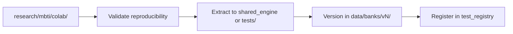

# 09 — Shared vs Test-Specific Classification

Версия: Draft 0.1

---

## 1. Purpose

Чёткое разделение: что входит в **shared_engine** (универсальное), что остаётся в **test plugins**, что живёт только в **research/**.

Правило: если компонент нужен ≥2 тестам или не содержит test-specific контента → `shared_engine`.

---

## 2. Summary table

| Component | Layer | Rationale |
|-----------|-------|-----------|
| `item_bank_loader.py` | shared_engine | CSV/YAML loading for all tests |
| `question_selector.py` | shared_engine | Weight-based sampling (MBTI + future) |
| `response_collector.py` | shared_engine | Tri-mode: voice, button, text |
| `voice_pipeline.py` | shared_engine | STT for all voice-capable tests |
| `answer_resolver.py` | shared_engine | Framework; test rules in YAML |
| `scoring_pipeline.py` | shared_engine | Strategy dispatch |
| `dichotomy_scorer.py` | shared_engine | Any dichotomy typology |
| Likert scorer logic | shared_engine | DISC, HEXACO share algorithm |
| `normalization.py` | shared_engine | Config-driven transforms |
| `interpretation_engine.py` | shared_engine | Band lookup + AI slot |
| `session_state_machine.py` | shared_engine | Generic test flow |
| `report_builder.py` | shared_engine | PDF/charts assembly framework |
| `test_registry.py` | domain | Plugin discovery |
| `telegram_adapter.py` | integration | Channel adapter |
| `telegram_outbound.py` | adapters | Send message + keyboard |
| PAEI item bank | tests/paei | Test content |
| DISC item bank | tests/disc | Test content |
| HEXACO item bank | tests/hexaco | Test content |
| Soft Skills item bank | tests/soft_skills | Test content |
| MBTI 48 questions | tests/mbti | Test content |
| `answer_patterns.yaml` | tests/* | Per-test resolver rules |
| AI summary prompts | tests/* | Test-specific narrative |
| Interpretation bands | tests/* / data/ | Test-specific text |
| PAEI forced-choice logic | tests/paei | Uses shared `forced_choice_count` |
| MBTI question_selector config | tests/mbti | Axes, weights from definition |
| Orchestrator v3 state machine | research/mbti | Experimental |
| AI question gen (MBTI nb2) | research/mbti | Non-reproducible |
| Colab notebooks | research/ | Not production |
| `archive/` legacy scripts | none (discard) | Historical noise |

---

## 3. shared_engine (detailed)

### Must be test-agnostic

```text
shared_engine/
├── item_bank_loader.py       # schema validation, CSV/YAML parse
├── question_selector.py      # weight sort, shuffle, seed
├── response_collector.py     # voice | button | text → StructuredAnswer
├── voice_pipeline.py         # Telegram audio → STT
├── answer_resolver.py        # dispatches to test patterns
├── dichotomy_scorer.py       # pole count → type_code + levels
├── scoring_pipeline.py       # likert_sum, forced_choice, per_dimension, custom
├── normalization.py          # average, percentage, 0-60, none
├── interpretation_engine.py  # bands + AI gateway call
├── session_state_machine.py  # init → question → score → report
└── report_builder.py         # section assembly, chart slots
```

### Must NOT contain

- MBTI question texts
- PAEI scale names hardcoded
- DISC interpretation paragraphs
- Telegram bot token handling (→ adapters)
- Direct OpenAI client (→ AI gateway slot)

---

## 4. tests/* plugins (detailed)

Each plugin:

```text
tests/{test_id}/
├── definition.yaml           # TestDefinition
├── answer_patterns.yaml      # resolver rules for this test
├── interpretation.yaml       # static bands / type descriptions
├── scorer.py                 # optional: only if scoring_type=custom
└── README.md
```

### Plugin responsibilities

| Responsibility | Example (MBTI) |
|----------------|----------------|
| Item content | 48 questions with weights |
| Scale/axis definitions | E/I, S/N, T/F, J/P |
| Answer patterns | «вариант а» → option_a |
| Interpretation text | INTJ description |
| AI prompt | summary template |
| Chart preferences | dichotomy bars (optional) |

### Plugin must NOT

- Implement own STT
- Call OpenAI directly (production)
- Define own session state machine
- Create own Telegram polling loop

---

## 5. research/ (detailed)

```text
research/
├── README.md                 # boundaries + promotion checklist
├── colab/                    # exported notebooks
├── scripts/                  # one-off experiments
└── mbti/
    ├── colab/
    │   ├── structured_questions_scoring.ipynb
    │   ├── ai_generated_questions.ipynb
    │   └── process_orchestrator_v3.ipynb
    ├── ai_generated/         # notebook 2 artifacts
    └── process_orchestrator/ # notebook 3 artifacts
```

**Explicitly NOT production.**

Production code import guard (future): lint rule or CI check blocking `from psychological_testing.research`.

---

## 6. integration/ and adapters/

| Component | Layer | Shared? |
|-----------|-------|---------|
| `hr_core.py` | integration | Module-specific, pattern shared with skill_assessment |
| `telegram_adapter.py` | integration | Module-specific |
| `telegram_outbound.py` | adapters | Module-specific (copy pattern) |
| `app.hr.get_employee` | platform core | Shared platform |

---

## 7. data/ directory

| Content | Shared or test-specific |
|---------|------------------------|
| `data/banks/v1/*.csv` | Test-specific files, shared loader |
| `data/interpretations/v1/` | Test-specific files, shared engine |
| `data/prompts/v1/` | Test-specific files |
| Bank schema definition | Shared (documented in engine) |

---

## 8. MBTI classification example

| MBTI artifact | Layer |
|---------------|-------|
| `calculate_type_from_answers` algorithm | shared_engine → `dichotomy_scorer.py` |
| 48 QUESTIONS dict | tests/mbti → `data/banks/v1/mbti_items.yaml` |
| Weight-based selection config | tests/mbti/definition.yaml |
| Answer patterns for A/B voice | tests/mbti/answer_patterns.yaml |
| AI summary prompt | tests/mbti / data/prompts/v1/ |
| Notebook 2 AI question gen | research/mbti/ai_generated/ |
| Orchestrator v3 | research/mbti/process_orchestrator/ |

**Validation:** removing `tests/mbti/` must not break PAEI/DISC/HEXACO/Soft Skills.

---

## 9. Promotion path (research → production)



Checklist: [03_MODULAR_STRUCTURE.md](03_MODULAR_STRUCTURE.md) §4.

---

## 10. Anti-pattern: MBTI in core

```python
# FORBIDDEN in shared_engine/
if test_id == "mbti":
    return calculate_mbti_type(...)
```

```python
# CORRECT
return scoring_pipeline.dispatch(
    scoring_type=definition.scoring_type,
    answers=answers,
    config=definition.scoring,
)
```

Core knows `scoring_type`, not test names.
