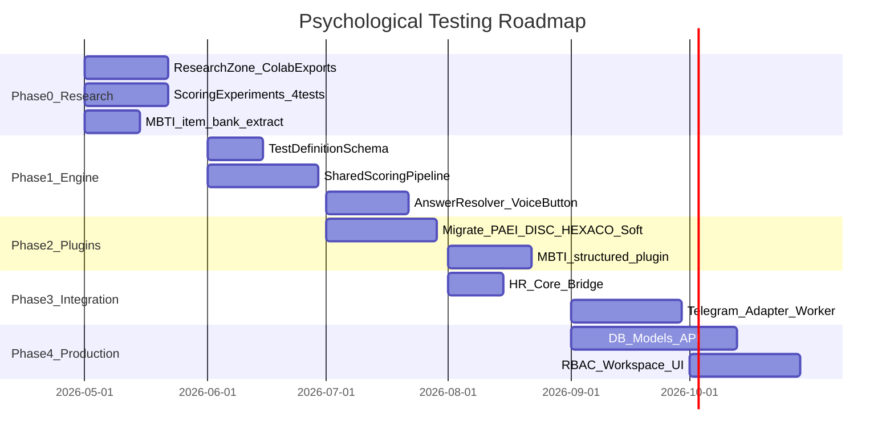

# 10 — Implementation Roadmap

Версия: Draft 0.1

---

## 1. Overview

Поэтапный план без production backend в текущей фазе. Каждая фаза имеет exit criteria.

---

## 2. Phase 0 — Research Foundation

**Goal:** Извлечь логику из Colab в Python-скрипты, validate scoring, establish research boundaries.

**Duration:** ~4 weeks

### Tasks

- [x] Architecture documentation (this doc set)
- [x] Create `psychological_testing/research/README.md` with promotion checklist
- [ ] Copy Colab notebooks → `research/mbti/colab/` (**reference only**)
- [ ] **Implement Python scripts** from Colab logic:
  - `research/mbti/scripts/dichotomy_scorer.py` (notebook 1)
  - `research/scripts/likert_scorer.py` (07 PsychTest)
  - `research/scripts/load_item_bank.py`
- [ ] Extract MBTI `QUESTIONS` dict → `data/banks/v1/mbti_items.yaml`
- [ ] Validate dichotomy_scorer.py == Colab output on fixed test cases
- [ ] Reconcile CSV banks vs bot question sets (DISC, HEXACO)
- [x] Document voice+button UX templates (06)

### Exit criteria

- Python scripts reproduce Colab scoring (fixed inputs → same type_code / scores)
- All 5 tests have documented scoring_type mapping
- MBTI item bank in YAML; results ∈ 16 types (`mbti_16_types.yaml`)
- No Colab runtime dependency in scripts

---

## 3. Phase 1 — Universal Engine

**Goal:** Minimal library implementing core abstractions.

**Duration:** ~6 weeks

### Tasks

- [ ] Create `psychological_testing/` package skeleton
- [ ] Implement `domain/test_registry.py` — load TestDefinition YAML
- [ ] Implement `shared_engine/item_bank_loader.py`
- [ ] Implement `shared_engine/scoring_pipeline.py` — likert, forced_choice, per_dimension
- [ ] Implement `shared_engine/dichotomy_scorer.py`
- [ ] Implement `shared_engine/normalization.py`
- [ ] Implement `shared_engine/answer_resolver.py` framework
- [ ] Implement `shared_engine/response_collector.py` — button path first, then voice
- [ ] Implement `shared_engine/voice_pipeline.py` — mock STT
- [ ] Unit tests for scorers (deterministic)

### Exit criteria

- Given StructuredAnswer[], each scoring_type produces expected ScoreResult
- MBTI notebook 1 `calculate_type_from_answers` matches `dichotomy_scorer` output
- `scoring.py` likert matches pipeline for DISC/HEXACO sample data
- Button path works without STT

---

## 4. Phase 2 — Test Plugins

**Goal:** Port 4 legacy tests + MBTI structured plugin.

**Duration:** ~7 weeks

### Tasks

- [ ] `tests/paei/` — definition, answer_patterns, reconcile with prompts
- [ ] `tests/disc/` — reconcile CSV (4 items) with bot (8 questions)
- [ ] `tests/hexaco/` — fix dimension mapping review
- [ ] `tests/soft_skills/` — 10 skills from bot → item bank
- [ ] `tests/mbti/` — structured plugin from notebook 1
- [ ] `data/banks/v1/` populated for all 5 tests
- [ ] `data/interpretations/v1/` for all tests
- [ ] Validate: removing mbti plugin doesn't affect other tests

### Exit criteria

- 5 TestDefinition YAML files validate against schema
- End-to-end scoring (no Telegram) for sample sessions
- MBTI delivery_mode=structured only in registry
- Notebook 2/3 remain in research/

---

## 5. Phase 3 — Platform Integration

**Goal:** Telegram channel + HR core bridge.

**Duration:** ~6 weeks

### Tasks

- [ ] `integration/hr_core.py` — mirror skill_assessment pattern
- [ ] `adapters/telegram_outbound.py` — text + inline keyboard + voice hint
- [ ] `integration/telegram_adapter.py` — tri-mode response handling
- [ ] `telegram_worker.py` — standalone poller
- [ ] Wire voice_pipeline to OpenAI Whisper (or mock)
- [ ] answer_resolver per test with voice patterns
- [ ] AI summary slot via gateway stub
- [ ] Report PDF generation — **не** монолит legacy; см. [16_PDF_EXPORT_CONTRACT_AND_PLAN.md](16_PDF_EXPORT_CONTRACT_AND_PLAN.md) (JSON → manifest → charts → PDF)

### Exit criteria

- Full test session via Telegram: text + buttons + voice hint → voice OR button answer
- STT misrecognition triggers reprompt with buttons
- Employee binding via telegram_id
- PDF export on HR request from session JSON (Telegram: text only; full PDF — RBAC export)

---

## 6. Phase 4 — Production

**Goal:** DB, API, RBAC, workspace activation.

**Duration:** ~10 weeks

**Out of current scope** — documented for planning only.

### Tasks

- [ ] `infrastructure/db_models.py` — pt_* tables
- [ ] `router.py` — `/api/psychological-testing/*`
- [ ] Mount in `app/main.py`
- [ ] RBAC guards on endpoints
- [ ] Activate workspace tab (unmute sidebar)
- [ ] Org test assignment workflow
- [ ] Audit log integration
- [x] Google Drive upload (service account, env switch) — [17](17_GDRIVE_STORAGE.md)
- [ ] Platform DB storage for sessions (source of truth = JSON until Phase 4) — [08](08_RBAC_STORAGE_VERSIONING.md)

### Exit criteria

- Multi-tenant sessions persisted
- RBAC matrix enforced
- HR admin can assign and view results
- Module enabled per organization

---

## 7. Current deliverable (this task)

| Done | Item |
|------|------|
| ✅ | 13 architecture markdown documents |
| ❌ | Python package |
| ❌ | DB migrations |
| ❌ | UI |

---

## 8. Dependencies

| Phase | Depends on |
|-------|------------|
| 1 | Phase 0 scoring validation |
| 2 | Phase 1 engine |
| 3 | Phase 2 plugins + skill_assessment Telegram patterns |
| 4 | Platform RBAC maturity + Phase 3 |

---

## 9. Parallel workstreams

Can run in parallel after Phase 0:

- **Stream A:** Engine + scorers (Phase 1)
- **Stream B:** Item bank reconciliation (Phase 2 prep)
- **Stream C:** Telegram UX prototyping with mock engine (Phase 3 prep)

---

## 10. Decision log

| Date | Decision | Rationale |
|------|----------|-----------|
| 2026-05 | Universal platform, not MBTI-first | HR OS + extensibility |
| 2026-05 | Text + buttons + voice hint UX | User approval |
| 2026-05 | MBTI structured (nb1) = production path | Deterministic scoring |
| 2026-05 | MBTI nb2/nb3 = research only | Non-reproducible / experimental |
| 2026-05 | Colab → Python scripts (not Colab runtime) | Reproducible, testable, promotable to shared_engine |
| 2026-05 | Separate from skill_assessment | Domain separation |
| 2026-05 | LLM banned from answer mapping | Reproducible scoring |

---

## 11. Success metrics (Phase 3+)

| Metric | Target |
|--------|--------|
| Voice answer resolution rate | ≥ 85% without reprompt |
| Button answer rate | Available 100% of questions |
| Scoring reproducibility | 100% same input → same output |
| STT latency | < 5s per voice message |
| Session completion rate | Track, no target yet |
