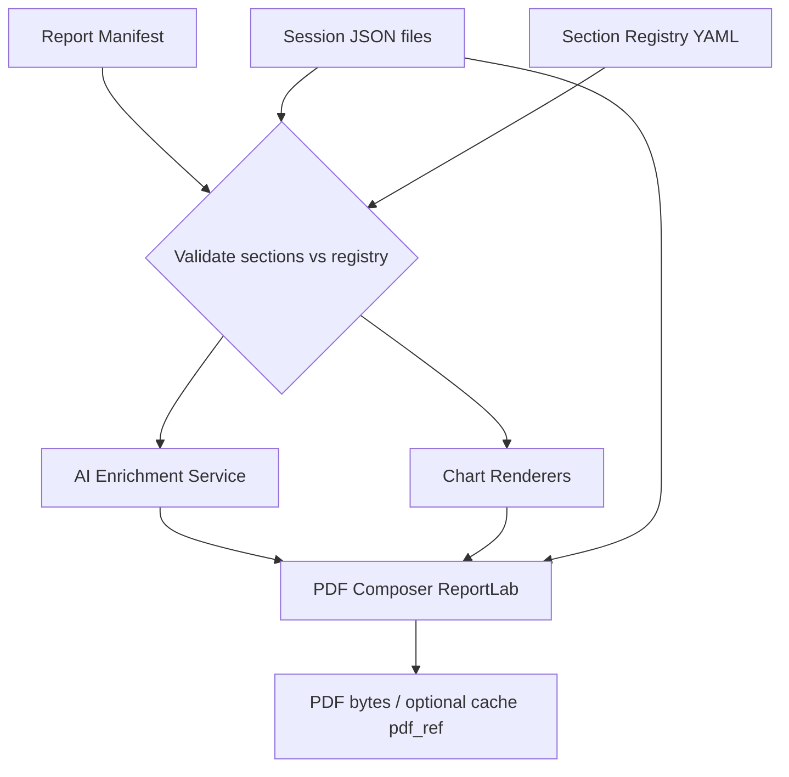

# 16 — PDF Export: контракт данных и план разработки

Версия: 0.2  
Дата: 2026-05-20  
Статус: **Утверждено** (2026-05-20). Реализация: **Фаза A ✅**, **Фаза B ✅**, **Фаза C ✅**, **Фаза D ✅**, **Фаза E ✅**.

---

## 1. Контекст и решение

### 1.1. Проблема

Legacy-бот (`07 PsychTest`) формировал **монолитный PDF** сразу после прохождения батареи тестов: AI-интерпретации, графики, приложение с вопросами. Это повышало ценность отчёта для клиента, но:

- PDF становился **источником истины** de facto;
- на каждого сотрудника и каждый прогон копились файлы;
- состав секций **не настраивался** HR;
- MBTI в legacy-батарее отсутствовал;
- монолит `enhanced_pdf_report_v2.py` (~951 строк) сложно расширять (см. [11_TECHNICAL_DEBT.md](11_TECHNICAL_DEBT.md) D11).

Target-модуль `psychological_testing/` уже сохраняет **канонический JSON** на сессию ([15_PHASE3B_PERSISTENCE_AND_HR.md](15_PHASE3B_PERSISTENCE_AND_HR.md)) и отдаёт в Telegram **краткий текст**. PDF пока не генерируется (`report.pdf_ref: null`).

### 1.2. Принятое направление (архитектурное решение)

| Аспект | Решение |
|--------|---------|
| Источник истины | **JSON-сессии** (`pt_session_result` v1+) |
| PDF | **On-demand представление**, не обязательный артефакт |
| Состав отчёта | **Выбираемые секции** HR из реестра доступных тестов/блоков |
| Графики | **Динамическая генерация** из `scores` / `axis_details` при рендере |
| AI-тексты | **Сохраняются в JSON** (`ai_enrichment`), PDF их только отображает |
| Legacy-layout | **Шаблон секций** (визуальный стиль legacy), **не** копирование монолита as-is |
| Telegram для сотрудника | Краткий текст сразу; **полный PDF — зона HR** (RBAC export) |

Согласовано с [07_AI_INTEGRATION_BOUNDARIES.md](07_AI_INTEGRATION_BOUNDARIES.md): scoring детерминированный; AI только для narrative **после** подсчёта.

**Sign-off:** архитектурное направление одобрено; детали §11 зафиксированы как решения по умолчанию (см. §11).

---

## 2. Контракт: уровни данных

### 2.1. Session JSON — `pt_session_result` (уже есть, v1.0.0)

Один завершённый тест → один документ. Форма — [15_PHASE3B_PERSISTENCE_AND_HR.md](15_PHASE3B_PERSISTENCE_AND_HR.md).

**Обязательные поля для PDF-рендера секции:**

| Поле | Назначение |
|------|------------|
| `employee_id`, `employee_display_name` | титул отчёта |
| `test_id`, `test_version`, `completed_at` | метаданные секции |
| `scores` | графики и числовые блоки |
| `interpretation` | статика (MBTI YAML и др.) |
| `responses[]` | приложение «вопросы и ответы» (опционально в PDF) |
| `report.text_telegram` | fallback-текст без AI |

**PDF не пишет обратно в scoring.** `report.pdf_ref` — опциональный кэш, не источник истины.

### 2.2. Расширение v1.1.0 — `ai_enrichment` (новое поле)

Опциональный блок внутри session JSON. Заполняется при первом запросе narrative (lazy) или при завершении теста (eager) — см. §4.

```json
{
  "ai_enrichment": {
    "schema_version": "1.0.0",
    "generated_at": "2026-05-20T10:00:00+00:00",
    "provider": "openai",
    "model": "gpt-4o-mini",
    "prompt_version": "paei_interpretation_v1",
    "sections": {
      "interpretation": "Текст интерпретации по PAEI…",
      "career_hints": "…"
    },
    "usage": {
      "input_tokens": 420,
      "output_tokens": 430
    }
  }
}
```

**Инварианты:**

- AI **не изменяет** `scores`, `typology_code`, `axis_details.dominant`.
- При повторном экспорте PDF читается `ai_enrichment` из JSON; повторный LLM-вызов — только по явному `regenerate_ai=true` (HR).
- Breaking change формата `ai_enrichment` → bump `ai_enrichment.schema_version`.

### 2.3. Report Manifest — `pt_report_manifest` v1 (новый документ)

Настройки **одного экспорта PDF** для сотрудника. Не дублирует scores — только ссылки и UI-выбор.

```json
{
  "schema_version": "1.0.0",
  "manifest_id": "uuid",
  "client_id": "org-1",
  "employee_id": "emp-42",
  "created_by": "hr_user_id",
  "created_at": "2026-05-20T11:00:00+00:00",
  "template_id": "legacy_team_assessment_v1",
  "locale": "ru",
  "program_id": "standard_hr_v1",
  "session_refs": [
    { "test_id": "mbti", "session_id": "164e6624-dfa5-4562-8631-5829cb6b9b17" },
    { "test_id": "paei", "session_id": "…" }
  ],
  "sections": [
    {
      "section_id": "cover",
      "enabled": true
    },
    {
      "section_id": "general_summary",
      "enabled": true,
      "requires_ai": true
    },
    {
      "section_id": "mbti",
      "enabled": true,
      "charts": ["decision_tree", "axis_bars"]
    },
    {
      "section_id": "paei",
      "enabled": true,
      "charts": ["combined"]
    },
    {
      "section_id": "soft_skills",
      "enabled": false
    },
    {
      "section_id": "hexaco",
      "enabled": true,
      "charts": ["radar"]
    },
    {
      "section_id": "disc",
      "enabled": true,
      "charts": ["combined"]
    },
    {
      "section_id": "career_recommendations",
      "enabled": true
    },
    {
      "section_id": "appendix_qa",
      "enabled": false
    }
  ],
  "options": {
    "include_disclaimer": true,
    "page_numbers": true
  }
}
```

**Правила выбора `session_refs`:**

- По умолчанию — **последняя завершённая** сессия (`status=done`) на каждый `test_id` в рамках `program_id`.
- HR может зафиксировать конкретный `session_id` (например, повторное тестирование).
- Секция с `enabled=true`, но без session → **warning** в UI и пропуск секции в PDF (не ошибка всего экспорта), если не включён strict mode.

### 2.4. Employee bundle (виртуальное представление)

Отдельный файл **не обязателен**. View:

```text
sessions WHERE employee_id = X AND status = done
  → latest per test_id (или по manifest.session_refs)
```

Phase 4: SQL/view поверх `pt_test_sessions`. Phase 3b: обход файлов `data/sessions/v1/**/{session_id}.json`.

---

## 3. Контракт: реестр секций и шаблоны

### 3.1. Section Registry (декларативный YAML)

Единый реестр — **не хардкод в PDF-комposer**. Планируемый путь:

```text
psychological_testing/data/report_sections/v1/registry.yaml
```

Пример записи:

```yaml
templates:
  legacy_team_assessment_v1:
    title_ru: "Оценка командных навыков"
    default_sections:
      - cover
      - general_summary
      - mbti
      - soft_skills
      - hexaco
      - disc
      - paei
      - career_recommendations

sections:
  mbti:
    label_ru: "MBTI — тип личности"
    test_id: mbti
    order: 10
    charts_available: [decision_tree, axis_bars, type_matrix]
    ai_slots: [interpretation]
    static_source: interpretation.profile

  paei:
    label_ru: "Тест Адизеса (PAEI)"
    test_id: paei
    order: 40
    charts_available: [combined]
    ai_slots: [interpretation]
```

**Почему реестр, а не список в коде:** HR UI (чекбоксы), API валидация manifest, добавление нового теста = новая запись в registry + renderer, без изменения orchestrator.

### 3.2. Маппинг на legacy PDF samples

Образцы: `psychological_testing/pdf samples/*_full.pdf` (PAEI + Soft + HEXACO + DISC, без MBTI).

| Legacy-блок | `section_id` | Источник данных |
|-------------|--------------|-----------------|
| Титул + дата | `cover` | manifest + employee |
| Общее заключение | `general_summary` | cross-test AI + scores summary |
| PAEI | `paei` | session JSON + chart |
| Soft Skills | `soft_skills` | session JSON + radar |
| HEXACO | `hexaco` | session JSON + radar |
| DISC | `disc` | session JSON + combined chart |
| Карьера / команда | `career_recommendations` | AI (general) или шаблон |
| Приложение Q&A | `appendix_qa` | `responses[]` + item bank |
| **Новое:** MBTI | `mbti` | `typology_code`, `axis_details`, YAML profile |

---

## 4. Контракт: AI enrichment

### 4.1. Разрешённые роли AI

| Слот | Когда | Вход | Выход |
|------|-------|------|-------|
| `{test_id}.interpretation` | экспорт / конец теста | scores, static profile | `ai_enrichment.sections.interpretation` |
| `general_summary` | экспорт cross-test | все scores сессий manifest | отдельный cache в manifest или employee-level doc |
| `career_recommendations` | экспорт | scores + interpretation texts | manifest cache или session |

Запрещено: infer type_code, изменение counts, hiring decisions ([07_AI_INTEGRATION_BOUNDARIES.md](07_AI_INTEGRATION_BOUNDARIES.md)).

### 4.2. Стратегия вызова (рекомендация: lazy + cache)

```text
export_pdf(manifest)
  FOR each enabled section WITH ai_slot:
    IF session.ai_enrichment.sections[slot] missing:
      LLM → write session JSON (or manifest ai_cache)
    ELSE:
      reuse cached text
  compose PDF
```

**Почему lazy + cache, а не eager always:**

- не тратим токены, если HR не экспортирует PDF;
- не тратим, если секция отключена в manifest;
- воспроизводимость: один и тот же PDF из тех же JSON + manifest.

**Почему не only-on-export without cache:**

- повторные экспорты и аудит HR OS требуют стабильного текста;
- стоимость LLM учитывается один раз (см. `audit`, `usage`).

Переключатель org-level (Phase 4): `PSYCH_TESTING_AI_ON_SESSION_COMPLETE=0|1`.

---

## 5. Контракт: графики

### 5.1. Принцип

```text
scores / axis_details (JSON) → chart_renderer → PNG bytes (in-memory или temp) → ReportLab Image → PDF
```

**Графики не хранятся** в JSON и не обязаны persist на диск. Temp-файлы удаляются после сборки PDF.

### 5.2. Chart types по секциям

| section_id | chart type | Вход из JSON |
|------------|------------|--------------|
| `paei` | `combined` | `scores.normalized_scores` (P,A,E,I) |
| `soft_skills` | `radar` | `scores.raw_scores` + skill labels |
| `hexaco` | `radar` | `scores.normalized_scores` (H,E,X,A,C,O) |
| `disc` | `combined` | `scores.normalized_scores` (D,I,S,C) |
| `mbti` | `decision_tree` | `axis_details` по 4 осям → путь к `typology_code` |
| `mbti` | `axis_bars` | `axis_details[*].counts` |
| `mbti` | `type_matrix` | `typology_code` → highlight 1 из 16 |

Reference implementation: `07 PsychTest/src/psytest/charts.py` (порт в `shared_engine/charts/`).

### 5.3. MBTI: «маршрут среди 16 типов»

MBTI определяется **последовательностью 4 дихotomий**, не перебором 16 узлов графа.

Рекомендуемая визуализация:

1. **Decision tree (4 уровня):** E/I → S/N → T/F → J/P — активная ветка = `dominant` на каждой оси.
2. **Axis bars:** для каждой оси два столбца (counts pole A vs B).
3. **Matrix 4×4 (опционально):** финальная ячейка = `typology_code`.

Данные уже есть в session JSON (пример: `axis_details` с `counts` и `level`).

---

## 6. Контракт: PDF render pipeline



**API (Phase 4, контракт):**

```http
POST /api/psychological-testing/employees/{employee_id}/export-pdf
Content-Type: application/json

{
  "template_id": "legacy_team_assessment_v1",
  "sections": [ ... ],           // optional override; default from template
  "session_refs": [ ... ],       // optional; default latest per test_id
  "regenerate_ai": false,
  "strict": false                // if true: fail when enabled section has no session
}
```

**Response:** `application/pdf` stream **или** `{ "pdf_ref": "...", "manifest_id": "..." }` при async/кэше.

RBAC: `hr.psych_testing.export` ([08_RBAC_STORAGE_VERSIONING.md](08_RBAC_STORAGE_VERSIONING.md)).

---

## 7. Контракт: кэш PDF (`pdf_ref`)

| Режим | Поведение |
|-------|-----------|
| `PDF_CACHE=off` (default dev) | PDF только stream, `pdf_ref` null |
| `PDF_CACHE=hash` | ключ = hash(manifest + session completed_at + schema versions); повторный запрос отдаёт файл |
| Phase 4 storage | object storage URL, retention = policy org |

**Инвариант:** удаление PDF **не теряет** данные; перегенерация всегда возможна из JSON.

---

## 8. Целевая структура кода (не реализовано)

```text
psychological_testing/
├── data/
│   ├── report_sections/v1/registry.yaml
│   └── prompts/v1/                    # AI prompts per section slot
├── shared_engine/
│   ├── report_sections/               # plug-in renderers per section_id
│   ├── charts/                        # scores → PNG
│   ├── pdf_composer.py                # ReportLab story assembly
│   └── pdf_export_service.py          # manifest + sessions → bytes
├── services/
│   └── interpretation_llm.py          # ai_enrichment read/write
└── integration/
    └── pdf_export_api.py            # Phase 4 router hook
```

Не переносить `enhanced_pdf_report_v2.py` целиком — только паттерны и chart math ([11_TECHNICAL_DEBT.md](11_TECHNICAL_DEBT.md) D11).

---

## 9. План разработки

### Фаза A — Контракт и каркас ✅ (2026-05-20)

| # | Задача | Exit criteria | Статус |
|---|--------|---------------|--------|
| A1 | Утвердить этот документ | sign-off | ✅ |
| A2 | `registry.yaml` v1 | валидация manifest против registry | ✅ `data/report_sections/v1/registry.yaml` |
| A3 | JSON draft `ai_enrichment` + `pt_report_manifest` | примеры | ✅ `data/report_examples/` |
| A4 | `session_persistence` — запись `ai_enrichment` | unit test round-trip | ✅ `report_contract.py`, `update_session_ai_enrichment` |

**Артефакты Phase A:**

```text
psychological_testing/data/report_sections/v1/registry.yaml
psychological_testing/data/report_examples/manifest_v1_example.json
psychological_testing/data/report_examples/ai_enrichment_v1_example.json
psychological_testing/shared_engine/report_contract.py
tests/test_psychological_testing_pdf_export.py
```

**Почему сначала контракт, а не ReportLab:** без manifest/registry каждый следующий PR спорит о форме данных; PDF-монолит повторит legacy debt.

### Фаза B — Charts + статический PDF ✅ (2026-05-20)

| # | Задача | Exit criteria | Статус |
|---|--------|---------------|--------|
| B1 | Порт chart functions | pytest PNG bytes | ✅ `shared_engine/charts/` |
| B2 | Section renderer (DISC + MBTI) | PDF секции из session JSON | ✅ |
| B3 | `pdf_composer` + export service + CLI | `python -m psychological_testing.export_pdf` | ✅ |
| B4 | MBTI charts | decision_tree + axis_bars | ✅ |

**Артефакты Phase B:**

```text
psychological_testing/shared_engine/charts/
psychological_testing/shared_engine/pdf_composer.py
psychological_testing/shared_engine/pdf_export_service.py
psychological_testing/export_pdf.py
requirements.txt  (+ matplotlib, reportlab)
```

CLI:

```bash
python -m psychological_testing.export_pdf \
  --manifest psychological_testing/data/report_examples/manifest_v1_example.json \
  --output reports/demo.pdf
```

**Почему charts до AI:** графики полностью детерминированы; быстрый parity-check с legacy samples без API keys.

### Фаза C — AI enrichment ✅ (2026-05-20)

| # | Задача | Exit criteria |
|---|--------|---------------|
| C1 | Prompts v1 per test (порт текстов из `07 PsychTest/data/prompts/`) | ✅ `data/prompts/v1/` |
| C2 | `interpretation_llm.enrich_session(session, slots[])` | ✅ `services/interpretation_llm.py` |
| C3 | Lazy+cache в `pdf_export_service` | ✅ `ensure_export_ai_enrichment` |
| C4 | `general_summary` cross-test slot | ✅ `manifest.ai_cache` |

**Почему AI после статического PDF:** границы AI уже описаны; визуальный каркас не блокируется на LLM; fallback = static `report.text_telegram` + YAML.

### Фаза D — Полный legacy template + MBTI ✅ (2026-05-20)

| # | Задача | Exit criteria |
|---|--------|---------------|
| D1 | Все section renderers (5 tests + career + appendix) | ✅ `shared_engine/report_sections/` |
| D2 | MBTI section (static YAML + charts + AI slot) | ✅ `mbti_section.py` |
| D3 | `legacy_team_assessment_v1` default manifest | ✅ registry + manifest (Phase A) |
| D4 | Optional `appendix_qa` | ✅ `appendix_qa.py` + item banks |
| D5 | Layout: шрифты, отступы, нумерация | ✅ `pdf_composer` page_numbers |

**Почему MBTI отдельным этапом в D:** в legacy samples MBTI не было; новая секция не должна блокировать parity PAEI/DISC/HEXACO/Soft.

### Фаза E — Platform integration ✅ (2026-05-20)

| # | Задача | Exit criteria |
|---|--------|---------------|
| E1 | `POST export-pdf` + RBAC | ✅ `app/routers/psychological_testing.py` |
| E2 | Workspace UI: чекбоксы секций, preview sessions | ✅ `static/workspace/index.html` |
| E3 | `pdf_ref` cache policy | ✅ `PSYCH_TESTING_PDF_CACHE=hash\|off` |
| E4 | Persist manifest (file store) | ✅ `data/report_exports/` + `manifest_store.py` |

**Почему API последним:** Phase 3b уже пишет JSON; CLI/local export достаточен для демо и обсуждения layout до UI.

---

## 10. Зависимости и риски

| Зависимость | Влияние |
|-------------|---------|
| `PSYCH_TESTING_PERSIST_JSON=1` | без JSON нет источника для export |
| OpenAI / mock (`llm_service`) | AI секции; без ключа — static fallback |
| ReportLab + matplotlib | PDF/charts; добавить в project deps |
| Item banks для appendix | нужны тексты вопросов по `item_id` |
| Шрифты кириллицы (Windows/Linux) | как в legacy `_setup_fonts` |

| Риск | Митигация |
|------|-----------|
| Scope creep «ещё одна секция» | жёсткий registry + version template |
| Расхождение AI-текста при re-run | cache + `regenerate_ai` explicit |
| Mini banks DISC/HEXACO vs legacy 8/10 items | документировать в PDF footnote; Phase 2 bank expansion |
| Performance (5 charts + AI) | async export Job + notification (Phase 4+) |

---

## 11. Зафиксированные решения (бывшие вопросы для обсуждения)

| # | Вопрос | Решение (default) |
|---|--------|-------------------|
| 1 | Eager vs lazy AI | **Lazy + cache** в session JSON при первом HR export; env `PSYCH_TESTING_AI_ON_SESSION_COMPLETE=0` |
| 2 | PDF сотруднику в Telegram | **Нет** в v1; полный PDF только HR (`hr.psych_testing.export`); сотруднику — `text_telegram` |
| 3 | Strict mode | **Default `strict: false`** — пропуск секции + warning; strict=true для контролируемого экспорта |
| 4 | general_summary AI cache | **`manifest.ai_cache`** для cross-test слотов; per-test — `session.ai_enrichment` |
| 5 | Версия template | **`template_id`** меняется при breaking layout; minor — `registry_version` в template |
| 6 | Parity с legacy PDF | **Тот же контент**, layout допускает улучшения (не pixel-perfect) |
| 7 | MBTI matrix 16 типов | **Опционально** (`type_matrix`); обязательны `decision_tree` + `axis_bars` |

Изменение решений — правка §11 + bump `schema_version` / `template_id` при необходимости.

---

## 12. Критерии готовности (Definition of Done для всего направления)

- [x] JSON session v1.1 с `ai_enrichment` documented and implemented (Phase A)
- [x] Manifest v1 validated against section registry (Phase A)
- [x] Export из session JSON → PDF с выбранными секциями (Phase B, статический текст)
- [x] Charts строятся только из JSON (no stored PNG assets)
- [x] MBTI секция с decision_tree + axis_bars в PDF
- [x] AI текст кэшируется; повторный export идемпотентен (Phase C)
- [x] RBAC export hook (`PSYCH_TESTING_RBAC_EXPORT=1`, role `admin`)
- [x] Legacy sample `_full.pdf` coverage: PAEI, Soft, HEXACO, DISC (+ MBTI) — Phase D renderers

---

## 13. Связанные документы

| Документ | Связь |
|----------|-------|
| [15_PHASE3B_PERSISTENCE_AND_HR.md](15_PHASE3B_PERSISTENCE_AND_HR.md) | базовый JSON contract |
| [07_AI_INTEGRATION_BOUNDARIES.md](07_AI_INTEGRATION_BOUNDARIES.md) | границы AI |
| [09_SHARED_VS_TEST_SPECIFIC.md](09_SHARED_VS_TEST_SPECIFIC.md) | report_builder = shared |
| [13_MBTI_EXTENSION_POINT.md](13_MBTI_EXTENSION_POINT.md) | MBTI report + AI summary |
| [08_RBAC_STORAGE_VERSIONING.md](08_RBAC_STORAGE_VERSIONING.md) | export permission, retention |
| [11_TECHNICAL_DEBT.md](11_TECHNICAL_DEBT.md) | D11 monolithic PDF |
| [14_E2E_PHASE3_REPORT.md](14_E2E_PHASE3_REPORT.md) | текущий статус Telegram |
| [10_IMPLEMENTATION_ROADMAP.md](10_IMPLEMENTATION_ROADMAP.md) | Phase 4 platform |

Legacy reference: `07 PsychTest/enhanced_pdf_report_v2.py`, образцы `psychological_testing/pdf samples/`.
